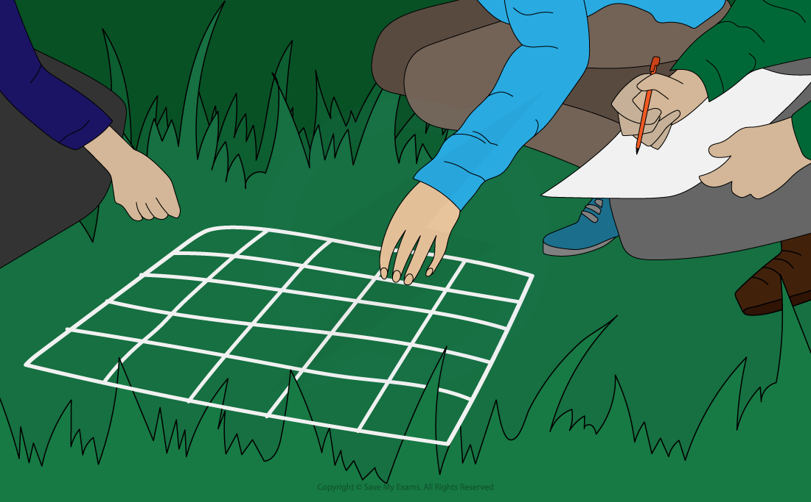
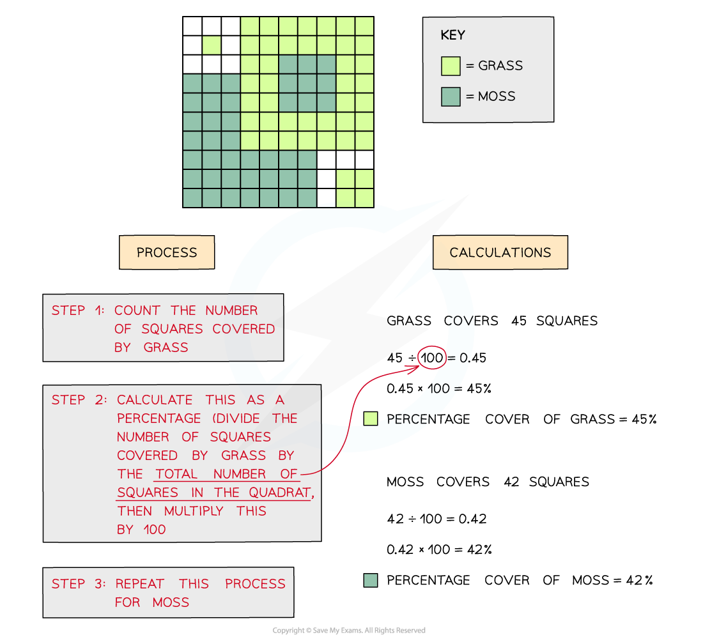
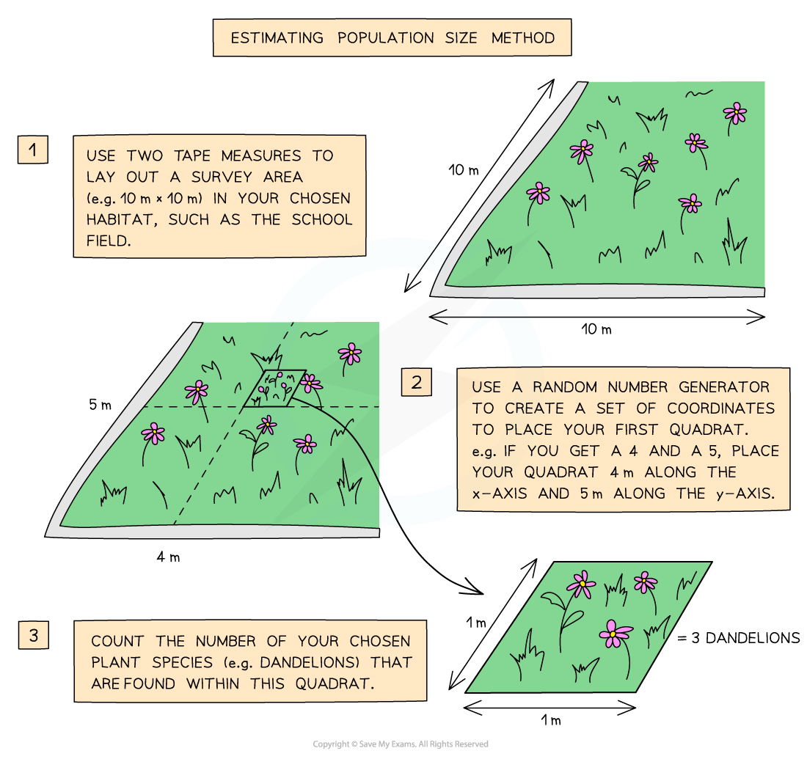
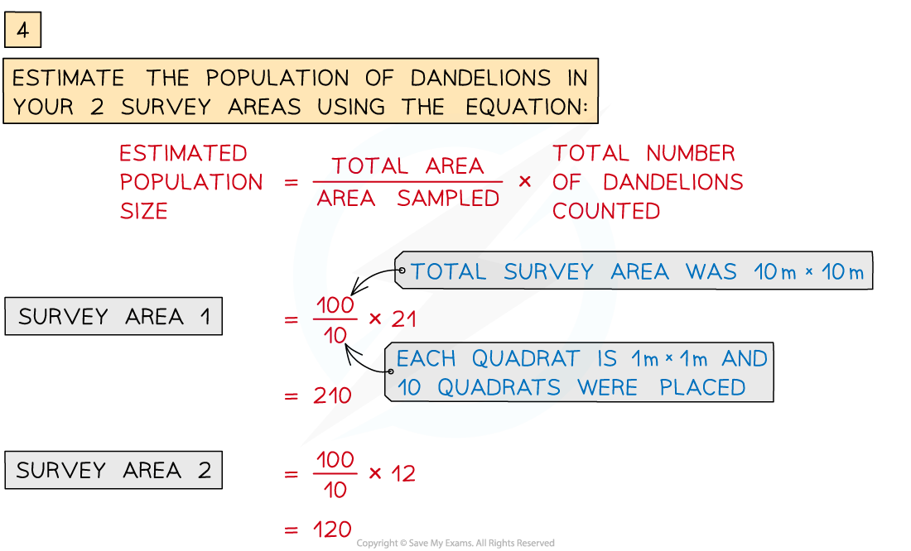

# Practical: Investigating Population Size

## Practical: Investigating Population Size

> **Spec point** — `spcpt_9V2VXDc8V3vSBsrN` · practical: investigate the population size of an organism in two different areas using quadrats

## Practical: Investigating Population Size

- **Ecology **is the branch of biology that studies species **distribution, abundance**, **interactions between species,** and their interactions with the** abiotic environment**
- **Ecologists **investigate ecosystems, often using tools like** quadrats** to study population size

#### Quadrats

- Quadrats are **square frames** made of wood or wire
- They can be a variety of sizes, e.g. 0.25 m2 or 1 m2
- They are placed on the ground and the organisms within them are recorded
- **Plants species** are commonly studied using quadrats to estimate their **abundance**

***Quadrats are used to investigate population size or species distribution***

- Quadrats can be used to measure abundance by recording:

  - the **number of individuals** of a single species, e.g. buttercups
  - **species richness**: the number of different species present
  - **percentage cover**: the approximate percentage of the quadrat area in which an individual species is found
  
    - this method is used when it is difficult to count individuals of the plant species being recorded, e.g. grass or moss

***Percentage cover can be assessed using a quadrat***

### Investigating population size in two different areas using quadrats

#### Apparatus

- 2 tape measures
- Quadrat
- Random number generator
- Species key

#### Method

**The population size of a plant species in a survey area can be estimated using quadrats**

#### Results

- Once the results have been collected and the averages calculated, we can **compare the abundance of the species **in each survey area
- Species abundance is likely to be influenced by **biotic factors** such as:

  - competition
  - predator-prey relationships
  - interactions with other organisms within the food chain or food web
- The abundance will also be influenced by **abiotic factors **such as:

  - light intensity
  - mineral availability
  - water availability
  - pH
  - temperature
  - salinity

#### Limitations

- It can be easy to **miss individual organisms** when counting in a quadrat, especially if they are covered by a different species

  - Solution: Use a **pencil** or stick to carefully **move leaves out of the way** to check if there is anything else underneath
- **Identifying species** may be tricky

  - Solution: Use a **species key** to identify the species

> **Exam Hint**
> Take care with your spelling of the word 'quadrat' it is commonly written as 'quadra**nt' **by students in examinations**.**
