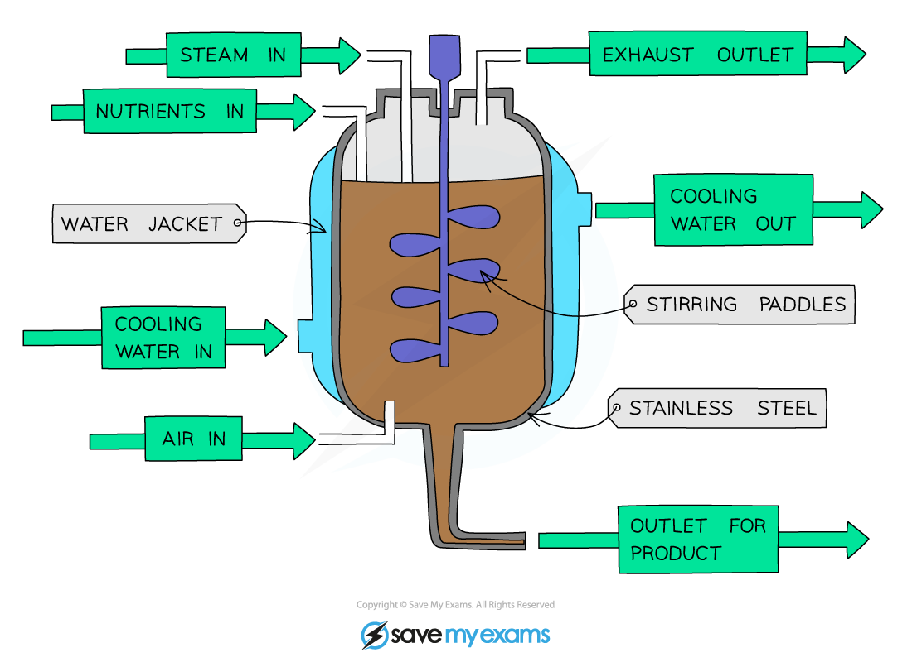

# Industrial Fermenters

## Industrial Fermenters

> **Spec point** — `spcpt_z26s5H9gtK7vyZ7R` · understand the use of an industrial fermenter and explain the need to provide suitable conditions in the fermenter, including aseptic precautions, nutrients, optimum temperature and pH, oxygenation and agitation, for the growth of microorganisms

## Industrial Fermenters

- **Fermenters** are containers used to grow (‘**culture**’) microorganisms like bacteria and fungi in **large amounts**
- These can then be used for **making yoghurt **and** mycoprotein** and other processes not involving food, like producing **genetically modified bacteria **and** moulds that produce antibiotics** (e.g. penicillin)
- The advantage of using a fermenter is that **conditions can be carefully controlled** to produce large quantities of exactly the right type of microorganism

***A diagram of an industrial fermenter used to produce large quantities of microorganisms***

#### Controlling conditions in an industrial fermenter table

| **Condition** | **Why and how is it controlled?** |
|---|---|
| Aseptic precautions | Fermenter is cleaned by steam to kill microorganisms and prevent chemical contamination, which ensures only the desired microorganisms will grow |
| Nutrients | Nutrients are needed for use in respiration to release energy for growth and to ensure the microorganisms are able to reproduce |
| Optimum temperature | Temperature is monitored using probes and maintained using the water jacket to ensure an optimum environment for enzymes to increase enzyme activity (enzymes will denature if the temperature is too high or work too slowly if it is too low) |
| Optimum pH | pH inside the fermenter is monitored using a probe to check it is at the optimum value for the particular microorganism being grown. The pH can be adjusted, if necessary, using acids or alkalis |
| Oxygenation | Oxygen is needed for aerobic respiration to take place |
| Agitation | Stirring paddles ensure that microorganisms, nutrients, oxygen, temperature and pH are evenly distributed throughout the fermenter |
