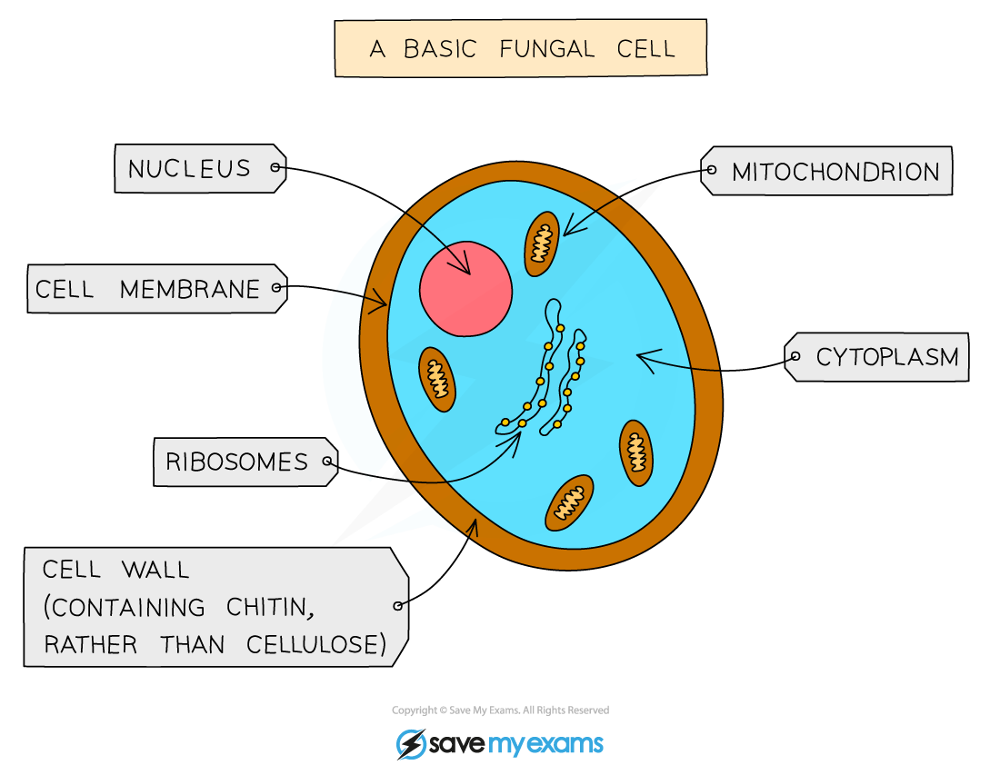
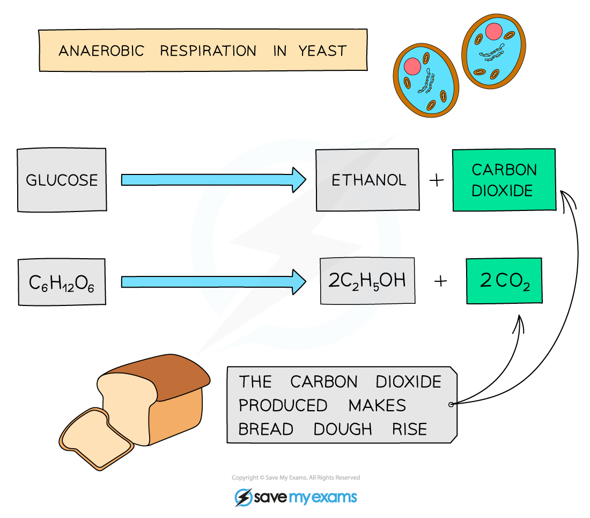

# Yeast in Food Production

## Yeast in Food Production

> **Spec point** — `spcpt_DXBrMq43jJZVS4x3` · understand the role of yeast in the production of food including bread

## Yeast in Food Production

- Microorganisms can be used by humans to produce foods and other useful substances
- One example of this is the **production of bread using yeast**
- Yeast is a** single-celled fungus** that can carry out both ***aerobic*** and ***anaerobic*** respiration

***Yeast is a single-celled fungus, similar to the one shown in the diagram above***

### Making bread

- During bread making yeast is added to bread dough
- The yeast produces **enzymes** that break down the **starch** in **flour**, releasing **sugars** that can be used by the yeast in respiration

  - The yeast begin to respire aerobically but will **switch to anaerobic respiration** when oxygen runs out
- When yeast carries out **anaerobic respiration** it produces **alcohol (ethanol)** and **carbon dioxide**
- The **carbon dioxide** produced by the yeast is trapped in small air-pockets in the dough, causing the dough to **rise **(increase in volume)
- The dough is then **baked** in a hot oven to form bread

  - During baking any **ethanol** produced by the yeast is **evaporated** in the heat, so bread doesn't contain any alcohol
- The yeast is killed by the high temperatures used during baking

  - This ensures there is no further respiration by the yeast

***The carbon dioxide produced by the anaerobic respiration of glucose is what makes bread dough rise***
