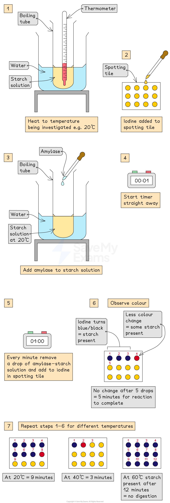

# Practical: Investigating Temperature & Enzyme Activity

## Practical: Enzymes & Temperature

> **Spec point** — `spcpt_bnZCC3m5jSRY5Wkg` · practical: investigate how enzyme activity can be affected by changes in temperature

## Practical: Enzymes & Temperature

- **Amylase** is an enzyme that digests **starch **into** maltose:**

  - Starch is a large biological molecule formed from many glucose molecules joined together
  - Maltose is a molecule formed from two glucose molecules joined together
- Iodine solution is used to test for the presence of starch:

  - Iodine solution has a yellow-brown colour
  - In the presence of starch, iodine solution changes colour from yellow-brown to blue-black
- The effect of temperature on the activity of the enzyme amylase can be investigated

#### Apparatus

- Spotting tile
- Measuring cylinder
- Test tube
- Syringe
- Pipette
- Stopwatch
- Water
- Thermometer
- Water bath
- Iodine solution
- Starch solution
- Amylase solution

#### Safety

- Both iodine solution and amylase solution can cause irritation to eyes - wear safety goggles
- Amylase solution can cause irritation to the skin - wear gloves
- Take care to avoid burns/scalding with very hot water - handle equipment with tongs

#### Method

- Add 5cm3** starch solution **to a test tube and heat in a beaker of water that has been heated with a Bunsen burner to a temperature of 20°C
- Add a drop of** iodine solution** to each of the wells of a spotting tile
- Use a syringe to add 2cm3 **amylase** to the starch solution  and mix. Start the timer
- After 1 minute, transfer a droplet of the amylase-starch solution to the first well of iodine solution on the spotting tile
- Repeat this transfer process every minute until the iodine solution **stops changing colour**

  - At this point, the amylase has broken down all the starch in the solution
- Record the time taken for the reaction to be completed by counting up to the first well where no change in colour of iodine has occurred
- Repeat the steps above at the same temperature at least 2 more times
- Repeat the investigation for a range of temperatures (eg. from 30°C to 60°C)

*Investigating the effect of temperature on enzyme activity*

#### Results and Analysis

- Amylase is an enzyme which **breaks down** **starch** into maltose

  - In the presence of starch, iodine changes colour from yellow-brown to blue-black
  - If there is no starch present (because it has been broken down into maltose) then iodine will not change colour, it will remain yellow-orange
- The less time it takes for all of the starch to be digested into maltose, the faster the activity of the enzyme amylase
- This investigation shows:

  - At the **optimum temperature**, the iodine stopped turning blue-black in the least amount of time
  
    - This is because the enzyme is working at its fastest rate and has digested all the starch in the solution
  - At **colder temperatures** (below optimum), the iodine took a longer time to stop turning blue-black
  
    - This is because the amylase enzyme is working slowly due to low kinetic energy and few collisions between the amylase and the starch
  - At **hotter temperatures** (above optimum) the iodine turned blue-black throughout the whole investigation
  
    - This is because the amylase enzyme has become denatured and so can no longer bind with the starch or break it down

#### Limitations

- One limitation of this investigation is that the temperature of the starch and amylase solutions may not have been kept constant. The method described above (heating water to different temperatures using a Bunsen burner) makes it difficult to maintain a stable and **precise** temperature, which affects the reliability of the results

  - An improvement would be to use **water baths** set to each temperature being investigated. The starch and amylase solutions should be placed in a water bath and allowed to reach the required temperature (checked using a thermometer) before being mixed. About **10 minutes** is usually enough time for the solutions to reach the temperature of the water bath
- Another limitation is **determining accurately when the starch has been fully digested** by amylase. Judging the colour change of iodine to show the presence or absence of starch relies on visual observation, which is subjective

  - An improvement would be to use a **colorimeter** to determine whether starch is still present in the solution
  - A colorimeter is a scientific instrument that measures the **intensity of colour** in a solution by **shining light through it** and detecting how much light passes through. This gives a **numerical reading** of colour intensity. A darker solution allows less light to pass through and gives a **lower light transmission reading** than a lighter solution
  - When amylase has broken down all of the starch into maltose, the **yellow-brown iodine** will no longer change colour.
  - *Note: You do not need to know what a colorimeter is for your exam, but using one in this investigation would provide more accurate and objective results.*

#### Applying CORMS to practical work

- CORMS can be used to plan an investigation on the effect of temperature on enzyme activity

***Using CORMS to plan an experiment to investigate the effect of temperature on enzyme activity***

- The CORMS for this experiment might look something like this:

  - **C** - changing the temperature
  - ***O**** - This is not relevant to this investigation*
  - **R** - repeat the investigation several times at each temperature for reliable results
  - **M1** - measure the time for the iodine to stop turning black
  - **M2** - by counting the number of spotting tiles
  - **S** - control the concentration and volume of starch solution, iodine and amylase used in the investigation

> **Exam Hint**
> Describing and explaining experimental results for enzyme experiments is a common type of exam question so make sure you understand what is happening and can relate this to changes in the active site of the enzyme when it has denatured, or if it is a **low temperature**, relate it to the amount of kinetic energy the molecules have.
