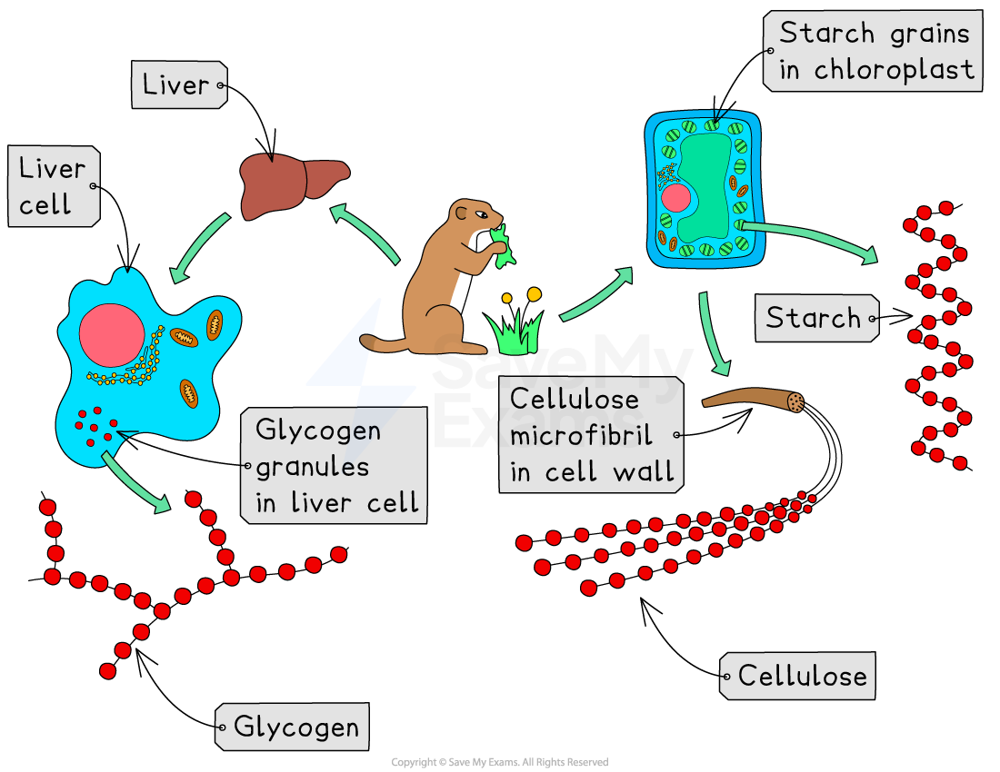
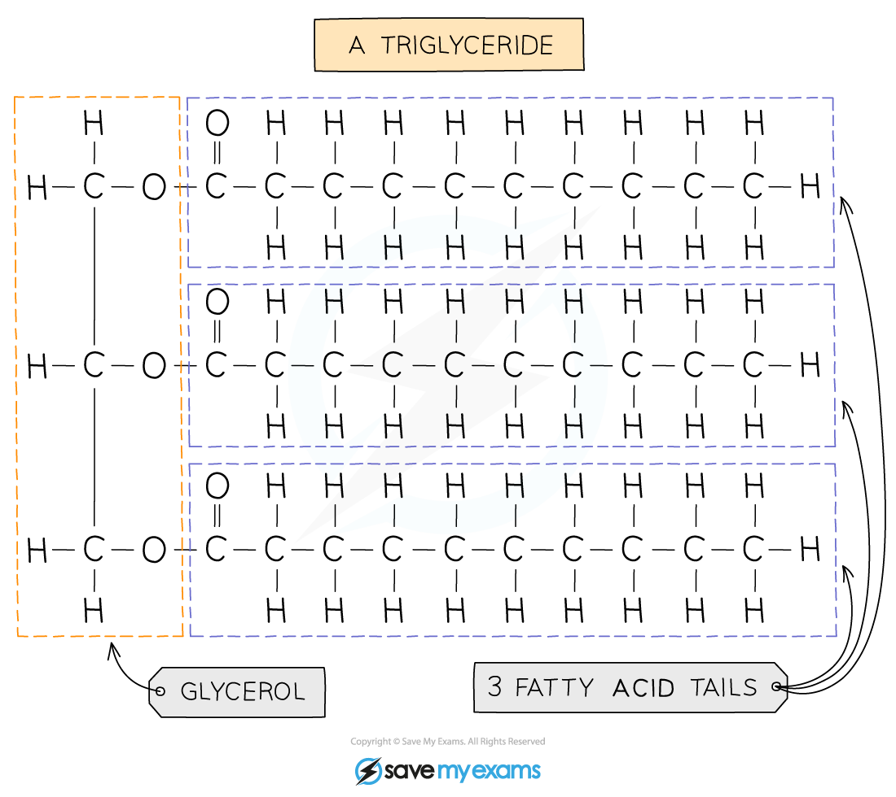
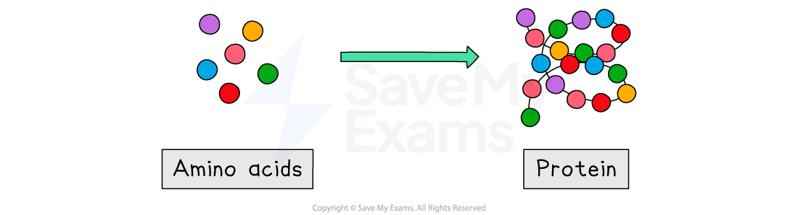

# Structure of Biological Molecules

## Chemical Elements

> **Spec point** — `spcpt_bgB6xmmzsRS8SyDf` · identify the chemical elements present in carbohydrates, proteins and lipids (fats and oils)

## Chemical Elements

- Most of the molecules in living organisms fall into three categories: **carbohydrates, proteins and lipids **(fats and oils)
- These **all contain carbon** and so are described as **organic **molecules

| Molecule | Chemical elements |
|---|---|
| Carbohydrate | Carbon (C), oxygen (O) and hydrogen (H) |
| Protein | All contain carbon (C), oxygen (O), hydrogen (H) and nitrogen (N) Some contain small amounts of other elements such as sulfur (S) |
| Lipid | Carbon (C), oxygen (O) and hydrogen (H) |

## Structure of Carbohydrates, Proteins & Lipids

> **Spec point** — `spcpt_sCwVvcmKQzybV7fH` · describe the structure of carbohydrates, proteins and lipids as large molecules made up from smaller basic units: starch and glycogen from simple sugars, protein from amino acids, and lipid from fatty acids and glycerol

## Structure of Carbohydrates, Proteins & Lipids

### Carbohydrates

- Carbohydrates contain the elements **carbon**, **hydrogen** and **oxygen**
- Carbohydrates can be **small**, **simple** sugars or more complex **larger** molecules

  - A monosaccharide is a **simple** sugar e.g. **glucose **(C6H12O6)
  - A disaccharide is made when **two** monosaccharides join together, e.g.** maltose** is formed from **two glucose **molecules joined together
  - A **large** polysaccharide is formed when **lots** of monosaccharides join together
  
    - **Starch, glycogen or cellulose** are all formed when **lots** **of simple glucose** molecules join together
    - Polysaccharides are insoluble and therefore useful as storage molecules

*Glycogen, cellulose and starch are all made from glucose molecules. Glycogen is also found in animal muscle cells. *

> **Exam Hint**
> You don't need to know the terms monosaccharide, disaccharide and polysaccharide for your exam, but you do need to know that **starch** and **glycogen** are **large molecules** formed from **many glucose molecules** (a simple sugar)  joined together. 
> 
> There is also a difference in how plants and animals store glucose: **plants** store **glucose** as **starch molecules**, whereas **animals** store glucose as **glycogen** **molecules**. Take care not to confuse the two!

### Lipids

- **Lipids**, like carbohydrates and proteins, are large molecules made up of smaller basic units: **glycerol** and **fatty acids**
- Lipids may be solid at room temperature (solid lipids are also known as **fats**) or liquid at room temperature** **(liquid lipids are also known as **oils** )

***One type of lipid found in the human body is a triglyceride; like all lipids it is formed from the smaller units glycerol and fatty acids joined together. ***

> **Exam Hint**
> You don't need to know the structure of a triglyceride, just that lipids are large molecules formed from the smaller units **glycerol** and **fatty acids**, and that lipids contain the chemical elements **carbon** (C), **hydrogen** (H) and **oxygen** (O).

### Proteins

- Proteins, like carbohydrates and lipids are large molecules formed from smaller molecules called **amino acids**
- When amino acids are joined together a **protein** is formed
- Amino acids can be arranged in any order, resulting in hundreds of thousands of different proteins

  - Each protein has a specific amino acid sequence which gives the overall protein molecule a particular** **shape; and the shape of a protein determines its function
  - Examples of proteins include ***enzymes***, ***haemoglobin*** and keratin (a protein found in hair)

*Amino acids join together to form proteins*

> **Exam Hint**
> You must be able to recall the **chemical elements** found in the three biological molecules on this page, as well as what the **smaller units** are for each molecule. This knowledge links to a later topic in the course - the [role of enzymes in human digestion ](https://www.savemyexams.com/igcse/biology/edexcel/19/revision-notes/2-structure-and-function-in-living-organisms/nutrition/role-of-digestive-enzymes/)- as all large biological molecules need to be broken down into their smaller units (by enzymes) so that they can be absorbed into the bloodstream.
