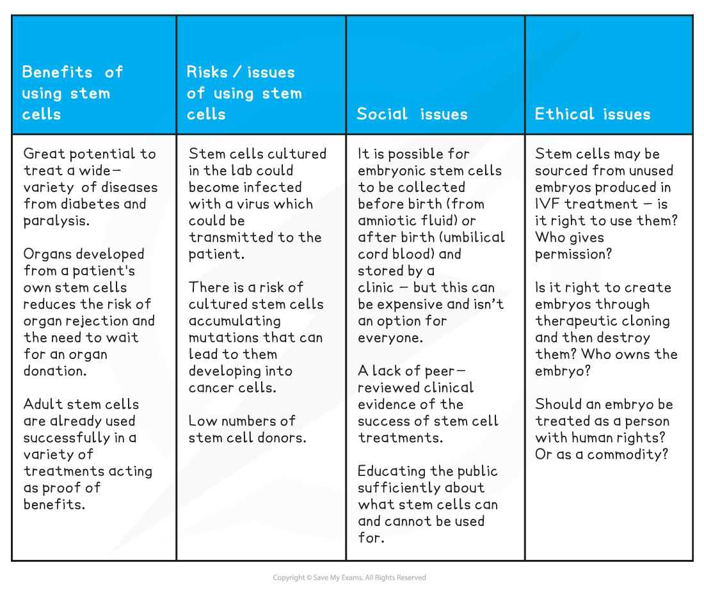

# Stem Cells in Medicine: Advantages & Disadvantages

## Stem Cells

> **Spec point** — `spcpt_bT43SCHCz2hTXCv8` · understand the advantages and disadvantages of using stem cells in medicine

## Stem Cells

- Stem cells are different from other cell types. A stem cell is an **undifferentiated cell** of an organism that is capable of dividing by mitosis an unlimited number of times
- When a stem cell divides by mitosis, the cells formed may remain  **undifferentiated** (these cells themselves can divide again to form more undifferentiated stem cells) **or **the cells formed may differentiate into  **specialised cells**

  - Cells that are undifferentiated have not specialised into a particular cell type to carry out a particular function
- In animals, **adult stem cells** are found in some tissues and organs (eg. the bone marrow). **Adult stem cells** can **differentiate into a limited number of specialised cell types**
- **Embryonic stem cells** are found only in **embryos**. They are different to adult stem cells because they can **differentiate into any cell type** to produce all of the tissues and organs in the developing organism

#### Types of Stem Cells Table

|   | Embryonic stem cells | Adult stem cells |
|---|---|---|
| Source | Embryos | Some tissues and organs in animals |
| Potential of cell | Can differentiate into all the different cell types | Can differentiate into a limited number of cell types |

## Stem Cells in Medicine

> **Spec point** — `spcpt_k4HSYj2gsvbwBYkb` · understand the advantages and disadvantages of using stem cells in medicine

## Stem Cells in Medicine

- Stem cells have the potential to be used in medicine to treat illnesses where cells in the body are not functioning properly and need replacing or repairing. This is known as stem cell therapy
- An advantage of using embryonic stem cells over adult stem cells for stem cell therapy is that embryonic stem cells can be used to make any cell type required in the body, whereas adult stem cells differentiate into fewer cell types
- However, there are ethical issues about growing embryos as a source of embryonic stem cells, because some people see human embryos as potential human lives and many people object to the killing of embryos to obtain embryonic stem cells for use in stem cell therapy

### Example of the use of stem cells in medicine

- Human blood cells are produced from adult stem cells in the bone marrow. The cells formed when these stem cells divide **can only differentiate into blood cells**: red blood cells, white blood cells and the cells that form platelets.
- A number of blood conditions can be treated using stem cells from bone marrow:

  - Red blood cells can be used to treat anaemia, caused by the blood not being able to transport enough oxygen around the body
  - White blood cells (e.g. phagocytes and lymphocytes) can be used in patients with a reduced immune system to improve their immunity
  - Platelets can be used to treat patients with blood clotting problems
- Stem cells taken from healthy donor bone marrow can be transplanted into a patient's bone marrow by doctors to treat these conditions.
- One disadvantage, however, is that as these cells contain different antigens (proteins on the cell surface) from the patient’s own cells, the patient has to take immunosuppressant drugs to prevent their immune system from rejecting the cells
- It is far more advantageous to use a patient's own stem cells if possible, because the cells formed from these stem cells will have the same genes and therefore antigens as the patient, so there would be no rejection by the patient's body
- There would be no need for the patient to take immunosuppressant drugs to prevent an immune response towards the cells formed from a donor’s cells

### Evaluating the use of stem cells in medicine

- There are many benefits and risks associated with using stem cells in medicine, as well as considerable ethical and social concerns

#### Evaluating Stem Cells in Medicine Table

> **Exam Hint**
> - There is a lot of information here. You do not need to recall specific examples of disorders/diseases that can be treated with stem cells, but you do need to be able to describe what a stem cell is and the differences between embryonic stem cells and adult stem cells
> - You also need to know the advantages and disadvantages of using stem cells in medicine to treat diseases
> 
>   - The main issue with embryonic stem cells is that they can only be sourced from embryos, which many people ethically object to scientists growing in the lab as they are viewed as a potential human life
>   - The main disadvantage of adult stem cells is that adult stem cells can only form a limited range of cell types, and if sourced from a donor they may be rejected by a patient because the antigens on cells produced from donor cells will differ to the patients’ own, which is why using stem cells from the patient is better
