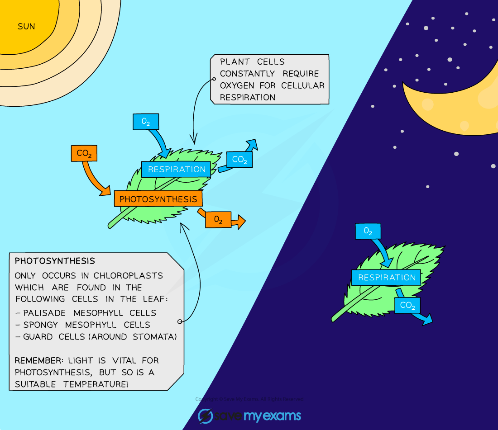

# Gas Exchange: Night vs Day

## Gas Exchange: Night vs Day

> **Spec point** — `spcpt_sq6ksStFbpKZPvGZ` · understand how respiration continues during the day and night, but that the net exchange of carbon dioxide and oxygen depends on the intensity of light

## Gas Exchange: Night vs Day

- Plants can only photosynthesise when they have sufficient **light**, however, the cells of plants respire all the time
- This means that gas exchange in plants **varies** throughout a 24 hour period
- During the **day** plants both** respire and photosynthesise**

  - The rate of photosynthesis tends to be **higher** than the rate of respiration (unless light intensity is low)
  - Therefore there is a **net diffusion** of carbon dioxide** into** the plant and a net diffusion of oxygen **out** of the plant during the day
- During the **night**, plants only **respire**

  - This means that there is a **net movement** of oxygen **into** the plant and a net diffusion of carbon dioxide **out** of the plant during the nighttime
- At **low light intensities**, the rate of photosynthesis is **equal** to the rate of respiration

  - This means that there is **no net movement** of oxygen or carbon dioxide in either direction

***Plants photosynthesise and respire during the day but only respire at night time***
