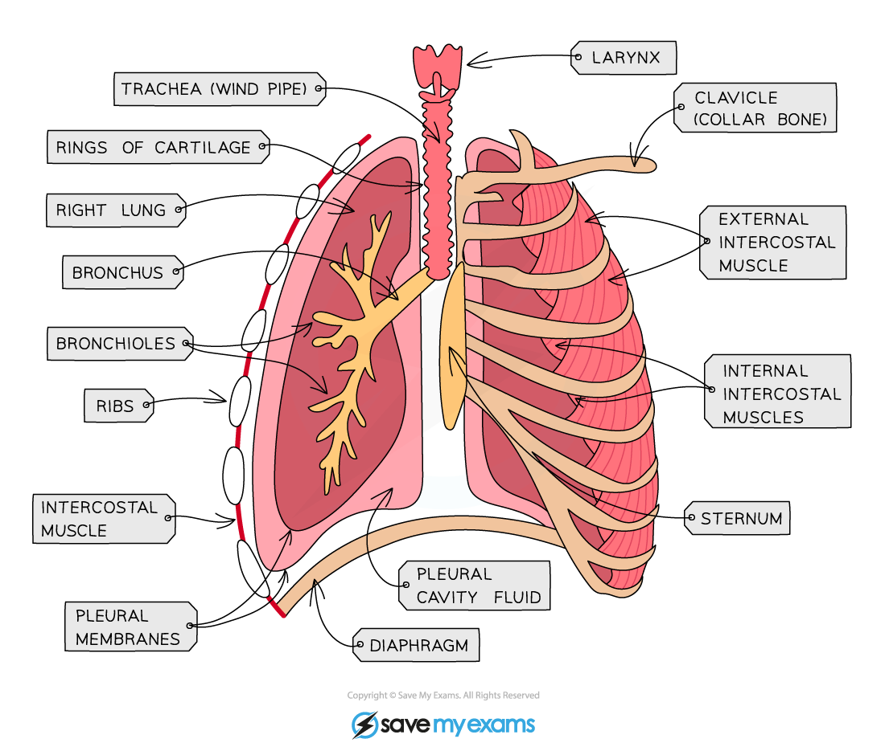
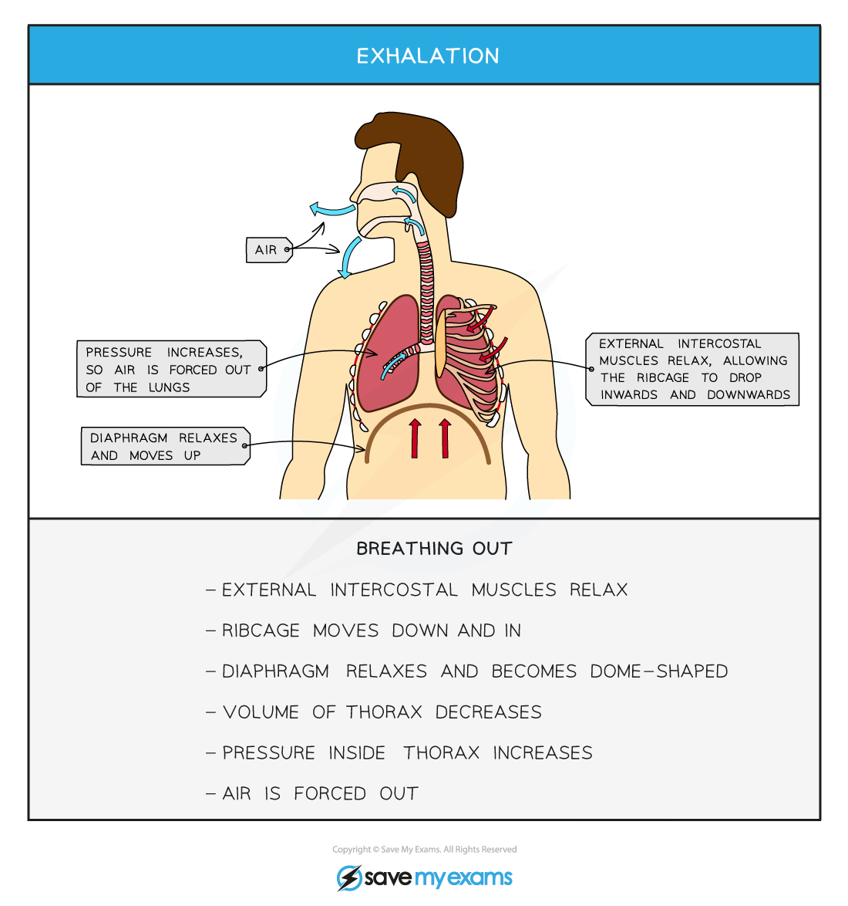

# Role of the Intercostal Muscles & Diaphragm

## Intercostal Muscles & Diaphragm

> **Spec point** — `spcpt_JQ5xCyDwfBvfX2NY` · understand the role of the intercostal muscles and the diaphragm in ventilation

## Intercostal Muscles & Diaphragm

- Muscles are only able to pull on bones, not push on them
- This means that two sets of **intercostal muscles** work *antagonistically* to facilitate breathing

  - **External **intercostal muscles contract to pull the rib cage **up **during inhalation
  - **Internal** intercostal muscles contract to pull the ribcage **down **during forced exhalation
- The **diaphragm** is a thin sheet of muscle that separates the chest cavity from the abdomen and also facilitates in the breathing process

***There are two sets of intercostal muscles: the external, on the outside of the rib cage, and the internal, on the inside of the rib cage. The diaphragm also works with these to facilitate breathing.***

### Ventilation

- **Inhalation** (breathing air in)

  - The **diaphragm** **contracts** and flattens
  - The **external intercostal muscles contract **to pull the ribs **up and out**
  - This **increases the volume** of the chest cavity, or thorax
  - There is a **decrease in air pressure** inside the lungs relative to outside the body
  - Air is** drawn in**
- Normal **exhalation** (breathing air out)

  - The **diaphragm** **relaxes** and moves upwards back into its domed shape
  - The external **set of intercostal muscles relax** so the ribs **drop** **down and inwards**
  - This **decreases the volume** of the chest cavity
  - There is an **increase in air pressure** inside the lungs relative to outside the body
  - Air is **forced out**

***Changes in the thorax during ventilation***

#### Forced exhalation

- The external and internal intercostal muscles work as **antagonistic** pairs
- When we need to increase the rate of gas exchange, e.g. during strenuous activity, the internal intercostal muscles will also work to** pull the ribs down and in**; this decreases the volume of the thorax further, forcing air out more quickly – this is called **forced exhalation**

  - There is a greater need to rid the body of increased levels of carbon dioxide produced during strenuous activity
- This allows a **greater volume of gases to be exchanged**

> **Exam Hint**
> You may see the terms **inhalation/inspiration** (breathing in), and **exhalation/expiration** (breathing out). Both sets of terms mean exactly the same thing, so don’t let them confuse you!
> 
> The sequence of events during ventilation is a common exam question and you should be able to **explain in detail** what is happening to the external and internal intercostal muscles, the rib cage, the diaphragm, the volume and the pressure-volume of the lungs when breathing in and out. Remember, if you learn one, the other is almost exactly the opposite.
