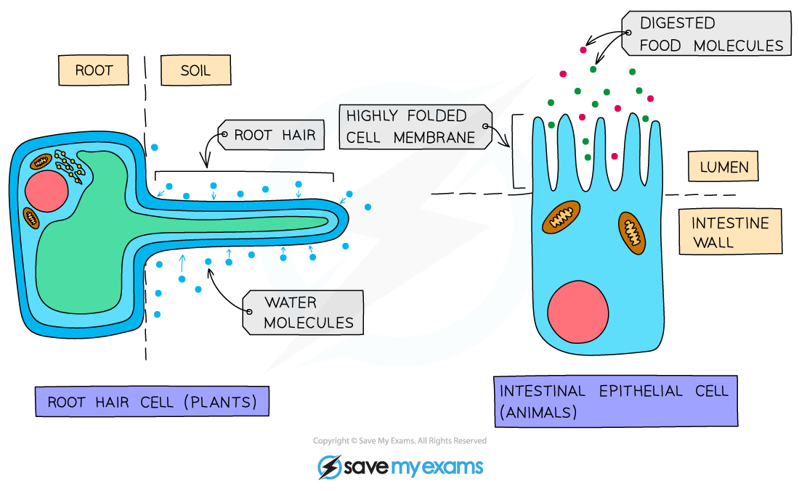
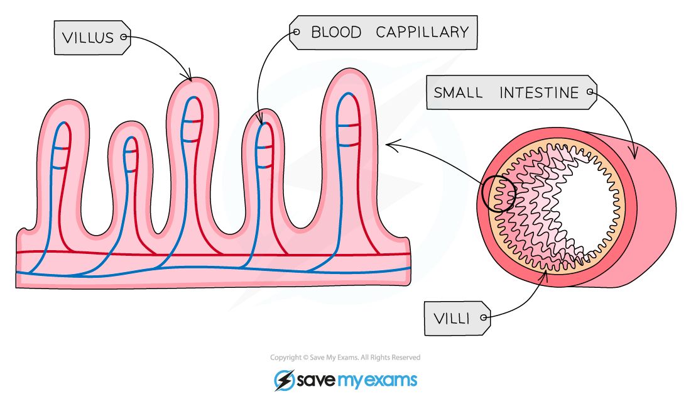
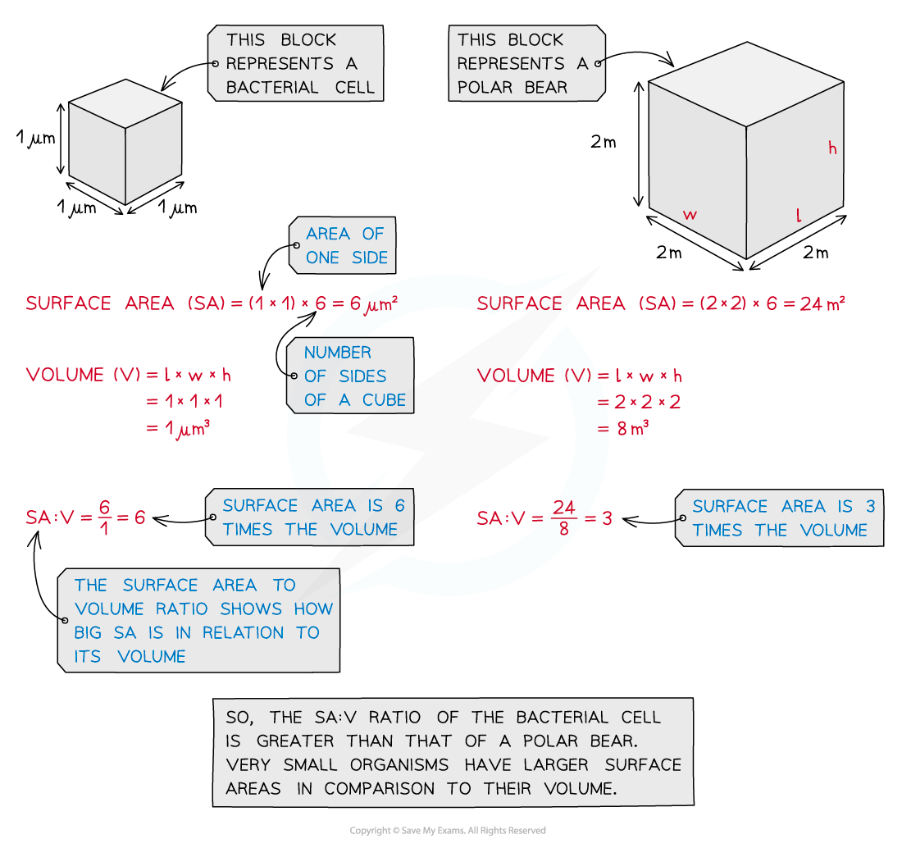

# Factors Affecting the Rate of Movement of Substances

## Factors that Influence Diffusion

> **Spec point** — `spcpt_P7XcJbnscnzgWCQK` · understand how factors affect the rate of movement of substances into and out of cells, including the effects of surface area to volume ratio, distance, temperature and concentration gradient

## Factors that Influence Diffusion

- The movement of substances like oxygen and carbon dioxide into and out of cells happens mainly by **diffusion**
- The rate of diffusion in organisms depends on several factors**, including surface area to volume ratio, distance, temperature** and **concentration gradient**

#### Surface area to volume ratio

- Surface area refers to the total area of the surface through which substances can diffuse
- As a **cell** or **organism** **increases** in size, its **surface area to volume ratio decreases**

  - This means there is less surface area available for each unit of volume, so diffusion alone becomes less efficient at supplying cells with essential substances and removing waste products
  - To overcome this, larger organisms have evolved specialised exchange surfaces (such as alveoli in the lungs or villi in the small intestine) that increase surface area and often have thin walls and good blood supply to maintain a steep concentration gradient for efficient diffusion
- In addition, many cells which are adapted for diffusion have **increased surface area** in some way - e.g. root hair cells in plants (which absorb water and mineral ions) and cells lining the ileum in animals (which absorb the products of digestion)

***Cell adaptations for diffusion***

***The highly folded surface of the small intestine increases its surface area***

- You should be able to **calculate and compare** surface area to volume ratios
- You can model the effect of how increasing size affects surface area to volume ratio using simple cubes:

***Calculating the surface area to volume ratio***

#### Diffusion distance

- The **shorter the distance** that molecules have to travel, the **faster diffusion can occur**

  - This is why **alveoli** in the lungs and **capillary walls** are only **one cell thick** — to **minimise the diffusion distance** for gases
  - A shorter diffusion distance allows **oxygen and carbon dioxide** to diffuse **rapidly and efficiently** between the air in the alveoli and the blood in the capillaries

#### Temperature

- The **higher** the temperature, the** faster** molecules move as they have more kinetic energy
- This results in more collisions against the cell membrane and therefore a faster rate of movement across them

#### Concentration gradient

- The **greater the difference** in concentration on either side of the membrane, the **faster** movement across it will occur
- This is because on the side with the higher concentration, more random collisions against the membrane will occur

#### Summary of Diffusion Factors Table

| **Factor** | **How it affects diffusion** |
|---|---|
| **Concentration gradient** | The greater the difference in concentration between two regions, the faster the overall rate of diffusion |
| **Temperature** | The higher the temperature, the more kinetic (movement) energy the particles of that substance will have  They will move/spread faster, compared to at a lower temperature when they have less kinetic energy |
| **Surface area to volume ratio** | The larger the surface area relative to volume, the faster the overall rate of diffusion, because more particles can diffuse across the surface at the same time and diffusion can reach more of the volume efficiently |

> **Exam Hint**
> You should have carried out investigations into the factors that influence the rate of diffusion and as so should be able to use the information above to **explain experimental results** in an exam. You should also be able to **plan and carry out an experiment** to investigate the effect of one of these factors.
