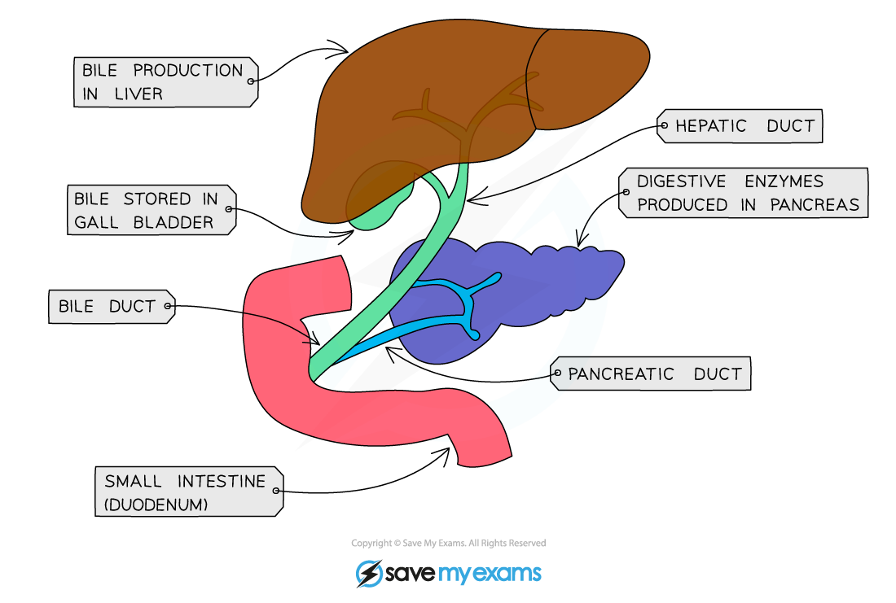
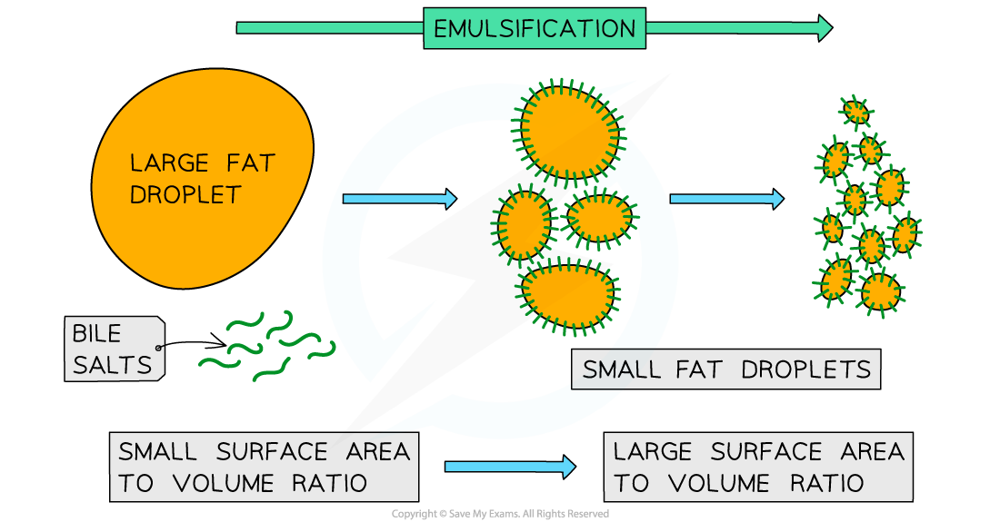

# Bile

## Bile Production & Storage

> **Spec point** — `spcpt_BNGcTmMW8Cmh3sDh` · understand that bile is produced by the liver and stored in the gall bladder

## Bile Production & Storage

- Bile is an **alkaline** substance produced by cells in the** liver**
- Before being released into the **small intestine**, bile is stored in the **gall bladder**

***Bile production and secretion***

> **Exam Hint**
> **Bile** contains **bile salts**, which **emulsify lipids**. In exam answers, it is usually acceptable to say that “bile emulsifies lipids,” but the molecule responsible is actually the bile salts.

## The Role of Bile

> **Spec point** — `spcpt_GrScbmK7jynWpnfD` · understand the role of bile in neutralising stomach acid and emulsifying lipids

## The Role of Bile

- Bile has two main roles:

  1. **Neutralising** the **hydrochloric acid** from the stomach
  
    - The **alkaline **properties of bile allow for this to occur
    - This neutralisation is essential as enzymes in the small intestine have a higher (more alkaline) **optimum pH** than those in the stomach
  2. **Breaking apart large drops of lipids (fats) into smaller ones **(and so increasing their surface area)
  
    - This is known as **emulsification**
- The more** alkaline conditions** and **larger surface area** allows **lipase** to chemically break down the lipid molecules into **glycerol** and **fatty acids** at a faster rate

***Bile salts break large lipid droplets into smaller ones with a larger surface area***

> **Exam Hint**
> Emulsification is the equivalent of tearing a large piece of paper into smaller pieces of paper. This is an example of **mechanical digestion**, not chemical digestion – breaking something into smaller pieces does not break bonds or change the chemical structure of the molecules which make it up, which is the definition of chemical digestion.
