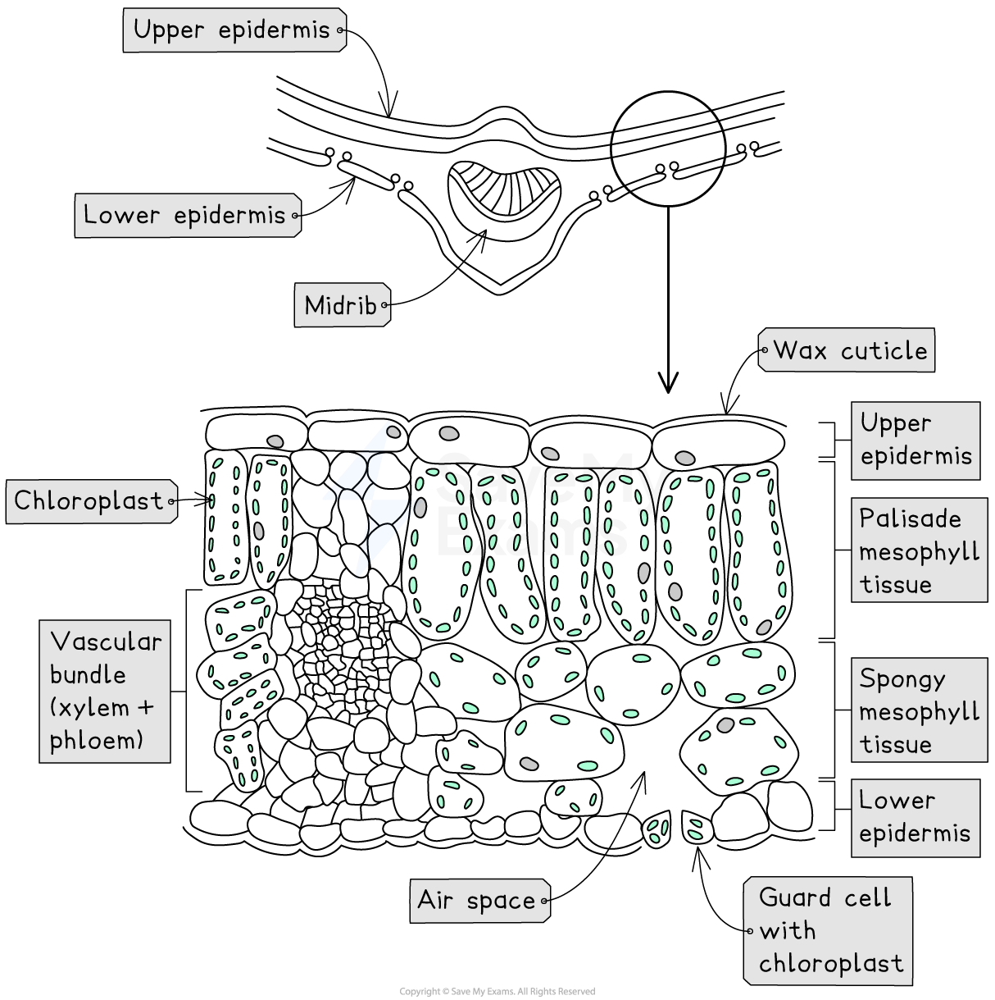

# Leaf: Structure & Adaptations

## Leaf Structure

> **Spec point** — `spcpt_rTMwpzWb5tvQWtfS` · describe the structure of the leaf and explain how it is adapted for photosynthesis

## Leaf Structure

- Plant leaves have complex structures with** layers of different tissues **containing specially adapted cells
- The table below describes the different structures in a leaf and their functions

#### Leaf structures table

| **Structure** | **Description** |
|---|---|
| Wax cuticle | Protective layer on upper and lower sides of the leaf, prevents water loss |
| Upper epidermis | Thin and transparent to allow light to enter palisade mesophyll layer underneath it |
| Palisade mesophyll | Column-shaped cells tightly packed with chloroplasts to absorb more light, maximising photosynthesis |
| Spongy mesophyll | Contains internal air spaces that increase the surface area to volume ratio for the diffusion of gases (mainly carbon dioxide) |
| Lower epidermis | Contains guard cells and stomata |
| Guard cell | Absorbs and loses water to open and close the stomata to allow carbon dioxide to diffuse in, oxygen to diffuse out |
| Stomata | Where gas exchange takes place: opens during the day, closes during the night. Evaporation of water also takes place from here. In most plants, more stomata are found on the underside of the leaf to reduce water loss |
| Vascular bundle | Contains xylem and phloem to transport substances to and from the leaf |
| Xylem | Transports water into the leaf for mesophyll cells to use in photosynthesis and for transpiration from stomata |
| Phloem | Transports sucrose and amino acids around the plant |

*Diagram showing the cross-section of a leaf*

- Leaves are adapted for photosynthesis:

  - Leaves have a **large surface area** to increase the area for the diffusion of carbon dioxide and absorption of light for photosynthesis
  - Leaves are **thin**, which allows carbon dioxide to diffuse to palisade mesophyll cells quickly
  - Cells in the leaf have chloroplasts which contain **chlorophyll; **chlorophyll absorbs light energy required for photosynthesis to take place
  - The network of **veins** in the leaf allows the **transport of water** to the cells of the leaf and **carbohydrates** from the leaf for photosynthesis (water is used for photosynthesis, and carbohydrates are a product of photosynthesis)
  - **Stomata** in the leaf allow carbon dioxide to diffuse into the leaf and oxygen to diffuse out
  - The **epidermis is thin and transparent**, allowing more light to reach the palisade cells
  - The **thin cuticle made of wax** protects the leaf without blocking sunlight
  - The palisade cell layer at the top of the leaf maximises the absorption of light as it will hit the chloroplasts in the cells directly
  - The spongy layer contains** air spaces that allow carbon dioxide to diffuse** through the leaf, increasing the surface area for exchange
