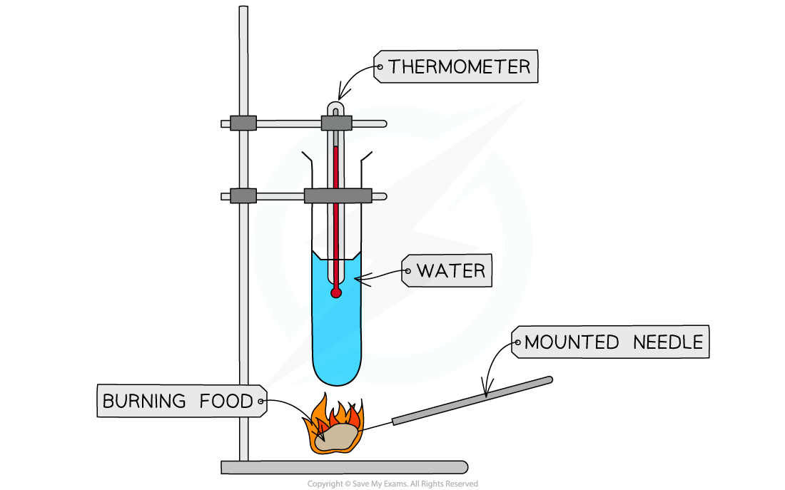

# Practical: Energy Content of a Food Sample

## Practical: Energy Content of a Food Sample

> **Spec point** — `spcpt_JzPvq8FBXYr5FKbN` · practical: investigate the energy content in a food sample

## Practical: Energy Content of a Food Sample

We can investigate the energy content of food in a simple calorimetry experiment

### Apparatus

- Boiling tube
- Boiling tube holder
- Bunsen burner
- Mounted needle
- Measuring cylinder
- Balance/scales
- Thermometer
- Water
- Food samples

### Method

- Use the measuring cylinder to measure out 25 cm3 of **water** and pour it into the boiling tube
- Record the **starting temperature** of the water using the thermometer
- Record the** mass** of the food sample
- Set fire to the sample of food using the bunsen burner and hold the sample 2 cm from the boiling tube until it has **completely burned**
- Record the **final temperature** of the water
- **Repeat** the process with different food samples

  - E.g. popcorn, nuts, crisps

#### Investigating the energy content of food samples diagram

***Different food samples can be burned in a simple calorimetry experiment to compare the energy contents of the samples***

### Results

- The** larger the increase** **in water temperature**, the **more energy** is stored in the sample
- We can calculate the energy in each food sample using the following equation:

`text energy transferred per gram of food  end text open parentheses J close parentheses space equals space fraction numerator text mass of water  end text open parentheses g close parentheses thin space cross times space text temperature increase end text space open parentheses degree C close parentheses thin space cross times space 4.2 over denominator text mass of food sample end text space open parentheses g close parentheses end fraction`

- 4.2 kJ is the specific heat capacity of water, meaning that it is the energy required to raise 1 kg of water by 1 °C
- 1 cm3 of water has a mass of 1 g

#### The energy content of food samples table

| **Food sample** | **Mass of water / g** | **Mass of food / g** | **Initial water temperature / °C** | **Final water temperature / °C** | **Change in water temperature / °C** | **Energy transferred per gram of food (J/g)** |
|---|---|---|---|---|---|---|
| Popcorn | 25 | 8.5 | 20.5 | 31.2 | 10.7 | 132.2 |
| Walnut | 25 | 8.1 | 20.4 | 34.1 | 13.7 | 177.6 |

### Limitations

- **Incomplete burning** of the food sample

  - Some food may not burn completely, so not all of the energy of the food is released
  - Solution: relight the food sample until it no longer lights up
- **Heat energy loss** to the surroundings

  - Some of the energy from the burning food escapes into the air instead of heating the water
  - This can make the calculated energy values lower than the true values
- **Ways to reduce heat loss:**

  - Simple improvements:
  
    - Keep the boiling tube close to the burning food (but safely)
    - Use a piece of aluminium foil around the tube to reduce heat loss
  - An alternative is to use a **calorimeter**:
  
    - A calorimeter is a piece of equipment that captures almost all of the heat released when food burns
    - Instead of burning food in open air to heat water in a boiling tube, the food is burned inside the calorimeter
    - This reduces heat lost to the surroundings and transfers more of the food’s energy to the water. As a result, the calculated energy content (from measuring the temperature change in the water) is more accurate and closer to the true energy stored in the food
