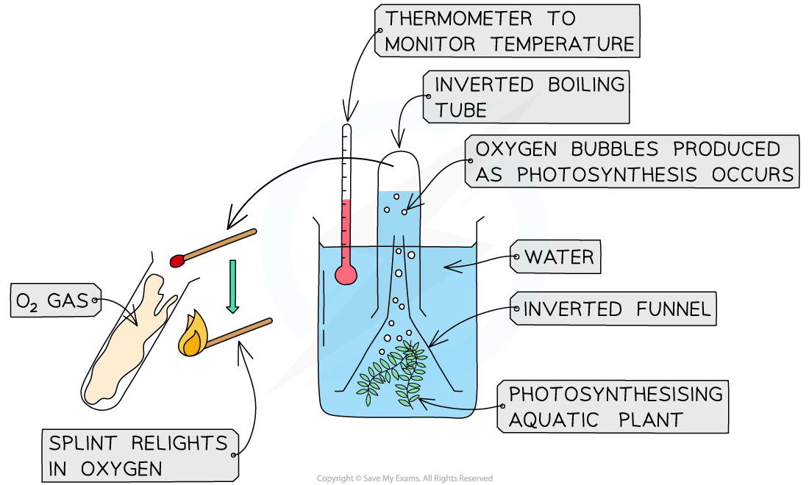
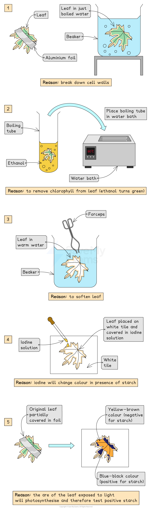
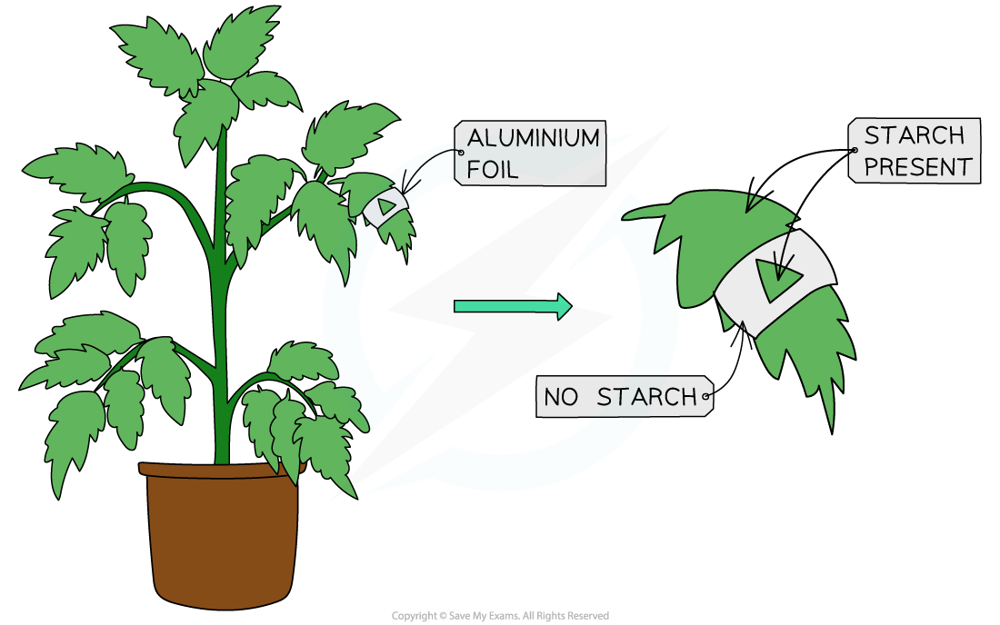
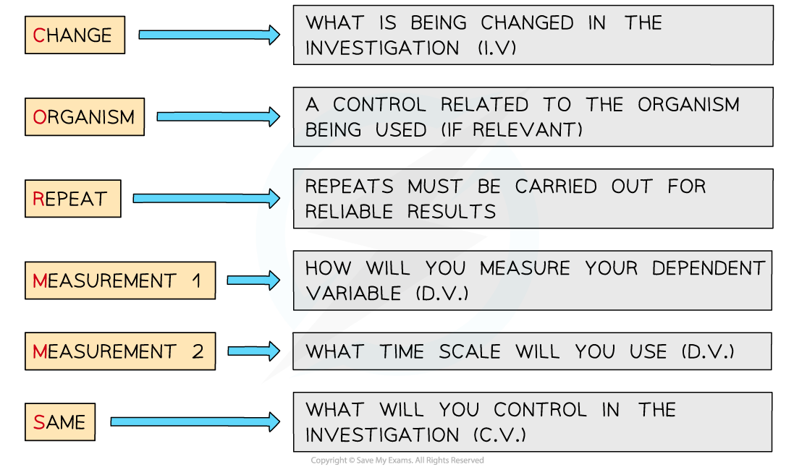
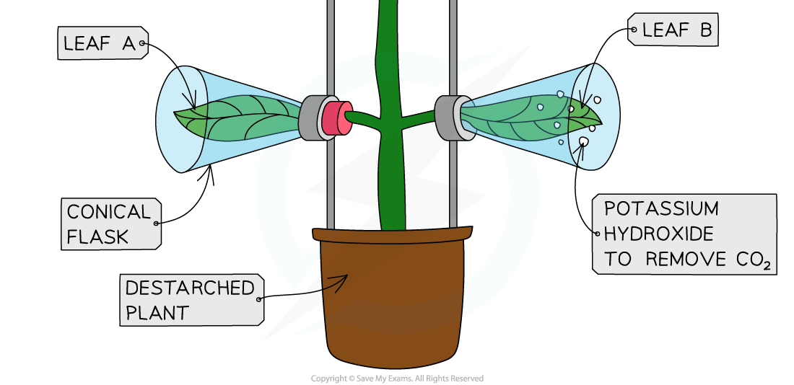

# Practical: Investigating Photosynthesis

## Practical: Evolution of Oxygen

> **Spec point** — `spcpt_3yD9TY5SbVxxTytr` · practical: investigate photosynthesis, showing the evolution of oxygen from a water plant, the production of starch and the requirements of light, carbon dioxide and chlorophyll

## Practical: Evolution of Oxygen

- We can demonstrate the evolution of oxygen (from the process of photosynthesis) using a water plant such as ***Elodea***
- As photosynthesis occurs, **oxygen gas produced is released **
- As the plant is in water, the oxygen released can be seen as **bubbles** leaving the cut end of the pondweed

#### Apparatus

- Beaker
- Pondweed
- Funnel
- Boiling tube
- Splint
- Bunsen burner (for the oxygen test)
- Heat proof mat

#### Method

- Take a bundle of shoots of a type of pondweed
- Submerge them in a beaker of water underneath an upturned funnel
- Fill a boiling tube with water and place it over the end of the funnel
- As oxygen is produced, the bubbles of gas will collect in the boiling tube and displace the water

#### Results and analysis

- Show that the gas collected is oxygen by **relighting a glowing splint**
- The **quantity of bubbles / volume of oxygen** can also be measured in order to investigate the** rate** of photosynthesis over a certain amount of time

***Experiment to show the evolution of oxygen from a water plant***

## Practical: Investigating Light & Photosynthesis

> **Spec point** — `spcpt_zs9P6gVPtdcJsJqm` · practical: investigate photosynthesis, showing the evolution of oxygen from a water plant, the production of starch and the requirements of light, carbon dioxide and chlorophyll

## Practical: Investigating Light & Photosynthesis

- Although plants synthesise glucose during photosynthesis, their **leaves cannot be tested for its presence** as the glucose produced is quickly used up, converted into other substances and transported or stored as starch
- Starch is stored in the chloroplasts where photosynthesis occurs so **testing a leaf for starch** is a reliable indicator of which parts of the leaf are photosynthesising

#### Apparatus

- A plant
- Aluminium foil
- Safety goggles
- Beakers
- Boiling tubes
- Water bath/kettle
- Forceps
- Ethanol
- Iodine solution
- White tile

### Investigating the requirement for light in photosynthesis

- Before testing for starch, complete the following procedure:

#### Method Part 1 - Preparing the leaf to be tested

- **De-starch **the plant by placing it in a dark cupboard for 24 hours

  - This ensures that **any starch already present in the leaves will be used up** and will not affect the results of the experiment
- Following de-starching, **partially cover a leaf of the plant with aluminium foil** and place the plant in sunlight for a day
- Remove the covered leaf and test for starch using the method below

#### Method Part 2 - Testing the leaf for starch

- Safety notes:

  - Ethanol is highly flammable and must be kept away from naked flames. Use a water bath or a beaker of water boiled in a kettle instead of a Bunsen burner to heat ethanol
  - Safety goggles must be worn when handling ethanol and iodine solution
  - Handle hot liquids carefully
- Remove the foil from the leaf and drop the leaf in a beaker of just **boiled water **for 5 minutes

  - This **denatures enzymes **and** softens the leaf**
- Using forceps, transfer the leaf to a boiling tube and add enough **ethanol **to cover the leaf. Place the boiling tube in a beaker of hot water or in a water bath for 5-10 minutes, or until all of the green colouring (chlorophyll) has been removed from the leaf

  - Placing the leaf in boiling ethanol **removes the chlorophyll** so colour changes from iodine can be seen more clearly
- Using forceps, place the leaf in a beaker of warm water

  - This softens the leaf tissue after being in ethanol
- Using forceps, spread the leaf out on a white tile and cover it with **iodine solution**

#### Results and analysis

- When tested for starch, a green leaf fully exposed to light should turn **blue-black** as photosynthesis is occurring in all areas of the leaf
- The area of the leaf that was covered with aluminium foil will **remain yellow-brown** as it did not receive any sunlight and **could not photosynthesise**, while the area exposed to sunlight will turn **blue-black**

  - When the cells of the leaf can't photosynthesise they break down starch to use the glucose for respiration
- This proves that light is necessary for photosynthesis and the production of starch

***Photosynthesis cannot occur in sections of the leaf where light cannot reach the chloroplasts***

- In the experiment example shown above, after testing for starch the majority of the leaf would appear blue-black, however there would be a strip of orange-brown with a blue-black triangle in the centre

#### Safety

- Care must be taken when carrying out this practical as **ethanol is extremely flammable**
- The safest way to heat the ethanol is to use an electric water bath or water from a just-boiled kettle

#### Applying CORMS evaluation to practical work

- When designing a practical investigation, remember to consider CORMS

***CORMS evaluation***

- In this investigation, the CORMS should look something like this:

  - **C** - changing whether there is light or no light onto the leaf
  - **O** - leaves will be taken from the **same** plant or **same** species, age and size of the plant
  - **R** - repeat the investigation several times to ensure our results are reliable
  - **M1** - observe the colour change of the leaf when iodine is applied
  - **M2** - ...after 1 day
  - **S** - control the temperature of the room

> **Exam Hint**
> Remember that when using CORMS you must make sure to use the word **same** when stating your Organism e.g. **same** species. Then you have to pick a different factor for your Same part of the answer. There are often two marks available for listing two different control variables for the Same part of the answer.

## Practical: Investigating Carbon Dioxide & Photosynthesis

> **Spec point** — `spcpt_NcGJcyn58kHJrgTC` · practical: investigate photosynthesis, showing the evolution of oxygen from a water plant, the production of starch and the requirements of light, carbon dioxide and chlorophyll

## Practical: Investigating Carbon Dioxide & Photosynthesis

- The **iodine test for starch** can be used to investigate the requirement for **carbon dioxide** in photosynthesis
- Before testing for starch, complete the following procedure:

#### Apparatus

- Conical flasks
- Potassium hydroxide solution
- Clamps
- Clamp stands
- A plant
- Beakers
- Bunsen burner
- Tripod
- Gauze platform
- Prongs
- Ethanol
- Safety goggles
- Iodine solution
- White tile

#### Method

- **De-starch **the plant by placing it in a dark cupboard for 24 hours

  - This ensures that **any starch already present in the leaves will be used up** and will not affect the results of the experiment
- Following de-starching, enclose one leaf with a conical flask containing **potassium hydroxide**

  - The potassium hydroxide will **absorb carbon dioxide** from the surrounding air
- Enclose another leaf with a conical flask containing **no potassium hydroxide** (control experiment)
- Place the plant in bright light for several hours
- Test both leaves for starch using **iodine solution**

  - Drop the leaf in boiling water
  - Transfer the leaf into hot ethanol in a boiling tube for 5-10 minutes
  - Rinse the leaf in cold water
  - Spread the leaf out on a white tile and cover it with iodine solution

***Experiment to test if carbon dioxide is needed for photosynthesis***

#### Results

- The leaf from the conical flask containing potassium hydroxide will **remain orange-brown** as it could not photosynthesise due to lack of carbon dioxide
- The leaf from the control conical flask not containing potassium hydroxide should turn **blue-black** as it had all necessary requirements for photosynthesis

#### Applying CORMS evaluation to practical work

- When working with practical investigations, remember to consider your CORMS evaluation

***CORMS evaluation***

- In this investigation, your evaluation should look something like this:

  - **C** - We are changing whether there is carbon dioxide or no carbon dioxide
  - **O** - The leaves will be taken from the **same **plant or **same **species, age and size of plant
  - **R** - We will repeat the investigation several times to ensure our results are reliable
  - **M1** - We will observe the colour change of the leaf when iodine is applied
  - **M2** - ...after 1 day
  - **S** - We will control the temperature of the room and the light intensity

## Practical: Investigating Chlorophyll and Photosynthesis

> **Spec point** — `spcpt_cJzbZYmyc2xDbjWm` · practical: investigate photosynthesis, showing the evolution of oxygen from a water plant, the production of starch and the requirements of light, carbon dioxide and chlorophyll

## Practical: Investigating Chlorophyll and Photosynthesis

- Starch is stored in chloroplasts where photosynthesis occurs so **testing a leaf for starch** is a reliable indicator of which parts of the leaf are photosynthesising
- This method can also be used to test whether chlorophyll is needed for photosynthesis by using a **variegated** leaf (one that is partially green and partially white)

#### Apparatus

- Beakers
- Leaf tissue (leaves must be **variegated**)
- Bunsen burner
- Tripod
- Gauze platform
- Prongs
- Ethanol
- Safety goggles
- Iodine solution
- White tile

#### Method

- Drop the leaf in **boiling water**

  - This **kills the tissue and breaks down the cell walls**
- Transfer the leaf into hot **ethanol** in a boiling tube for 5-10 minutes

  - This **removes the chlorophyll** so colour changes from iodine can be seen more clearly
- Rinse the leaf in cold water

  - This is done to soften the leaf tissue after being in ethanol
- Spread the leaf out on a white tile and cover it with **iodine solution**

#### Safety

- Care must be taken when carrying out this practical as **ethanol is extremely flammable, **so at that stage of the experiment, the Bunsen burner should be turned off
- The safest way to heat the ethanol is in an electric water bath rather than using a beaker over a Bunsen burner with an open flame

#### Results and analysis

- The white areas of the leaf contain no chlorophyll and when the leaf is tested **only the areas that contain chlorophyll stain blue-black**
- The areas that had no chlorophyll remain orange-brown as **no photosynthesis is occurring here and so no starch is stored**

#### Applying CORMS evaluation to practical work

- When working with practical investigations, remember to consider your CORMS evaluation

***CORMS evaluation***

- In this investigation, your evaluation should look something like this:

  - **C** - We are changing whether there is chlorophyll or no chlorophyll
  - **O** - The leaves will be taken from the **same** plant or **same** species, age and size of the plant
  - **R** - We will repeat the investigation several times to ensure our results are reliable
  - **M1** - We will observe the colour change of the leaf when iodine is applied
  - **M2** - ...after 1 day
  - **S** - We will control the temperature of the room and the light intensity

> **Exam Hint**
> Don't forget that CORMS questions in your exams will likely ask about unfamiliar experiments so you need to practice applying CORMS to lots of different practical scenarios.
