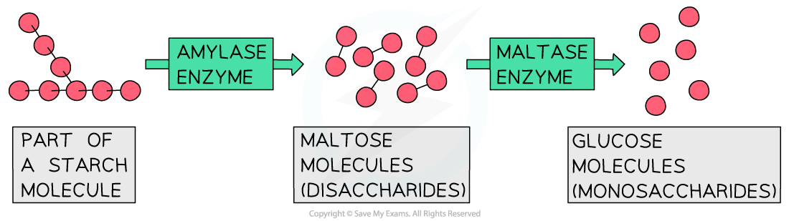
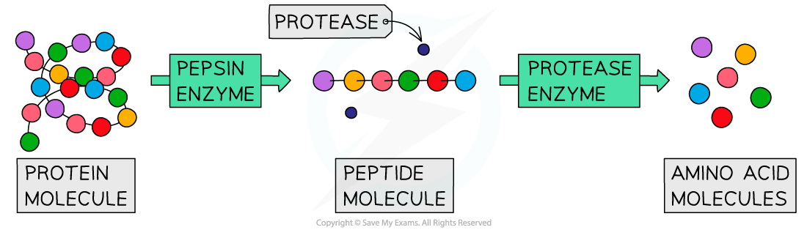
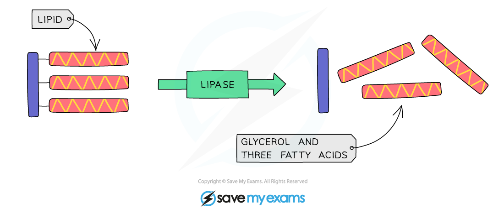

# Role of Digestive Enzymes

## The Role of Digestive Enzymes

> **Spec point** — `spcpt_NPQzv4JBDZmk2qfs` · understand the role of digestive enzymes, including the digestion of starch to glucose by amylase and maltase, the digestion of proteins to amino acids by proteases and the digestion of lipids to fatty acids and glycerol by lipases

## The Role of Digestive Enzymes

- The purpose of digestion is to **break down large, insoluble molecules **into** smaller, soluble molecules that can be absorbed into the bloodstream**
- Food is partially digested **mechanically** (by chewing, churning and emulsification) in order to break large pieces of food into smaller pieces of food which **increases the surface area for enzymes** to work on
- Digestion mainly takes place **chemically**, where bonds holding the large molecules together are broken to make smaller and smaller molecules
- Chemical digestion is **controlled by enzymes** which are produced in different areas of the digestive system
- Enzymes are **biological catalysts** – they speed up chemical reactions without themselves being used up or changed in the reaction
- There are three main types of ***digestive enzymes*** – **carbohydrases, proteases and lipases**

## Carbohydrases

> **Spec point** — `spcpt_ZwjMJSk29WV9xHvW` · understand the role of digestive enzymes, including the digestion of starch to glucose by amylase and maltase, the digestion of proteins to amino acids by proteases and the digestion of lipids to fatty acids and glycerol by lipases

## Carbohydrases

- Carbohydrases are enzymes that break down **carbohydrates** to simple sugars such as **glucose**
- Two examples of carbohydrases are **amylase** and **maltase**
- **Amylase** is a carbohydrase which breaks down **starch** into **maltose**

  - **Amylase** is made in the **salivary glands, the pancreas **and the** small intestine**
  
    - Amylase produced by the salivary glands gets **denatured** by acid in the stomach
    - The pancreas also produces amylase, which is released into the small intestine, where it acts.
    - The small intestine also produces a small amount of amylase
- **Maltase** then breaks down maltose into **glucose**

  - Maltase is made in the small intestine, which is where it also acts to breakdown the sugar maltose into glucose

***Starch is broken down into glucose using two enzymes: amylase and maltase***

## Proteases

> **Spec point** — `spcpt_Db5w9y7dFXTfRhCf` · understand the role of digestive enzymes, including the digestion of starch to glucose by amylase and maltase, the digestion of proteins to amino acids by proteases and the digestion of lipids to fatty acids and glycerol by lipases

## Proteases

- Proteases are a group of enzymes that break down **proteins** into **amino acids**
- **Pepsin** is an enzyme made in the **stomach** which breaks down proteins into smaller **polypeptide chains**
- **Protease enzymes** made in the **pancreas** and **small intestine **break the polypeptide chains into **amino acids**

***Proteins are broken down using pepsin and other proteases***

## Lipases

> **Spec point** — `spcpt_P5fBMSpvvmw6mV2T` · understand the role of digestive enzymes, including the digestion of starch to glucose by amylase and maltase, the digestion of proteins to amino acids by proteases and the digestion of lipids to fatty acids and glycerol by lipases

## Lipases

- Lipases are enzymes that break down **lipids** (fats) to **glycerol** and **fatty acids**
- Lipase enzymes are produced in the **pancreas** and secreted into the **small intestine**

***Diagram showing the digestion of lipids***

> **Exam Hint**
> The pancreas is an accessory organ in the digestive system. Food does not pass directly through it, but it has a key role in producing digestive enzymes to be released into the small intestine, as well as the hormone insulin.
