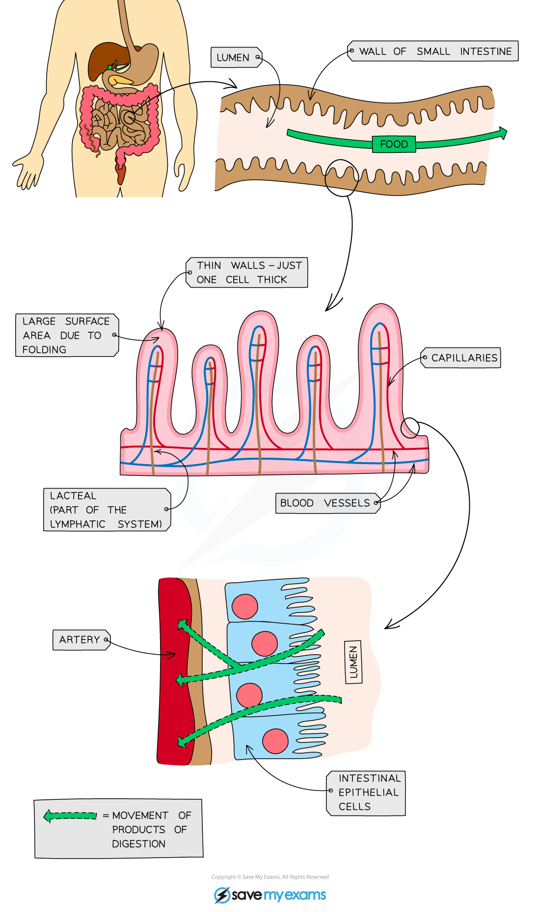

# Small Intestine: Structure & Adaptations

## Absorption of Food & Water

> **Spec point** — `spcpt_DDyMY2TsrFDYht5f` · understand how the small intestine is adapted for absorption, including the structure of a villus

## Absorption of Food & Water

- Absorption is the **movement of small digested food molecules from the digestive system into the blood **(glucose and amino acids)** **and lymph** **(fatty acids and glycerol)
- Absorption of small soluble molecules occurs through **diffusion** and sometimes **active transport**
- **Water** is absorbed (by **osmosis**) primarily in the **small intestine**,** **but also in the **large intestine**

## Adaptations of the Small Intestine

> **Spec point** — `spcpt_NmDPSCPKQZgP2HvH` · understand how the small intestine is adapted for absorption, including the structure of a villus

## Adaptations of the Small Intestine

- The small intestine is adapted for absorption as it is **very long** and has a **highly folded surface **with millions of** villi** (tiny, finger-like projections)

  - These adaptations massively **increase the surface area** of the small intestine, allowing absorption to take place faster and more efficiently
- **Peristalsis **helps by mixing together food and enzymes and by keeping things moving along the alimentary canal

### The role of villi in the small intestine

- Villi have several specific adaptations which allow for the rapid absorption of substances, such as:

  - **A large surface area**
  
    - **Microvilli **on the surface of the villus further increase the surface available for absorption
  - **A short diffusion distance**
  
    - The wall of a villus is only **one cell thick**
  - **A steep concentration gradient**
  
    - The villi are well supplied with a **network of blood capillaries** that transport glucose and amino acids **away** from the small intestine in the blood
    - **A lacteal **(lymph vessel) runs through the centre of the villus to transport **fatty acids and glycerol** away from the small intestine in the lymph
    - **Enzymes** produced in the walls of the villi assist with chemical digestion
    - The movement of villi helps to **move food along** and mix it with the enzymes present

***Adaptations of the small intestine***

> **Exam Hint**
> The way in which the **structure **of a villus is related to its **function** comes up frequently in exam questions so it is worth ensuring you have learned these adaptations and how they influence the **rate of absorption.**
