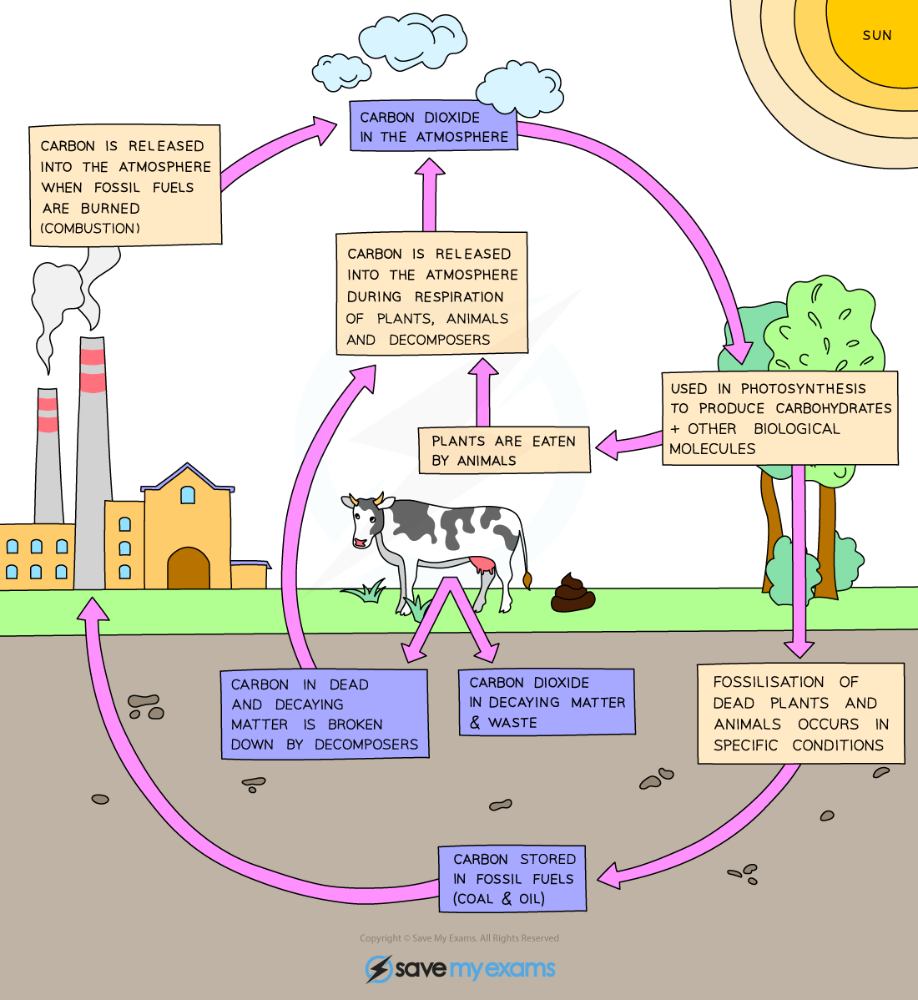

# Carbon Cycle

## The Carbon Cycle

> **Spec point** — `spcpt_vDqqYZxjM5YZQJfN` · describe the stages in the carbon cycle, including respiration, photosynthesis, decomposition and combustion

## The Carbon Cycle

- Carbon is an essential part of the **biological molecules** from which cells are built, e.g. carbohydrates, proteins and fats
- Carbon is cycled through ecosystems via the processes of the **carbon cycle**

### Uptake of carbon by living organisms

- Carbon is taken out of the atmosphere in the form of carbon dioxide by plants during **photosynthesis**
- The carbon is used to make** glucose**, which can be turned into carbohydrates, fats and proteins within the** biomass** of plants

### Transfer of carbon between living organisms

- Carbon is passed from plants to animals when herbivores **feed**
- Carbon passes between animals when carnivores feed

### Release of carbon into the atmosphere

- Carbon returns to the atmosphere in the form of carbon dioxide during **respiration**

  - Respiration occurs in plants and animals
  - Microorganisms, such as bacteria and fungi, use dead and waste material to fuel respiration, releasing CO2 during **decomposition**
- If animals and plants die in conditions where decomposers are not present the carbon in their bodies can be converted into **fossil fuels**;** **these can be burned to release carbon dioxide into the atmosphere by **combustion**

***Carbon is cycles through ecosystems by processes such as photosynthesis, respiration, decomposition and combustion***
