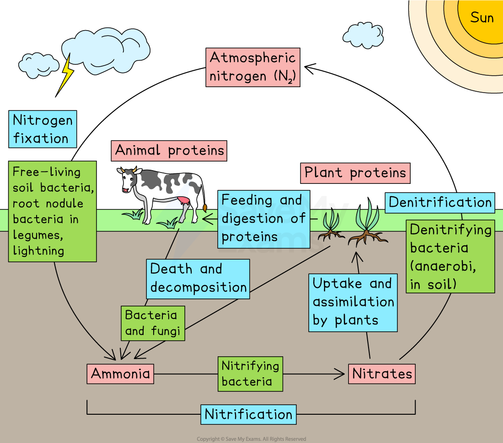

# Nitrogen Cycle

## The Nitrogen Cycle

> **Spec point** — `spcpt_hQRZJ7ZS9nC8H5vF` · describe the stages in the nitrogen cycle, including the roles of nitrogen fixing bacteria, decomposers, nitrifying bacteria and denitrifying bacteria (specific names of bacteria are not required)

## The nitrogen cycle

- Nitrogen is present as **N****2**** gas in the atmosphere** and within biological molecules, such as **proteins**, in the tissues of living organisms
- Nitrogen is cycled through ecosystems via the **nitrogen cycle**

### Nitrogen fixation

- **Nitrogen fixation** makes nitrogen available to living organisms
- Nitrogen fixing bacteria convert **N****2**** gas** into ammonium compounds, which are then converted into **nitrates** in the soil
- Nitrogen fixing bacteria include:

  - Free-living bacteria in the soil
  - **Bacteria** in the **root nodules** of **leguminous plants** (e.g. peas, beans, clover) which form a mutualistic relationship with the plant
- Nitrogen can also be fixed by lightning or during the production of chemical fertilisers
- After nitrogen fixation has occurred **plants absorb nitrates** from the soil to build **plant proteins**

### Transfer of nitrogen between living organisms

- Animals** feed** on plants, digest the proteins in the plant tissues, providing nitrogen to build **animal proteins**
- Nitrogen may then be passed from one consumer to another up the food chain in the same way

### Release of nitrogen from tissues

- Nitrogen from dead organisms and metabolic **waste products** is returned to the soil as **ammonia** by **decomposers** (bacteria and fungi)

  - Ammonia reacts with water in the soil to form ammonium ions
- Plants can’t absorb ammonium ions directly, so **nitrifying bacteria** convert **ammonia** into **nitrites**, and then into **nitrates**, which can be taken up again by plants
- The conversion of ammonium compounds to nitrates is known as** nitrification**, and can be summarised as follows:

**ammonia → nitrites → nitrates**

### Denitrification

- **Denitrifying bacteria** convert nitrates back into **N₂ gas**, returning nitrogen to the atmosphere. This process is known as **denitrification**
- Denitrifying bacteria are active in **anaerobic conditions**, e.g. in waterlogged or compacted soil
- Farmers reduce denitrification by ploughing the soil to increase aeration

***The nitrogen cycle involves nitrogen fixation, decomposition, nitrification and denitrification***
