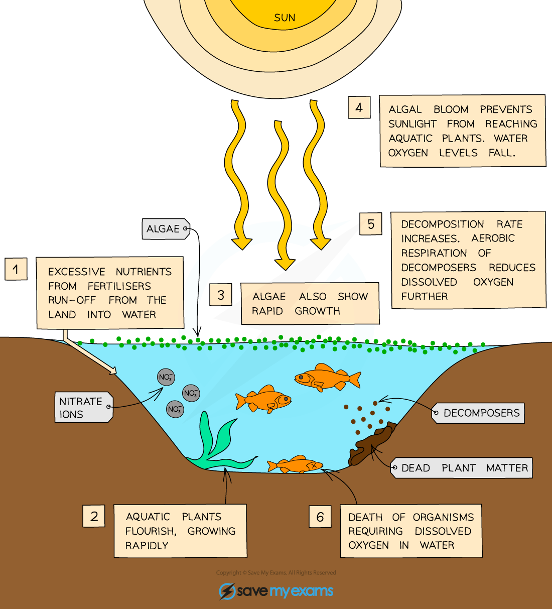

# Biological Consequences of Water Pollution

## Effects of Eutrophication

> **Spec point** — `spcpt_SNQY2DKhmgHhf96k` · understand the biological consequences of eutrophication caused by leached minerals from fertiliser

## Effects of Eutrophication

- **Minerals **from agricultural fertilisers can be ***leached*** into water bodies, such as lakes and streams, resulting in a process known as **eutrophication **
- The following events occur during eutrophication:

  - fertilisers are** high in nitrates**, an essential mineral for plant growth, so this can result in the **overgrowth of aquatic plants and algae **at the water surface
  - aquatic plants below the surface die due to reduced light levels, and are **broken down by decomposers**, e.g. bacteria and fungi
  - decomposers increase in number, and the increased respiration of these organisms uses up oxygen in the water, **reducing dissolved oxygen levels**
  - the water no longer contains enough oxygen to support other organisms, so **many aquatic organisms die**

***Fertiliser run-off can cause eutrophication in lakes and rivers***

## Effects of Sewage Pollution

> **Spec point** — `spcpt_F6Yd4q6DxdtZP2qr` · understand the biological consequences of pollution of water by sewage

## Effects of Sewage Pollution

- Water pollution can occur when **sewage** is washed into waterways, e.g. when sewers overflow or agricultural waste is washed off fields due to heavy rain
- This can have harmful effects on aquatic ecosystems

  - Sewage can cause an increase in **growth of aerobic bacteria**, which feed on biological waste
  - These bacteria **reduce the availability of dissolved oxygen** in water
  - **Aquatic organisms that are sensitive to oxygen levels die**, leaving only organisms that can survive at low concentrations of oxygen
  - The aquatic ecosystem **decreases in biodiversity**
- Sewage in waterways can also result in an increase in the number of **pathogenic bacteria** present
