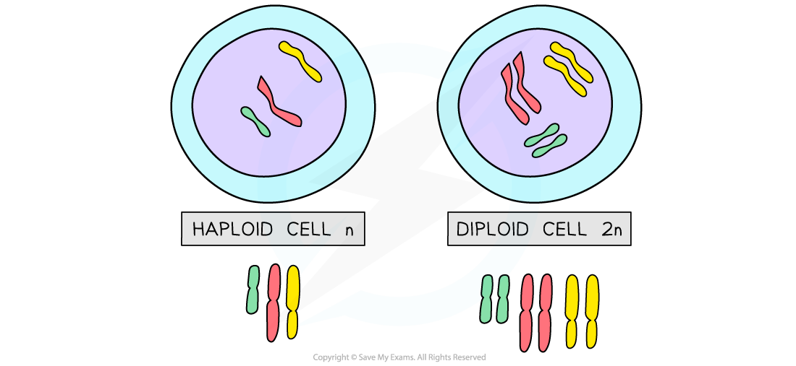

# Diploid vs Haploid

## Diploid vs Haploid

> **Spec point** — `spcpt_QJfdBxNppVvfqRm3` · know that in human cells the diploid number of chromosomes is 46 and the haploid number is 23

## Diploid vs Haploid

- A **diploid **cell is a cell that contains **two complete sets of chromosomes** (2n)

  - These chromosomes contain the **DNA **necessary for protein synthesis and cell function
  - Nearly all cells in the **human **body are diploid with 23 **pairs **(46) of chromosomes in their nucleus
- **Haploid** cells contain **one complete set of chromosomes** (n)

  - In other words they have **half the number of chromosomes** compared to diploid cells
  - **Humans **have haploid cells that contain 23 chromosomes in their nucleus (no pairs)
  - These haploid cells are called **gametes **and they are involved in sexual reproduction
  - For humans they are the female egg and the male sperm

***Haploid and diploid cells.***
