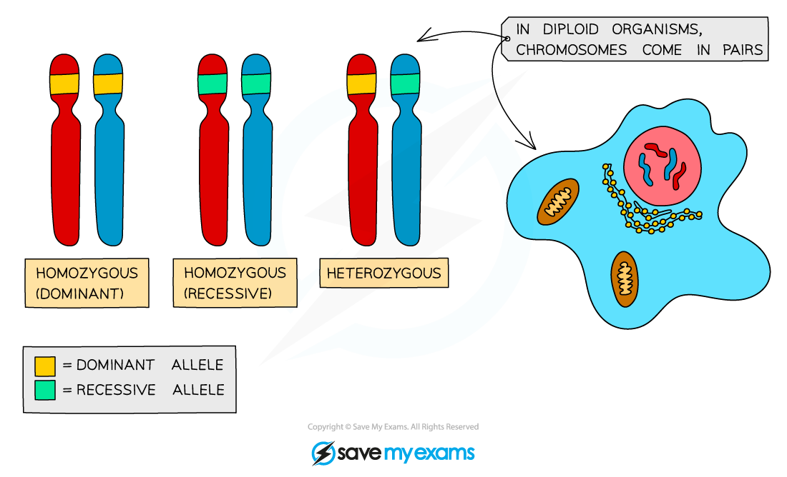

# Key Terms in Genetics

## Key Definitions

> **Spec point** — `spcpt_JqD2wsj65gmFCwVR` · understand the meaning of the terms: dominant, recessive, homozygous, heterozygous, phenotype, and genotype

## Key Definitions

- The **observable characteristics** of an organism are called the **phenotype**
- The **combination of alleles an organism has for a particular gene** is called the **genotype**

  - An allele is a single version of a gene, which can be represented by a single letter (eg. B or b)
  - The genotype  is the pair of alleles an organism has for a gene, which can be represented as two letters (eg. BB, Bb or bb)
- Alleles can be **dominant** or **recessive:**

  - A **dominant **allele only needs to be inherited from one parent for the characteristic to appear in the phenotype
  - A **recessive **allele must be inherited from both parents for the characteristic to show up in the phenotype.
  - If only one recessive allele is present in the genotype, it is masked by the dominant allele and the dominant characteristic is shown
- The genotype can be **homozygous** or **heterozygous**:

  - If in an organisms genotype two alleles for a gene are the **same**, the individual is **homozygous** (homo = same)
  
    - An individual could be **homozygous dominant** - having two copies of the dominant allele, or **homozygous recessive** - having two copies of the recessive allele)
  - If the two alleles of a gene are **different**, the individual is **heterozygous** (hetero = different)
- Dominant alleles are represent by capital letters, and recessive alleles lowercase letters (usually the same letter)

**Example PTC tasting:**

- The ability to taste **phenylthiocarbamide (PTC)** is controlled by a single gene with two alleles:

  - **T** = can taste PTC (dominant)
  - **t** = cannot taste PTC (recessive)
- Possible genotypes and phenotypes:

  - **TT** → taster
  - **Tt** → taster
  - **tt** → non-taster
- PTC itself isn’t found in food, but it tastes similar to **bitter compounds** in vegetables such as **cabbage, kale, and Brussels sprouts. **Tasters often find these foods more bitter than non-tasters

***Alleles are different forms of the same gene. You can only inherit two alleles for each gene, and they can be the same (homozygous) or different (heterozygous).***

#### Key terms & definitions for inheritance

| Key term | Definition | Example |
|---|---|---|
| Gene | A section of a molecule of DNA | PTC tasting gene |
| Allele | Alleles are alternative forms of genes. Humans have two copies of each gene, and so can have two different alleles for a single gene | **T** (taster) or **t** (non-taster) in PTC tasting |
| Dominant | Expressed in the **phenotype** even if only **one allele** is present | **T** in PTC tasting |
| Recessive | Only expressed in the phenotype if both alleles are recessive (no dominant allele is present) | **t** in PTC tasting |
| Homozygous | Having two identical alleles for a gene | **TT** (homozygous dominant) or **tt** (homozygous recessive) |
| Heterozygous | Having two different alleles for a gene | **Tt** |
| Phenotype | The observable characteristics of an organism | Taster or non-taster for PTC tasting |
| Genotype | The combination of alleles an organism has for a particular gene.  (Genotype can also be used to refer to the complete set of genetic material an organism has) | **TT**, **Tt**, **tt **in PTC tasting |

> **Exam Hint**
> You do not need to memorise examples like PTC tasting for your exams. In an exam on this topic you may be given **an unfamiliar characteristic** and asked to determine **genotypes** and **phenotypes**.
> 
> Focus on understanding the **relationships between alleles, genotype, and phenotype**:
> 
> - **Dominant allele:** shows the characteristic even if only one copy is present.
> - **Recessive allele:** only shows the characteristic if both alleles are recessive.
> - **Homozygous:** two identical alleles.
> - **Heterozygous:** two different alleles.
> 
> Use the **letter notation** method (**capital for dominant, lowercase for recessive**) to represent alleles and work out genotypes and always **state the phenotype** based on the combination of alleles in the genotype.
