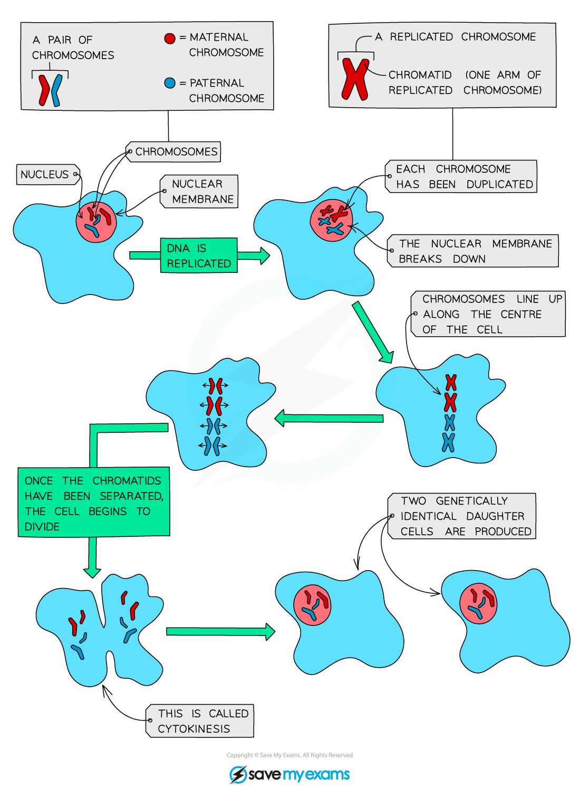

# Mitosis

## Mitosis

> **Spec point** — `spcpt_y4DQpnTWsHc4YGDv` · understand how division of a diploid cell by mitosis produces two cells that contain identical sets of chromosomes

## Mitosis

- Mitosis is defined as **nuclear division giving rise to genetically identical cells**
- Mitosis is used for:

  - **growth**
  - **repair of damaged tissues**
  - **replacement of cells**
  - **asexual reproduction**
- Most body cells have **two copies** of each chromosome
- We describe these cells as **diploid**
- When cells divide their **chromosomes double** beforehand (also known as duplication)
- This ensures that when the cell splits in two, each new cell still has **two copies **of each chromosome (is still diploid)

#### The process of mitosis

- Just before mitosis, each chromosome in the nucleus copies itself **exactly** (forms X-shaped chromosomes)
- Chromosomes then line up along the centre of the cell where cell fibres pull them apart
- The cell divides into two; each new cell has a copy of each of the chromosomes

***The process of cell division by mitosis***

## Importance of Mitosis

> **Spec point** — `spcpt_gV8ZjCcfSzQVhQfw` · understand that mitosis occurs during growth, repair, cloning and asexual reproduction

## Importance of Mitosis

- All cells in the body (excluding gametes) are produced by mitosis of the ***zygote***
- Mitosis occurs during:

  - **Growth**: mitosis produces new cells
  - **Repair**: to replace damaged or dead cells
  - **Asexual reproduction**: mitosis produces offspring that are genetically identical to the parent
- Mitosis is **important for replacing cells** e.g, skin cells, and red blood cells, and for **allowing growth** (production of new cells e.g. when a zygote divides to form an embryo)
