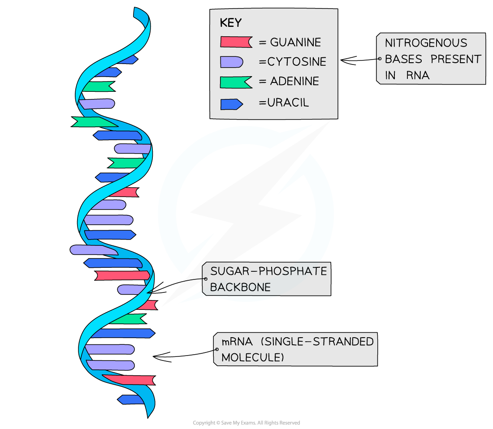

# RNA Structure

## RNA Structure

> **Spec point** — `spcpt_nPfjvp6JDrXJSNv7` · understand that an RNA molecule is single stranded and contains uracil (U) instead of thymine (T)

## RNA Structure

- Like DNA, the nucleic acid **RNA **(ribonucleic acid) is a **polynucleotide**

  - It is made up of many nucleotides linked together in a long chain
- RNA nucleotides contain the nitrogenous bases **adenine (A), guanine (G) and cytosine (C)**
- Unlike DNA, RNA nucleotides **never **contain the nitrogenous base thymine (T) – in its place they include the nitrogenous base **uracil (U)**
- RNA molecules are only made up of **one **polynucleotide strand (they are **single-stranded**)
- Each RNA polynucleotide strand is made up of alternating ribose sugars and phosphate groups linked together, with the nitrogenous bases of each nucleotide** projecting out** sideways from the single-stranded RNA molecule
- Examples of an RNA molecules are:

  - **messenger RNA** (mRNA) which is the transcript copy of a gene that encodes a specific polypeptide
  - **transfer RNA** (tRNA) which is involved in protein synthesis
  - **ribosomal RNA** (rRNA) which forms part of a ribosome

***Messenger RNA (mRNA) provides a good example of the structure of RNA***

> **Exam Hint**
> - The main differences you need to know between RNA and DNA:
> 
>   - RNA is single-stranded
>   - RNA contains uracil instead of thymine
