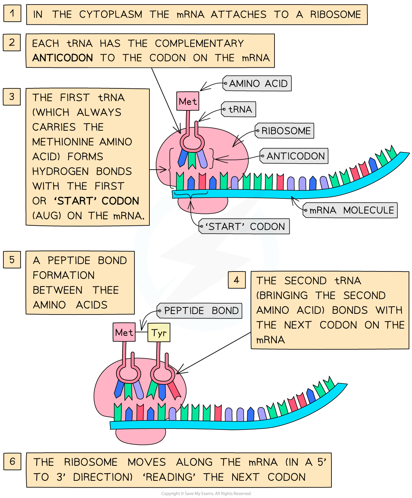

# Stages of Protein Synthesis

## Transcription & Translation

> **Spec point** — `spcpt_m8gmbTwTy7DSdkCQ` · describe the stages of protein synthesis including transcription and translation, including the role of mRNA, ribosomes, tRNA, codons and anticodons

## Transcription & Translation

- The process of turning a ***gene*** into** a specific sequence of amino acids (**that in turn make up a **specific protein) is split into two stages:**

  - **Transcription** – **DNA** is transcribed and an **mRNA **molecule is produced
  - **Translation** – **mRNA** (messenger RNA) is translated and an **amino acid sequence **(protein) is produced

### Transcription

- The transcription stage of protein synthesis occurs in the **nucleus** of the cell, and its role is to **produce a copy** of a section of DNA in the form of** **a **strand of mRNA**
- The sequence of events is as follows:

  1. Part of the DNA molecule **unwinds** when hydrogen bonds between the complementary base pairs (A-T, G-C) break
  2. This **exposes the template strand **of the gene that codes for the protein being synthesised
  3. **Free mRNA nucleotides** that are present in the nucleus** bind to complementary nucleotides** on the template strand
  4. The mRNA nucleotides are joined to neighbouring nucleotides, forming a **single strand** of mRNA
  5. The mRNA molecule **leaves the nucleus** via a pore in the nuclear envelope
- The new strand of mRNA is a** complementary** copy of the DNA code from the original gene

***Transcription occurs in the nucleus and produces a molecule of single-stranded mRNA***

### Translation

- This stage of protein synthesis occurs in the **cytoplasm** of the cell, and results in the production of a **chain of amino acids** that will go on to form a protein
- The process of translation is as follows:

  1. After leaving the nucleus, the mRNA molecule attaches to a **ribosome**
  2. In the cytoplasm there are free molecules of** tRNA** (transfer RNA); these tRNA molecules have a triplet of unpaired bases at one end known as the **anticodon**, and an** amino acid** at the other. Each specific anticodon corresponds to a specific amino acid
  3. The anticodon on each tRNA molecule pairs with a complementary triplet (**codon**) on the mRNA molecule, bringing its specific amino acid along with it
  4. A second tRNA molecule attaches to its complementary codon (on the mRNA), and a **peptide bond** is formed between the** two neighbouring amino acids**
  5. This process continues until a ‘stop’ codon on the mRNA molecule is reached; this acts as a signal for** translation to stop** and at this point the amino acid chain coded for by the mRNA molecule is complete
- This amino acid chain is then folded and modified to form the final **protein **molecule, e.g. an enzyme or antibody

***Translation occurs on the ribosomes in the cytoplasm, and results in the production of a chain of amino acids. Note that you don't need to know the details about start codons shown here.***

> **Exam Hint**
> This is a tricky topic, so take your time learning it. Make sure that you understand the roles of **mRNA**, **ribosomes**, **codons** and **anticodons** in the production of proteins.
