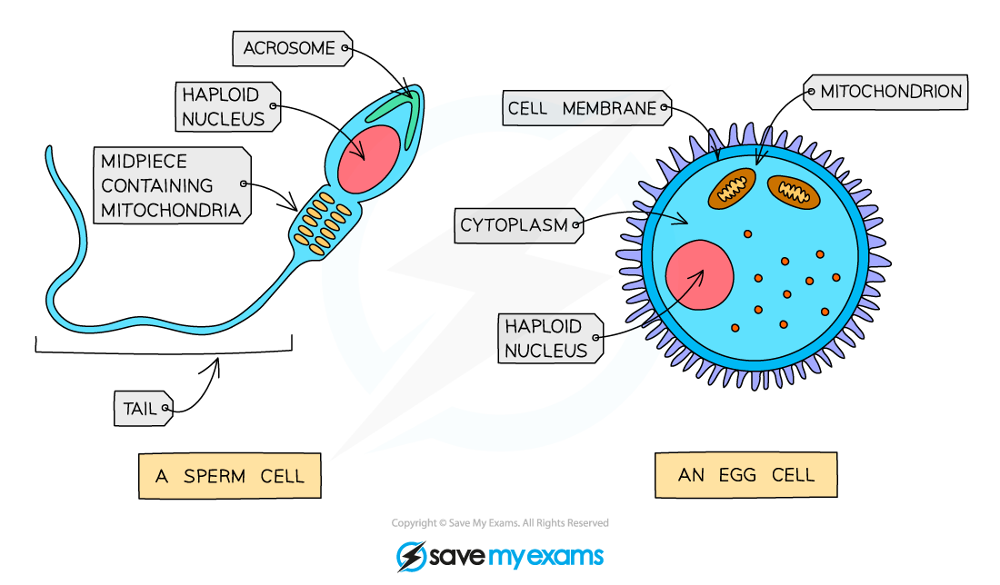
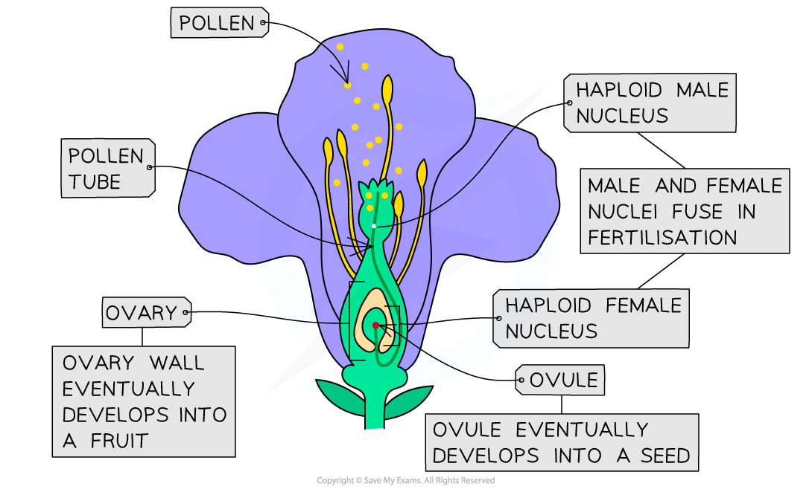

# Gametes & Fertilisation

## The Gametes

> **Spec point** — `spcpt_tXs46zcyvygYhcHS` · understand that fertilisation involves the fusion of a male and female gamete to produce a zygote that undergoes cell division and develops into an embryo

## Gametes

- **Gametes** are sex cells produced by meiosis

  - The **sperm **and **ovum** in animals
  - The **pollen** nucleus and **ovum** in plants
- Gametes contain** half the number of chromosomes **(23 in human gametes) compared to normal body cells
- Gametes have **adaptations** to improve the chances of **successful fertilisation** and embryo development, for example:

  - Sperm cells have a **tail to propel **them towards the egg and **mitochondria to provide energy** for this movement
  - Egg cells have **energy stores** within the cytoplasm to support early embryo development

#### Human gametes diagram

***Comparing sperm and egg cells***

## Fertilisation

> **Spec point** — `spcpt_r9PPGPbHfDm8d4CJ` · understand that fertilisation involves the fusion of a male and female gamete to produce a zygote that undergoes cell division and develops into an embryo

## Fertilisation

- Fertilisation can be described as:

**the fusion of a male gamete and female gamete to produce a zygote**

- The zygote then **divides by mitosis **to develop into an **embryo**
- Cells start to become **specialised to perform specific functions**, forming all the body tissues of the offspring

#### Fertilisation in humans

- During sexual intercourse, semen is ejaculated into the female's vagina near the cervix, and sperm travel through the cervix into the uterus.
- Fertilisation occurs in the oviduct if a sperm meets an egg, typically 1-2 days after ovulation
- A human zygote contains the full **46 chromosomes** (23 pairs of chromosomes)

  - Half of the chromosomes in a zygote come from the father and the other half from the mother

***The process of fertilisation in humans***

#### Fertilisation in plants

- In plants, fertilisation occurs when a pollen tube grows down from a pollen grain to deliver the male nucleus into the ovary
- Here the male and female gametes fuse to form the embryo
- More detailed notes on this process can be found [here](https://www.savemyexams.com/igcse/biology/edexcel/19/revision-notes/3-reproduction--inheritance/reproduction/3-4-fertilisation-in-plants/)

***The process of fertilisation in plants.***
