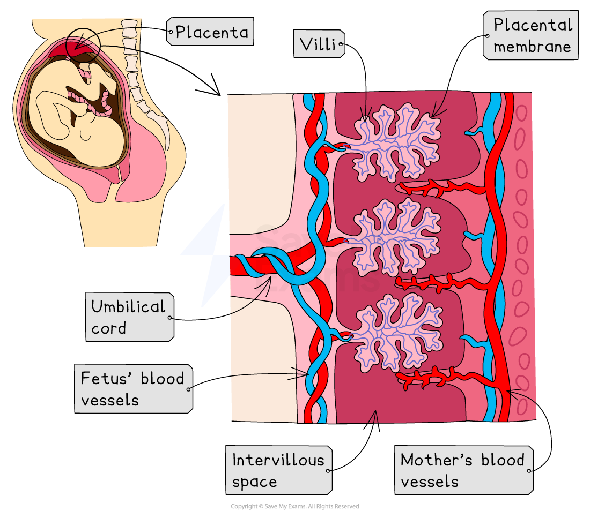

# Role of the Placenta

## The Placenta

> **Spec point** — `spcpt_KkjCyjMTzDBMgsvR` · describe the role of the placenta in the nutrition of the developing embryo

## The Placenta

- After fertilisation in the oviduct the zygote divides to form an **embryo**, and travels to the uterus
- Upon reaching the uterus the embryo **implants** in the uterine lining, where it continues to develop
- A structure called the** placenta **forms at the implantation site
- The placenta provides the developing embryo with nutrients and oxygen from the mother’s blood, which are essential for growth and development
- It also allows **waste products** from the embryo’s blood to be removed
- In the placenta, the **mother’s blood** comes into very close proximity to the **blood of the fetus**, but the two blood supplies **do not mix**
- The **umbilical cord** connects the fetus’ blood supply to the placenta
- The role of the placenta is to enable **exchange of substances** between the mother's blood and that of the fetus
- Substances that travel **from the mother's blood to the fetus **include:

  - Oxygen
  - Nutrients, eg. glucose, amino acids, vitamins and mineral (ions)
- Substances that travel **from the fetus' blood to the mother **include:

  - Carbon dioxide
  - Urea
- The placenta is an efficient exchange surface because it has:

  - A **large surface area**
  - A **thin wall **for efficient diffusion
- The placenta also acts as a barrier to some **toxins** and **pathogens**, although not all are stopped from passing through. For example:

  - **Nicotine** and **alcohol **can pass across the placenta
  - **Virus particles** can pass across the barrier

*The placenta allows exchange of substances between the fetus and the mother*

> **Exam Hint**
> If you are asked to "*describe the role of the placenta in reproduction"*, be sure to indicate the direction substances are moving. 
> 
> For example, the placenta provides the fetus with oxygen and nutrients such as glucose and amino acids, as well as antibodies. It removes carbon dioxide and urea. 
> 
> Other roles of the placenta are that it allows diffusion and it secretes hormones (eg. progesterone).
