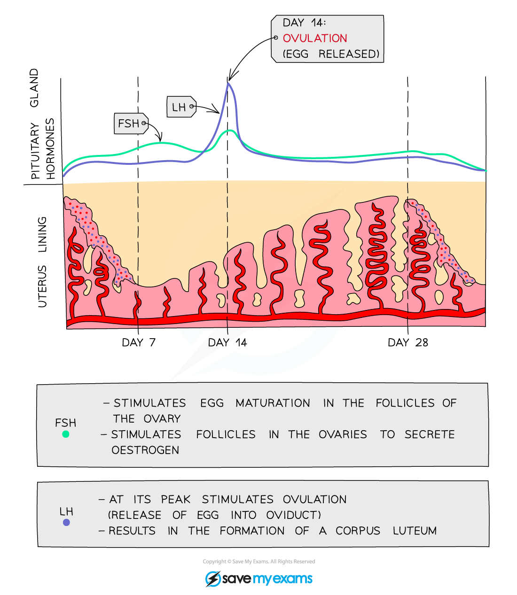

# Roles of FSH & LH in the Menstrual Cycle

## Roles of FSH & LH in the Menstrual Cycle

> **Spec point** — `spcpt_r5GZtxq8SnxtHPB9` · understand the roles of FSH and LH in the menstrual cycle

## Roles of FSH & LH in the Menstrual Cycle

- In addition to **oestrogen** and **progesterone**, the menstrual cycle is controlled by** FSH** and **LH**
- Both of these** hormones** are released from the **pituitary gland **in the brain

  - **FSH** **(follicle-stimulating hormone)** causes an **egg to start maturing** in the ovary
  
    - It also **stimulates the ovaries **to start releasing **oestrogen**
  - **LH (luteinising hormone) **is released when **oestrogen** levels have reached their peak
  
    - **LH** causes **ovulation to occur** and also **stimulates the ovary** to produce **progesterone**

***Changes in the levels of the pituitary hormones FSH and LH in the blood during the menstrual cycle***

#### Interaction between all four of the menstrual cycle hormones

1. The** pituitary gland** releases **FSH** to develop an ovarian follicle
2. The follicle produces an **egg** and **oestrogen**
3. **Oestrogen** stimulates **uterine lining growth** and **inhibits FSH** production
4. **High oestrogen **levels trigger **LH release** from the pituitary, causing **ovulation** (around day 14)
5. The follicle becomes the **corpus luteum**, producing** progesterone**
6. **Progesterone** maintains the uterine lining
7. If the egg isn't fertilised, the corpus luteum breaks down, **progesterone levels drop**, and **menstruation occurs**
8. If **pregnant,** the corpus luteum continues producing progesterone until the **placenta develops**, which then **maintains progesterone** production throughout pregnancy
