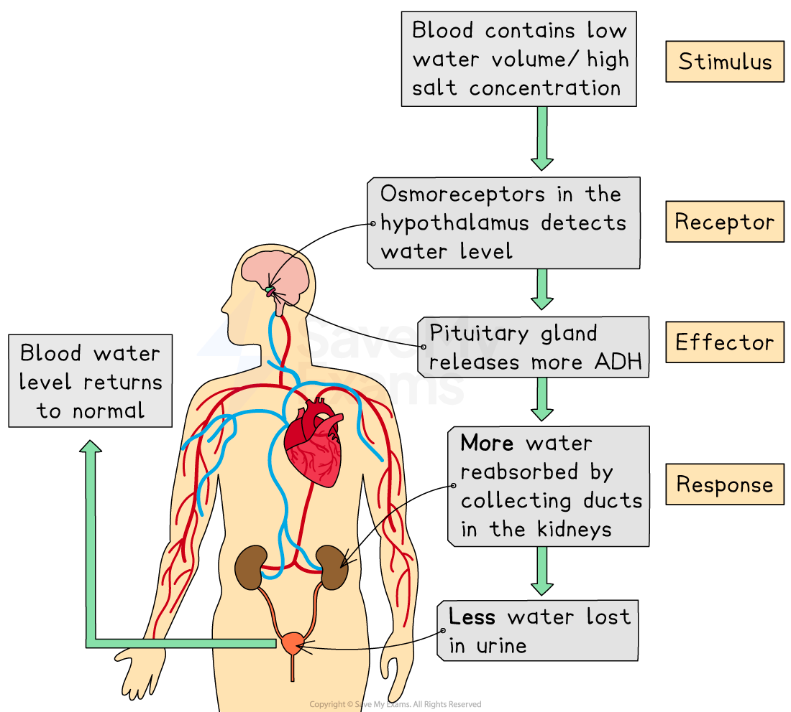

# Co-ordinating Response

## Co-ordinating a Response

> **Spec point** — `spcpt_WfGzf8t2H7fTgnWJ` · understand that a co-ordinated response requires a stimulus, a receptor and an effector

## Co-ordinating a Response

- **Homeostasis** (maintaining controlled conditions within the body) is under **involuntary (automatic) control**
- This means that the brain stem (or **non-conscious** part of the brain) and the spinal cord are involved in **maintaining homeostasis** – you don’t consciously maintain your body temperature
- These automatic control systems may involve **nervous responses** or **chemical responses** (e.g. via** hormones**)
- All control systems that carry out co-ordinated responses require the following:

  - A **stimulus** (a change in the environment e.g. a change in glucose levels in the blood, a change in body temperature etc.)
  - A **receptor** (receptor cells that detect stimuli)
  - A** coordination** **centre** (such as the brain, spinal cord and pancreas), which receives and processes information from receptors
  - An** effector **(a muscle or gland), which brings about responses to restore optimum levels

*A co-ordinated response (such as that required when there is not enough water in the blood) requires a stimulus, a receptor and an effector*
