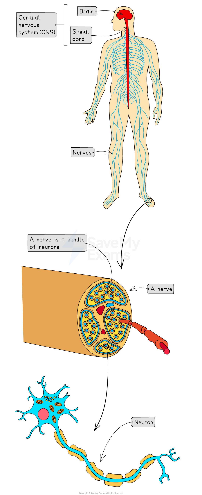

# Human Nervous System

## The Human Nervous System: Structure

> **Spec point** — `spcpt_3pT6kJ9mqQVw6cpJ` · understand that the central nervous system consists of the brain and spinal cord and is linked to sense organs by nerves

## The Human Nervous System: Structure

- The human nervous system consists of:

  - Central nervous system (**CNS**) – the **brain** and **spinal cord**
  - Peripheral nervous system (**PNS**) – all of the **nerves** that branch out from the **CNS** to the rest of the body
- Information is transmitted through the nervous system as **electrical impulses** – fast-moving electrical signals that pass along special cells called** *****neurones***
- A **nerve **is a bundle of neurones
- Nerves extends from the **CNS** to** **all areas of the body including the sense organs, allowing communication between the brain and different parts of the body
- The **CNS** acts as the **central coordinating centre** processing incoming information from sense organs and coordinates the body's response

*The central nervous system consists of the brain and spinal cord and is linked to sense organs by nerves which are bundles of neurones*

## The Human Nervous System: Function

> **Spec point** — `spcpt_4hcp4nbDvWxFp4MR` · "understand that stimulation of receptors in the sense organs sends electrical impulses
along nerves into and out of the central nervous system, resulting in rapid responses"

## The Human Nervous System: Function

- **Receptors** in sense organs detect **stimuli** (eg. light, sound, touch, temperature, chemicals)
- When stimulated, receptors produce **electrical impulses**
- These impulses travel along **sensory neurones** to the **CNS**
- The **CNS** processes the information and sends **impulses** along **motor neurones** to **effectors** (muscles or glands)
- **Effectors** carry out a **response** (eg. muscle contracts or gland secretes
- This pathway allows **rapid, automatic communication** within the body
- **In summary:**

  - Stimulus → receptor → sensory neurone → CNS → motor neurone → effector → response
