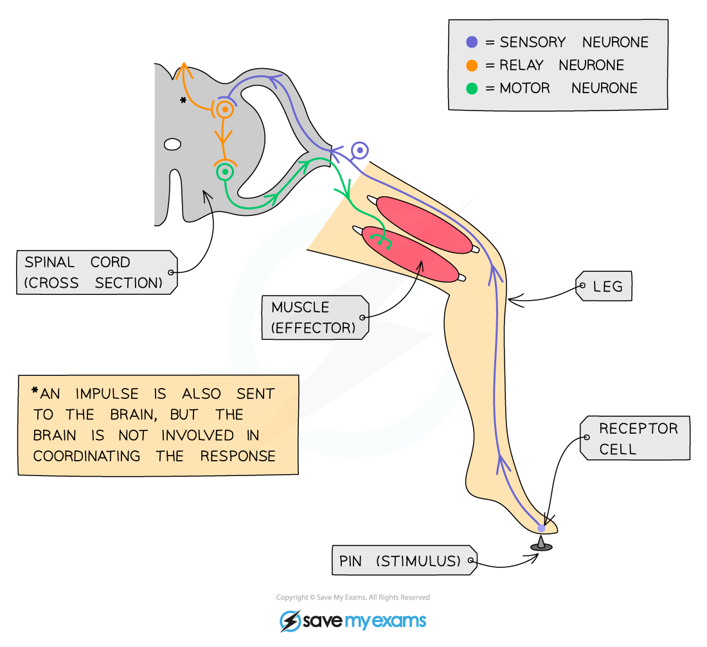

# Simple Reflex Arc

## Simple Reflex Arc

> **Spec point** — `spcpt_dHGK6QNFy7BwGGy9` · "describe the structure and functioning of a simple reflex arc illustrated by the
withdrawal of a finger from a hot object"

## Simple Reflex Arc

- A **reflex response** (also known as an **involuntary response**) does not involve the** conscious part of the brain** as the **coordinator** of the reaction
- Awareness of a response having happened occurs **after** the response has been carried out
- Responses are therefore **automatic** and **rapid** – this helps to **minimise damage** to the body and** aids survival**

  - Pain-withdrawal, blinking, and coughing are all examples of reflex responses that help us to avoid serious injury, such as damage to the eye or choking

### The reflex arc

- A ***reflex arc*** is the **pathway **taken by electrical impulses during a reflex action
- An example is the withdrawal reflex that occurs when someone steps on a pin
- The pathway of this reflex arc is as follows:

  1. The **stimulus **(the pin) is detected by a (pain/pressure/touch) **receptor** in the skin on the person's foot
  2. A **sensory** **neurone** sends electrical impulses to the spinal cord (which acts as the coordinator)
  3. An electrical impulse is passed to a **relay** **neurone** in the spinal cord (part of the **CNS**)
  4. A relay neurone **synapses** with a motor neurone
  5. A **motor neurone **carries an impulse to a muscle in the leg (the **effector**)
  6. When stimulated by the motor neurone, the muscle will contract and pull the foot up and away from the sharp object (the **response**)
- This all happens very quickly and without conscious thought

***The reflex arc pathway (in this case for a pain-withdrawal reflex). Reflex actions are automatic and rapid; they do not involve the conscious part of the brain.***
