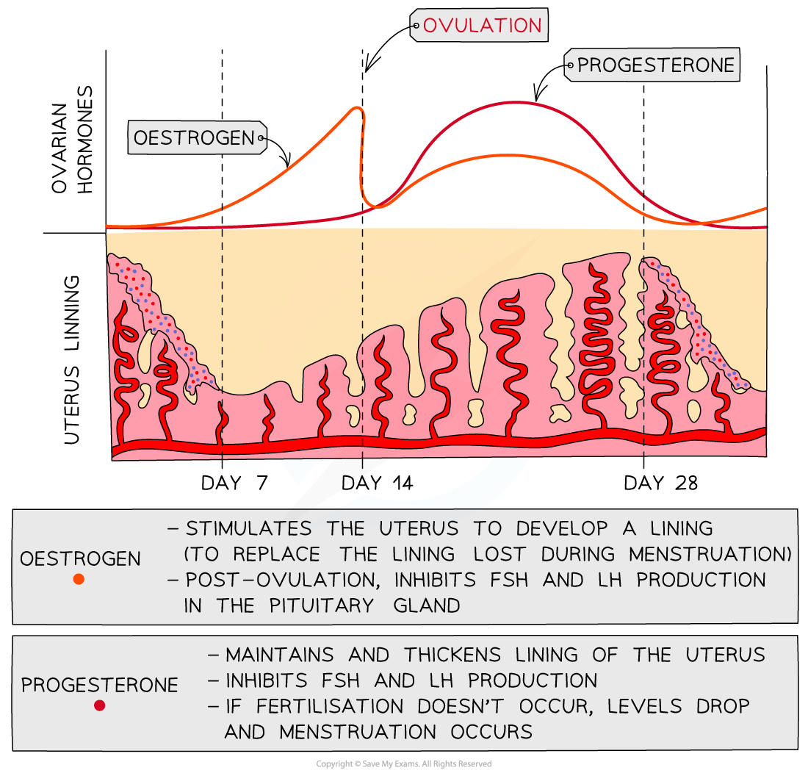

# The Role of Hormones: Advanced

## The Role of Hormones: Advanced

> **Spec point** — `spcpt_MhhNGGx6TSyPKSFf` · understand the sources, roles and effects of the following hormones: ADH, FSH and LH

## The Role of Hormones: ADH, FSH & LH

- As well as adrenaline, insulin, testosterone, progesterone and oestrogen, the following hormones are also of great importance in humans:

  - **ADH **(antidiuretic hormone)
  - **FSH** (follicle-stimulating hormone)
  - **LH** (luteinising hormone)

### ADH

- **If the water content (water potential) of the blood is too low:**

  - *If the water potential of the blood is too low, the blood solute concentration is too high*
  - Osmoreceptors in the hypothalamus detect the concentration of solutes in the blood and signal the pituitary gland to release **more** **ADH**
  - ADH makes the collecting ducts of the nephrons **more permeable** to water
  - **More water is reabsorbed** from the collecting ducts back into the blood
  - The kidneys produce a **smaller volume of urine** which is **more concentrated** (contains **less water**)

- **If the water content (water potential) of the blood is too high:**

  - *If the water potential of the blood is too high, the blood is too dilute*
  - Osmoreceptors in the hypothalamus detect this and signal the pituitary gland to release **less** **ADH**
  - The collecting ducts of the nephrons become** less permeable** to water
  - **Less water is reabsorbed** from the collecting ducts back into the blood
  - The kidneys produce a **larger volume of urine** which is **less concentrated** (contains **more water**)

### Hormonal control of the menstrual cycle

- Four hormones control the events that occur during the **menstrual cycle. **These are:

  - Oestrogen
  - Progesterone
  - FSH (follicle-stimulating hormone)
  - LH (luteinising hormone)
- Oestrogen and progesterone are both involved in preparing and maintaining the uterus lining

  - Oestrogen, produced by the ovaries, helps rebuild and thicken the uterus lining after menstruation
  - Progesterone, produced by the corpus luteum (the empty egg follicle in the ovary), helps maintain the thick uterus lining in preparation for a possible pregnancy

***Oestrogen and progesterone are both released from the ovaries and control events of the menstrual cycle***

#### The roles of FSH and LH

- **FSH **is released by the **pituitary gland** and causes an **egg to start maturing** in the ovary

  - It also **stimulates the ovaries **to start releasing **oestrogen**
- The **pituitary gland** is stimulated to release **LH** when **oestrogen **levels have reached their peak

  - **LH** causes **ovulation to occur** and also **stimulates the ovary** to produce **progesterone**

***Changes in the levels of the pituitary hormones FSH and LH in the blood during the menstrual cycle***

#### Other important hormones in the human body table

| **Hormone** | **Source** | **Role** | **Effect** |
|---|---|---|---|
| ADH | Pituitary gland | Controlling the water content of the blood | Increases the permeability of the collecting ducts in the kidneys to water, increasing the reabsorption of water back into the blood |
| FSH | Pituitary gland | Causes ovary to develop a mature egg cell | Stimulates the development of egg cells in the ovary and the release of oestrogen |
| LH | Pituitary gland | Causes ovary to release a mature egg cell | Stimulates the release of an egg cell from the ovary (ovulation) and the release of progesterone |
