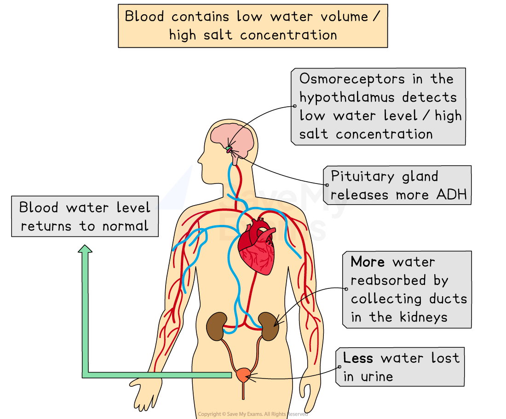
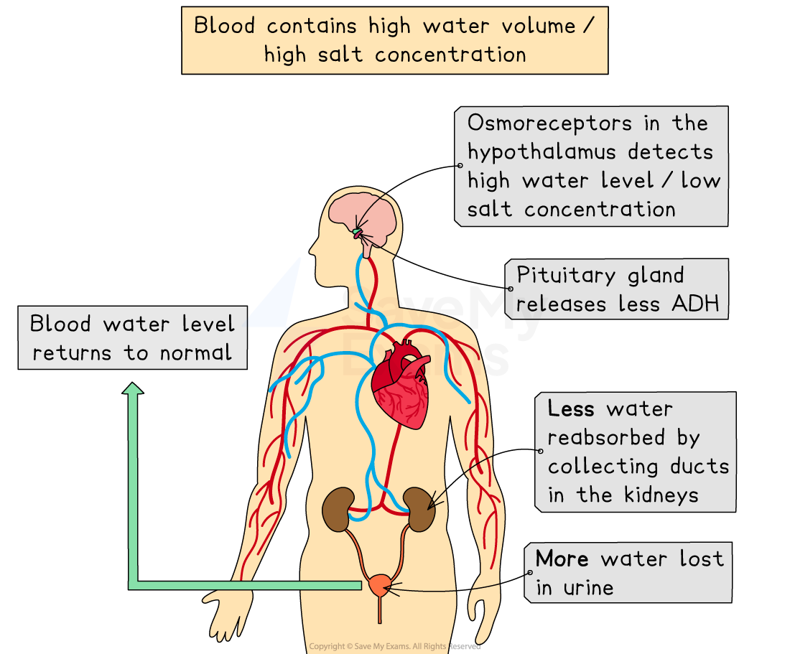

# ADH & Composition of Urine

## The Role of ADH

> **Spec point** — `spcpt_3MvT5Gj88x5Xfpft` · describe the role of ADH in regulating the water content of the blood

## The Role of ADH

- **Osmoregulation** is the maintenance of water and salt levels within the body
- The nephrons have a crucial role in [osmoregulation](https://www.savemyexams.com/igcse/biology/edexcel/19/revision-notes/2-structure-and-function-in-living-organisms/excretion/kidney-excretion-and-osmoregulation/); most water absorption from the filtrate occurs from the collecting duct
- The amount of water that is reabsorbed is controlled by the hormone ADH (antidiuretic hormone)

  - Maintenance of body water levels is an example of ***negative feedback***
- Changes in blood water levels are detected by **osmoreceptors** in the **hypothalamus** in the brain
- The **hypothalamus** sends signals to the **pituitary gland, **which releases **ADH**
- ADH affects the permeability of the collecting duct to water
- If the **water potential of the blood is too high **(too much water):

  - The pituitary gland in the brain releases **less** **ADH**
  - The collecting ducts become** less permeable** to water
  - **Less water is reabsorbed** from the collecting ducts
  - A **larger volume of dilute urine is produced**
- If the **water potential of the blood is too low **(too little water):

  - The pituitary gland in the brain releases **more** **ADH**
  - The collecting ducts become** more permeable** to water
  - **More water is reabsorbed** from the collecting ducts
  - A **smaller volume of concentrated urine is produced**

*ADH is produced by the pituitary gland and levels of ADH in the blood affect how permeable to water the collecting ducts of nephrons in the kidneys are *

> **Exam Hint**
> You must remember the key phrase "ADH increases the permeability of the collecting duct to water" for your exams. Mark schemes will expect you to use this exact terminology. 
> 
> Remember that blood with a low water level will have a high salt (or solute) concentration and blood with a high water level will have a low salt (or solute) concentration. Technically it's better to refer to "water potential" rather than "water level".

## The Composition of Urine

> **Spec point** — `spcpt_ZTjZVYcG496FtZSS` · understand that urine contains water, urea and ions

## The Composition of Urine

- **Urine** produced by the kidneys contains a mixture of

  - **urea**
  - **excess ions **
  - **excess water**
- The** colour **and** quantity **of urine produced in the body can change quickly

  - **Large quantities** of urine are usually **pale yellow** in colour because it contains a lot of water and so the urea is **less concentrated**
  - **Small quantities** of urine are usually **darker yellow / orange** in colour because it contains little water and so the urea is **more concentrated**
- There are various reasons why the concentration of urine will change, including:

  - **Water intake** - the more fluids drunk, the more water will be removed from the body and so a **large quantity of pale yellow, dilute urine** will be produced
  - **Temperature** - the higher the temperature the more water is lost in sweat and so less will appear in the urine, meaning a **smaller quantity of dark yellow, concentrated urine** will be produced
  - **Exercise** - the greater the level of exercise, the more water is lost in sweat and so less will appear in the urine, meaning a **smaller quantity of dark yellow, concentrated urine** will be produced
