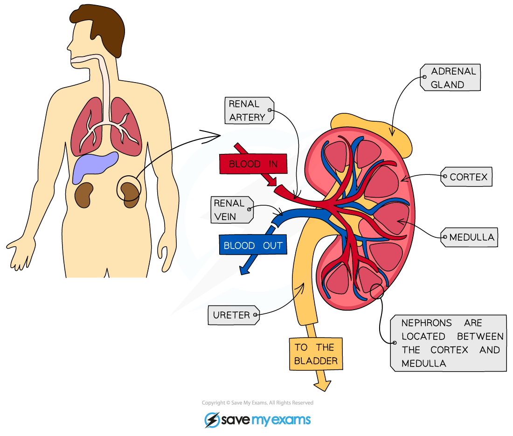
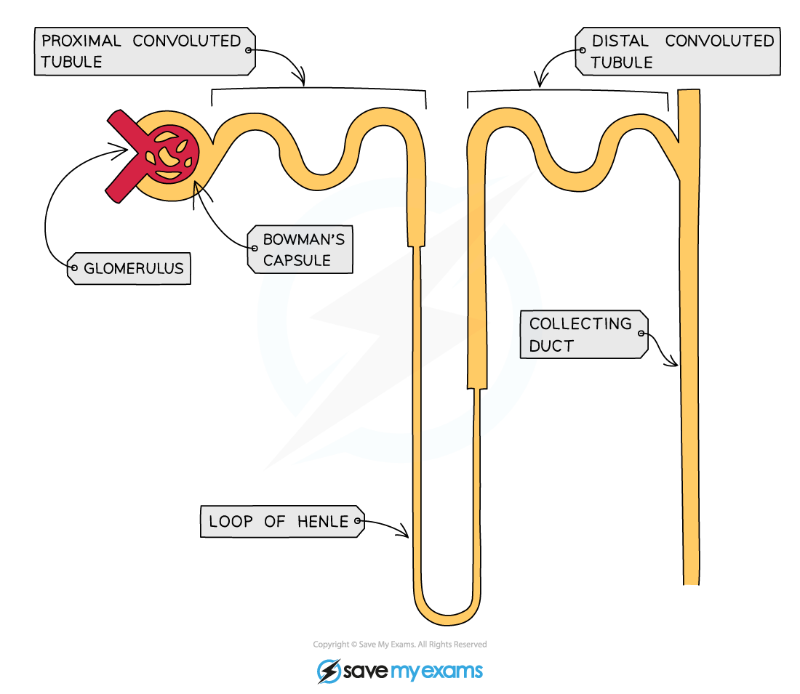

# Nephron Structure

## Kidney Structure

> **Spec point** — `spcpt_MrgZQRSNdtMn6fqz` · describe the structure of a nephron, including the Bowman’s capsule and glomerulus, convoluted tubules, loop of Henle and collecting duct

## Nephrons

- The kidney can be divided into three main regions: the cortex, the medulla and the renal pelvis
- Nephrons are the functional units of the kidney. Each kidney has around one million nephrons
- The nephron is responsible for **filtering the blood and forming urine**
- Some parts of the nephron are located in the cortex, and some parts are located in the medulla:

  - The Bowman’s capsule, glomerulus, PCT, and DCT are found in the cortex, which is the outermost layer of the kidney
  - The loop of Henle and collecting duct are found mainly in the medulla, the inner region of the kidney
- The renal pelvis is a funnel-shaped cavity that collects urine from the collecting ducts and passes it into the ureter

#### The structure of a nephron

- The main parts of a nephron are:

  - **Bowman's capsule**, which surround the **glomerulus**
  - **Proximal convoluted tubule (PCT)**
  - **Loop of Henle**
  - **Distal convoluted tubule (DCT)**
  - **Collecting duct**

*Nephron structure*
