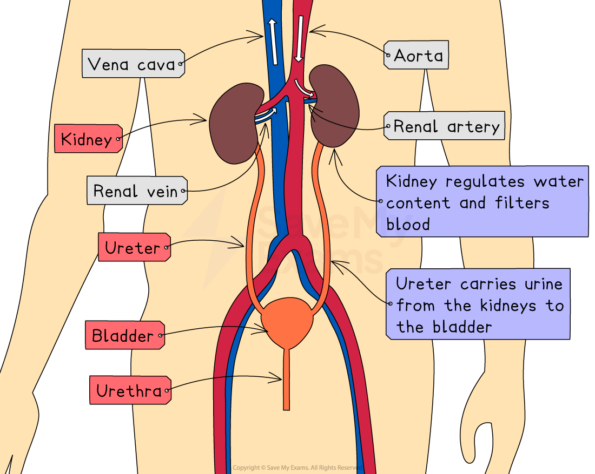

# Structure of the Urinary System

## The Urinary System: Structure

> **Spec point** — `spcpt_XHZD2sZFC45rjmHW` · describe the structure of the urinary system, including the kidneys, ureters, bladder and urethra

## The Urinary System: Structure

- The kidneys are part of the **urinary system**
- The urinary system consists of two** kidneys** (found at the back of the abdomen) joined to the **bladder** by two tubes called the **ureters**
- Another tube, the** urethra**, carries urine from the bladder to outside the body
- Each kidney is also connected to:

  - The **renal arteries** carry blood from the aorta to the kidneys to be filtered
  - The **renal veins** carry filtered blood away from the kidneys to the vena cava

***The urinary system in humans***

#### Main structures of the urinary system

| Structure | Description |
|---|---|
| Kidney | Compact, oval organ that has two main roles: excretion (removal of waste products from metabolism) and osmoregulation (maintenance of blood water levels) |
| Ureter | A tube that transports urine from the kidney to the bladder |
| Bladder | Organ that stores urine (a solution of water, ions and urea) until it's excreted by the body |
| Urethra | A tube that carries urines from the bladder to the outside of the body |

> **Exam Hint**
> Note the difference between the ‘ureter’ and the ‘urethra’. These two names are commonly confused by students so take care to learn them and know which tube is which – they are NOT interchangeable!
