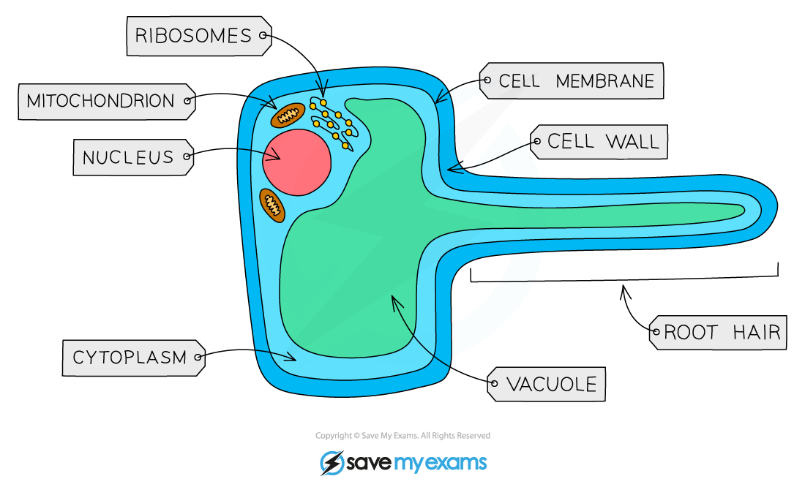
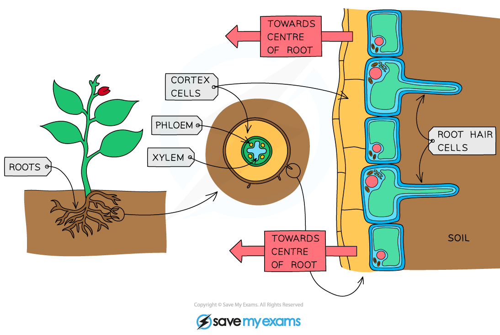
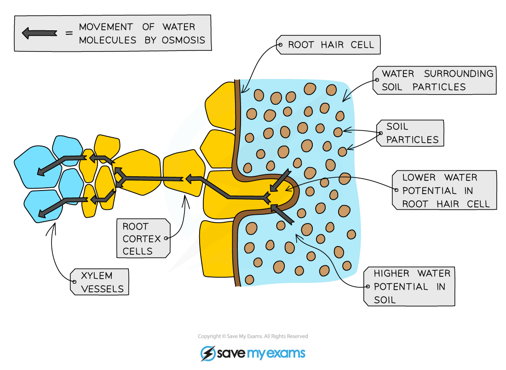

# Absorption of Water by Root Hair Cells

## Root Hair Cells

> **Spec point** — `spcpt_x996wxYqh39CtT4p` · understand how water is absorbed by root hair cells

## Root Hair Cells

#### Uptake of water into the root

- Root hair cells are tiny, single-celled extensions of epidermis cells in the root
- **Root hair cells** are adapted for the efficient uptake of water (by osmosis) and mineral ions (by active transport)

  - Root hairs** increase the surface area **of plant roots, increasing the rate at which water and minerals can be taken up
  - They contain **mitochondria** which release energy for **active transport**

***A root hair cell***

***The structure of a root specifically allows it to maximise absorption of water by osmosis and mineral ions by active transport***

#### The route of water through the plant

- Water moves by **osmosis** into the **root hair cells,** then through the **root cortex** and finally into the** xylem vessels**

  - Remember waters move from a solution with a **high** **water potential** to a solution with a **low water potential**
  - Water potential is a measure of how freely water molecules can move
- Once the water gets into the xylem, it is carried up to the leaves where it enters **mesophyll cells**
- A summary of the pathway is:

**root hair cell → root cortex cells → xylem → leaf mesophyll cells**

***Pathway of water into and across a root***
