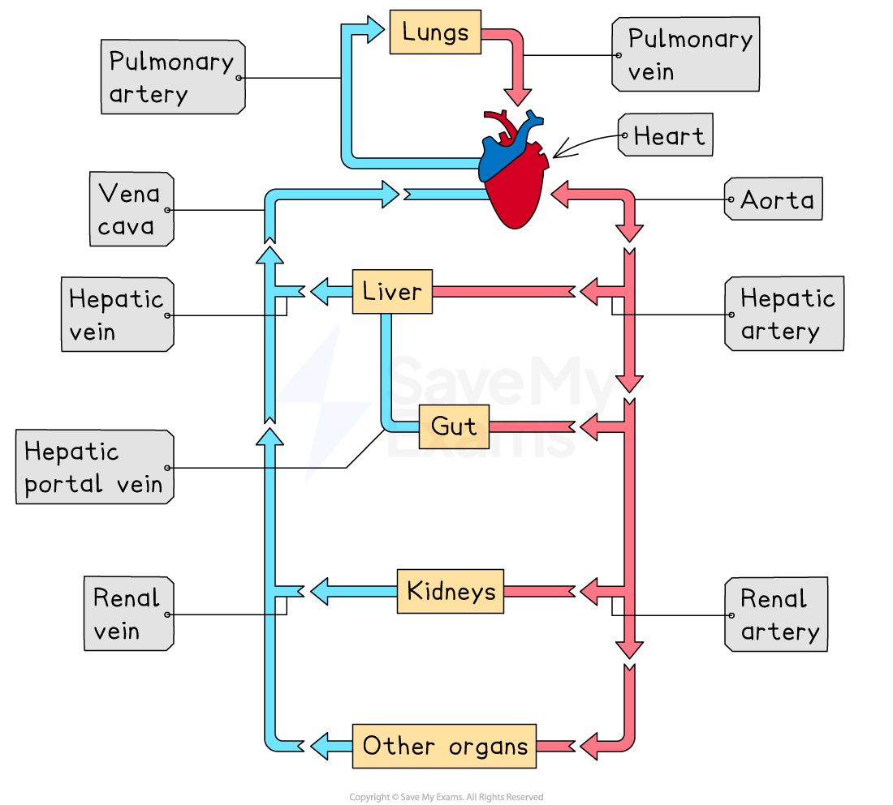

# Circulatory System: General Structure

## Circulatory System

> **Spec point** — `spcpt_BvXwgJxd6xmRWqdF` · understand the general structure of the circulation system, including the blood vessels to and from the heart and lungs, liver and kidneys

## Circulatory System

- The circulatory system is a **closed network** of blood vessels connected to the heart, with blood flowing in **one direction**
- Arteries carry blood away from the heart to organs, and this blood is usually **oxygenated**

  - The **pulmonary artery** is an exception, it carries **deoxygenated blood** away from the heart
- Arteries branch into narrower arterioles and then capillaries within the organs
- In the organs, **respiring cells** use up the oxygen from the blood
- Capillaries join to form venules, which widen into veins carrying blood back to the heart, and this blood is usually **deoxygenated**

  - The **pulmonary vein** is an exception, it carries **oxygenated** **blood** to the heart
- A different network of** lymphatic vessels** collect all the excess tissue fluid that leaks out of the capillaries and delivers it back to the **circulatory system**

***The circulatory system***

#### Main Blood Vessels of the Circulatory System Table

| **Organ** | **Towards organ ** | **Away from organ** |
|---|---|---|
| Heart | Vena cava, pulmonary vein | Aorta, pulmonary artery |
| Lung | Pulmonary artery | Pulmonary vein |
| Liver | Hepatic artery **and** hepatic portal vein | Hepatic vein |
| Kidney | Renal artery | Renal vein |
