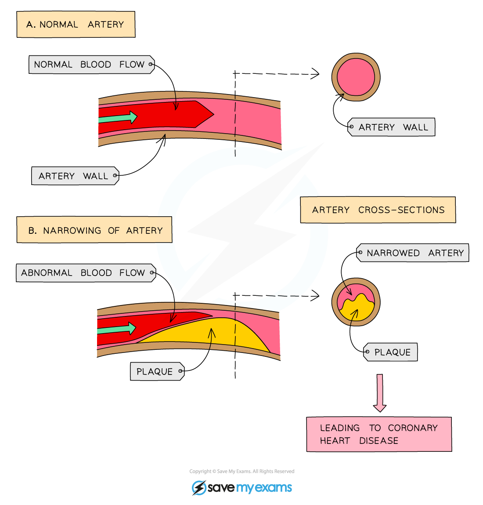

# Risk Factors for Coronary Heart Disease

## Heart Disease

> **Spec point** — `spcpt_5McgWtPb3ZjMjh4p` · understand how factors may increase the risk of developing coronary heart disease

## Heart Disease

- The** coronary arteries **are the **blood vessels **which supply cardiac muscle with oxygen and glucose
- **In coronary heart disease** (CHD), layers of fatty material (plaque) build up inside the **coronary arteries**

  - These fatty deposits are mainly formed from **cholesterol**
  - There are two sources of cholesterol in the body:
  
    - Dietary cholesterol (from animal products eaten)
    - Cholesterol synthesised by the liver

***Buildup of plaque in the coronary arteries narrows the lumen***

- If a coronary artery becomes partially or completely blocked by these fatty deposits, the flow of blood through the arteries is reduced, resulting in a lack of oxygen for the heart muscle

  - **Partial blockage** of the coronary arteries creates a restricted blood flow to the cardiac muscle cells and results in severe chest pains called **angina**
  - **Complete blockage** means cells in that area of the heart will not be able to respire aerobically, leading to a **heart attack**

***The effect of a narrowed lumen in a coronary artery is reduced blood flow to the heart***

#### Risk factors of coronary heart disease

- There are several **risk factors** which will increase the chances of coronary heart disease:
- **Obesity**

  - Carrying extra weight puts a strain on the heart
  - Increased weight can lead to **Type 2 diabetes **which further damages your blood vessels
- **High blood pressure**

  - This increases the force of the blood against the artery walls and consequently leads to damage of the vessels
- **High cholesterol**

  - Speeds up the build up of fatty plaques in the arteries leading to blockages
- **Smoking**

  - Chemicals in smoke cause an increase in plaque build up and an increase in blood pressure
  - Carbon monoxide also reduces the oxygen carrying capacity of the red blood cells
