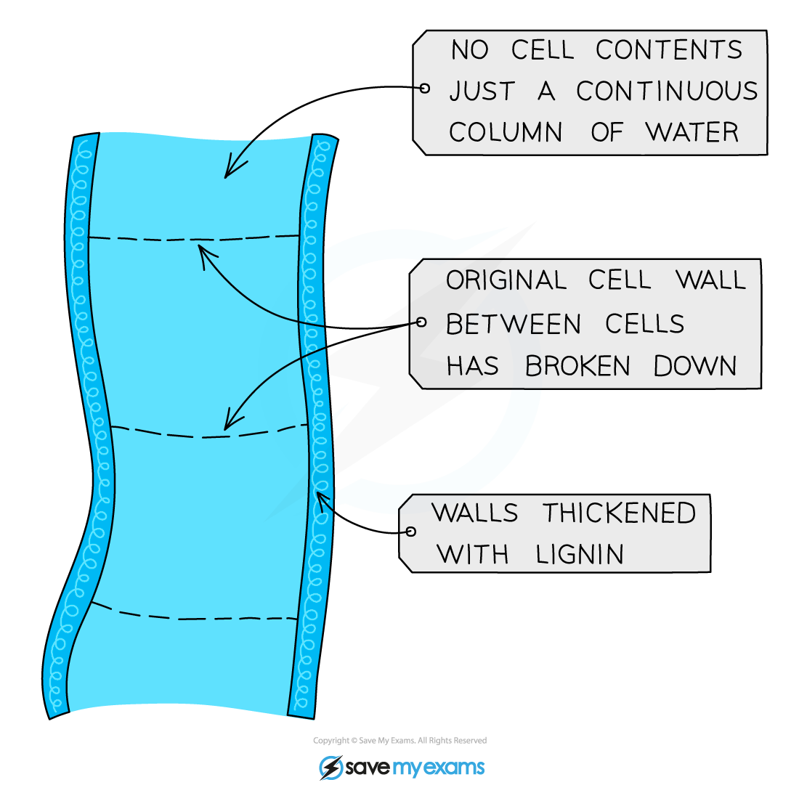
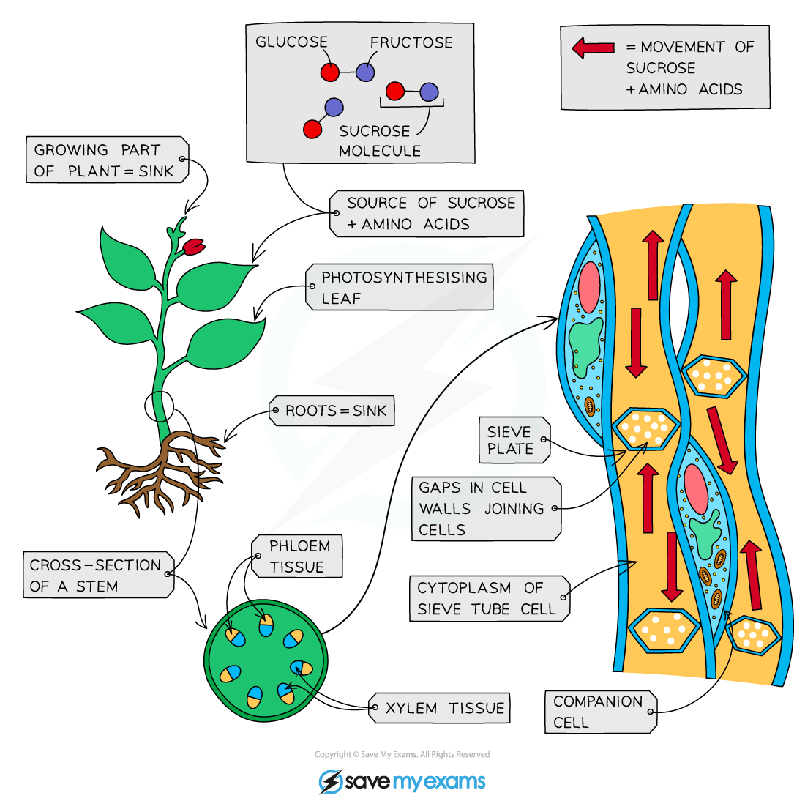

# Role of the Xylem & Phloem

## Xylem & Phloem

> **Spec point** — `spcpt_YKpJHS4ZTM4qnrV7` · "describe the role of phloem in transporting sucrose and amino acids between the leaves and other parts of the plant

describe the role of xylem in transporting water and mineral ions from the roots to other parts of the plant"

## Xylem & Phloem

- The xylem and phloem make up the **transport system** of vascular plants
- The role of the **xylem** is to transport **water and mineral ions** from the roots to other parts of the plant

  - The xylem is formed from a hollow tube of dead cells, reinforced by lignin, which provides a route for the column of water to move through the plant by transpiration.

*The structure of the xylem allows it to function as a vessel for the transport of water through the plant*

- The role of the **phloem** is to transport **sucrose and amino acids** from where they are produced or stored, to where they are needed

  - E.g. sucrose and amino acids are produced in the leaves while plants photosynthesise, so they are transported from the leaves to other parts of the plant
  - The phloem is formed from living cells forming a tube with small holes through which substances can move.

*Translocation through the phloem*
