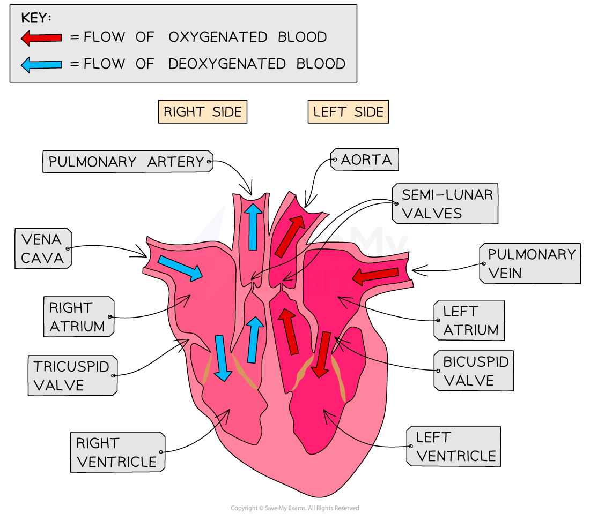

# Structure & Function of the Heart

## Structure & Function of the Heart

> **Spec point** — `spcpt_mK85xGkGQKkfcg3Y` · describe the structure of the heart and how it functions

## Structure & Function of the Heart

- The heart organ is a **double pump**

  - **Oxygenated blood** from the lungs enters the **left** side of the heart and is pumped **to the rest of the body (the systemic circuit)**
  
    - **The left ventricle has a thicker muscle wall than the right ventricle** as it has to pump blood at high pressure around the **entire body**,
  - **Deoxygenated blood** from the body enters the** right** side of the heart and is pumped **to the lungs (the pulmonary circuit)**
  
    - The right ventricle is pumping blood at lower pressure to the **lungs**
  - A muscle wall called the **septum **separates the two sides of the heart
- Blood is pumped **towards** the heart in **veins** and **away** from the heart in **arteries**
- The **coronary** **arteries** supply the **cardiac muscle tissue** of the heart with oxygenated blood

  - As the heart is a muscle it needs a constant supply of oxygen (and glucose) for aerobic respiration to release energy to allow continued muscle contraction
- **Valves** are present to **prevent blood flowing backwards**

***Structure of the Heart***

#### The pathway of blood through the heart

- **Deoxygenated blood** coming from the body flows through the **vena cava** and into the **right atrium**

  - The **atrium** **contracts** and the blood is forced through the **tricuspid (atrioventricular) valve** into the **right ventricle**
  - The ventricle **contracts** and the blood is pushed through the **semilunar valve **into the **pulmonary artery**
  - The blood travels to the** lungs** and moves through the capillaries past the alveoli where **gas exchange** takes place
  
    - **Low pressure** blood flow on this side of the heart prevents damage to the capillaries in the lungs
- **Oxygenated blood** returns via the **pulmonary vein **to the **left atrium**

  - The** atrium contracts** and forces the blood through the **bicuspid (atrioventricular) valve** into the **left ventricle**
  - The ventricle **contracts** and the blood is forced through the **semilunar valve** and out through the **aorta**
  
    - Thicker muscle walls of the left ventricle produce a **high enough pressure** for the blood to travel around the whole body

> **Exam Hint**
> Remember : **A**rteries carry blood **A**way from the heart.
> 
> When explaining the route through the heart we usually describe it as one continuous pathway with only one atrium or ventricle being discussed at a time, but remember that in reality, both atria contract at the same time and both ventricles contract at the same time.
> 
> Also, the heart is** labelled as if it was in the chest** so the left side of a diagram is actually the right hand side and vice versa
