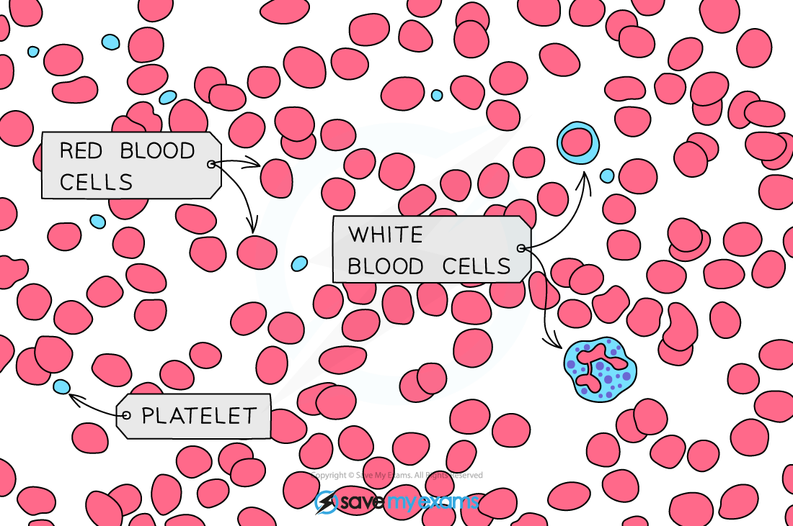
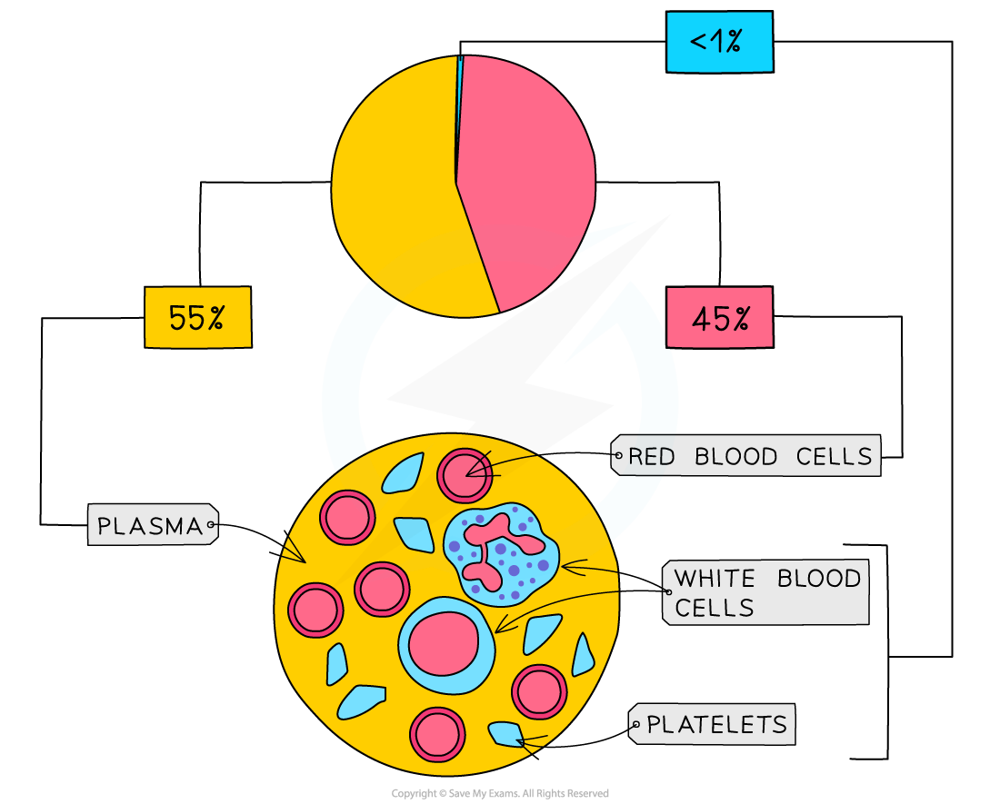
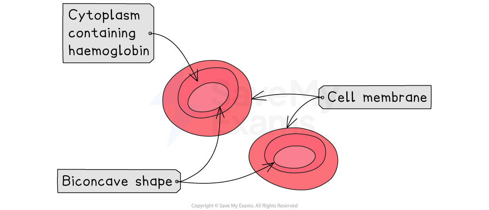

# The Blood

## Components of Blood

> **Spec point** — `spcpt_2VtjW9mZbtd3X8xQ` · describe the composition of the blood: red blood cells, white blood cells, platelets and plasma

## Components of Blood

- Blood consists of **red blood cells, white blood cells, platelets **and** plasma**
- Over half of the volume of the blood is made up of plasma
- The majority of the other half is made up of red blood cells
- The remaining fraction consists of white blood cells and platelets

***Blood micrograph***

***Composition of human blood***

#### Components of the Blood Table

| **Component** | **Structure** |
|---|---|
| Red blood cells | Biconcave discs, no nucleus and contains haemoglobin |
| White blood cells | Large cells containing a large nucleus; different types have slightly different structures and functions |
| Platelets | Fragments of cells |
| Plasma | Clear, straw-coloured aqueous solution |

## Plasma

> **Spec point** — `spcpt_qf8PnY6CkxBw2sTB` · understand the role of plasma in the transport of carbon dioxide, digested food, urea, hormones and heat energy

## Plasma

- **Plasma** is a straw coloured liquid which the other components of the blood are suspended within
- Plasma is important for the transport of many substances including:

  - **Carbon dioxide - **the waste product of **respiration,** dissolved in the plasma and transported from **respiring cells** to the** lungs**
  - **Digested food and mineral ions - **dissolved particles absorbed from the small intestine and delivered to **requiring cells** around the body
  - **Urea **- urea is a waste substance dissolved in the plasma and transported to the **kidneys**
  - **Hormones - chemical messengers **released into the blood from the endocrine organs (glands) and delivered to **target tissues/organs of the body**
  - **Heat energy - **heat energy (created in **respiration**) is transferred to** cooler parts** of the body or to the **skin** where heat can be lost

## Red Blood Cells

> **Spec point** — `spcpt_wD7Bmwrstq4hgPqk` · understand how adaptations of red blood cells make them suitable for the transport of oxygen, including shape, the absence of a nucleus and the presence of haemoglobin

## Red Blood Cells

- Red blood cells are **specialised cells** which carry **oxygen **to** **respiring cells
- They are adapted for this function in three key ways:

  - Red blood cells are packed with **haemoglobin**, a protein that binds to oxygen to form oxyhaemoglobin
  - They have **no nucleus** which allows more space for haemoglobin to be packed in
  - Red blood cells have a **biconcave disc shape**, which means they are thinner in the middle than at the edges. This shape gives them a **larger surface area to volume ratio**, allowing oxygen to diffuse in and out quickly and efficiently.

*Red blood cells*
