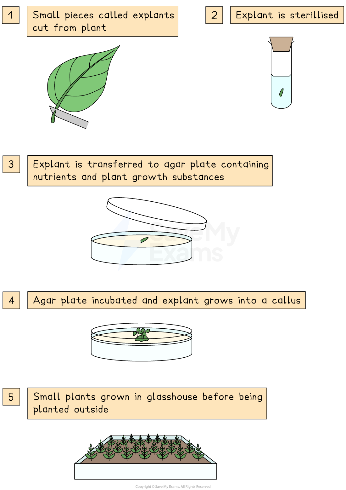

# Micropropagation

## Micropropagation

> **Spec point** — `spcpt_wBFy4DVjPXdRcmdm` · describe the process of micropropagation (tissue culture) in which explants are grown in vitro

## Micropropagation

- Tissue culture is a process in which very small (micro) pieces of plants ('**tissue'**) are grown (**‘cultured’**) using nutrient media
- Because they are initially grown in **Petri dishes on nutrient agar** we say they are grown ‘**in vitro**’ – outside a living organism
- Large numbers of genetically identical plants can be produced using **micropropagation**
- The stages of **micropropagation** are:

  - Small pieces are cut from the plant to be cloned - these pieces are known as explants
  - The surface of the **explants** are sterilised using a **disinfectant **followed by a rinse with sterile water
  - Sterilised explants are transferred to a **sterile petri dish** containing** sterile nutrient agar**
  - The growth medium encourages the explant cells to grow and divide into small masses of cells (known as a **callus**)
  - Each callus is transferred to a fresh growth medium that contains a range of **plant growth regulators** (hormones). The presence of these hormones causes the callus to develop **roots**, **stems** and **leaves**, forming a **plantlet**
  - Plantlets can be transferred to individual potting trays and develop into plants

***The steps of micropropagation to reproduce cloned plants***

> **Exam Hint**
> It is possible small pieces of plant tissue (explants) to grow into whole new individual plants because plant cells can differentiate into all different specialised cell types throughout a plants life. 
> 
> The same cannot occur in animals - small pieces of animal tissue cannot grow into new individuals. This is because only stems cells found in animal embryos can differentiate into all of the specialised cell types required to make a whole new individual.

## Commercial Use of Micropropagation

> **Spec point** — `spcpt_xSJccFgmd6Wp4bry` · understand how micropropagation can be used to produce commercial quantities of genetically identical plants with desirable characteristics

## Commercial use of micropropagation

### Advantages of micropropagation

- Advantages of micropropagation include:

  - The production of (many) **genetically identical clones** of plants with desirable traits
  - **Commercial benefits:**
  
    - Can produce plants **cheaply** and in **large quantities** per square metre
    - **Fast production**: plantlets grow into mature plants quicker than from seeds
    - Can be done at **any time of year, **without any seasonal limitations on growth
    - Ensures plants are **disease-free** (as they're grown in a sterile lab) and if the original plant has a trait for disease resistance, this trait is preserved in all the cloned plantlets
  - Another advantage is micropropagation is that is can can be used in conservation to **preserve rare plant species**

### Disadvantages of micropropagation

- There are a number of drawbacks to using micropropagation:

  - **Trained personnel** and a **sterile laboratory** are required
  - All the plants produced are **genetically identical** and so will all be **vulnerable to the same diseases and pests** (the lack of genetic variation makes them less able to adapt to environmental change)
