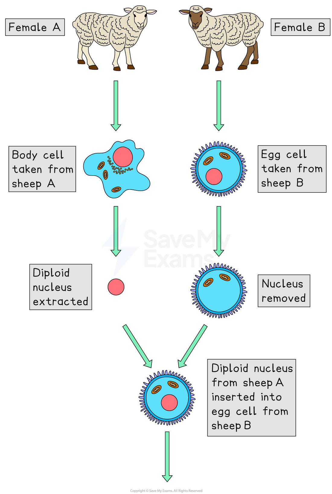
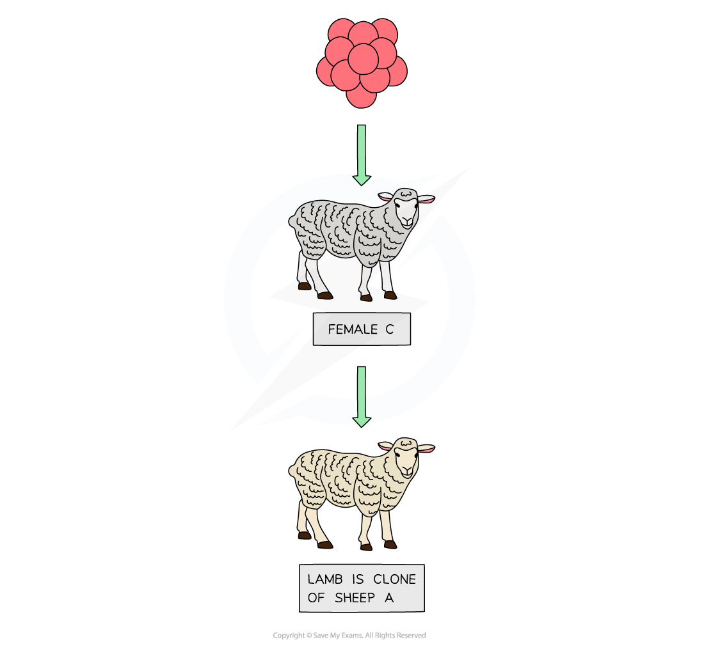

# The Production of Cloned Mammals

## Cloning Mammals

> **Spec point** — `spcpt_gDfz2jb5y6zkbC6S` · describe the stages in the production of cloned mammals involving the introduction of a diploid nucleus from a mature cell into an enucleated egg cell, illustrated by Dolly the sheep

## Cloning Mammals

### Adult cell cloning

- Adult cell cloning is achieved in the following way:

  - The **nucleus** is removed from an **unfertilised egg cell, **producing an** enucleated egg cell**
  - The diploid nucleus from a mature **adult body cell**, such as a skin cell, is **inserted** into the enucleated egg cell
  - A very small **electric shock stimulates **the cell** to divide** (by mitosis) to form an embryo
  - These embryo cells contain the same genetic information as the adult skin cell
  - When the embryo has developed into a ball of cells, it is inserted into the uterus of an adult female (known as the **surrogate mother**) to continue its development until birth
- This process was used to create the first clone (exact genetic copy) of a mammal in 1996

  - Scientists in Scotland successfully cloned an adult female sheep
  - The clone was called Dolly

***Adult cell cloning: the cloning technique used to produce the first cloned mammal, Dolly the sheep***

#### Benefits & risks of cloning table

| **Benefits of cloning** | **Risks of cloning** |
|---|---|
| Cloning can be used to help preserve endangered species or resurrect extinct animals | Cloning results in a lack of genetic diversity. This can make clones more vulnerable to disease or changes in the environment, leaving the population at risk |
| Cloning makes it possible to quickly and cheaply produce commercial quantities of consistently high-quality plants at any time of the year | There is some evidence that cloned animals may not be as healthy as normal ones |
| Cloning allows farmers to increase yields by using high-quality livestock and plants | There are ethical concerns about cloning, especially when it comes to humans. Many people believe it is unethical to clone humans. Additionally, cloning in humans has a high rate of failure, with some unsuccessful attempts resulting in stillborn children or children with severe disabilities |

## Cloning to Produce Human Proteins

> **Spec point** — `spcpt_S24VF72JmsR7zTYY` · understand how cloned transgenic animals can be used to produce human proteins

## Cloning to Produce Human Proteins

- Dolly the sheep was the **first cloned mammal** produced from an adult cell
- Scientists can produce **transgenic animals** by inserting a **foreign gene** into their genome
- The **foreign gene can code for a useful protein**, which the animal can then produce in its **milk, eggs, or blood**
- Once a transgenic animal has been created, it can be **cloned** to produce more animals with the same trait
- **Uses of transgenic animals** include producing **useful proteins for medical purposes**, such as proteins to treat diseases in humans
