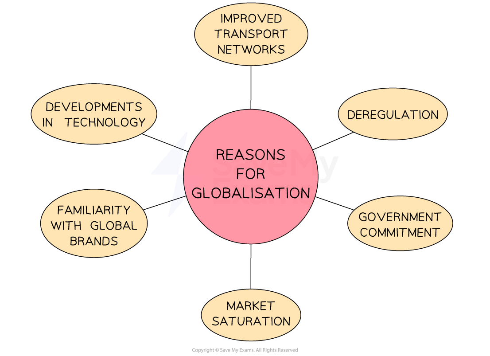

# Globalisation

## An introduction to globalisation

> **Spec point** — `spcpt_cmJbngMrCPtTH82K` · concept of globalisation

## An introduction to globalisation

- Globalisation is the business and **economic integration of different countries** through increasing freedoms in the cross-border movement of people, goods, services, technology and finance
- The past twenty years has been characterised by **rapid globalisation **and growing international business expansion
- Businesses that trade internationally import and export goods and services

  - **Imports** are goods and services **bought by people and businesses in one country from another country**
  
    - In 2022, the UK’s biggest import was cars, valued at approximately £3.25 billion
  - **Exports** are goods and services **sold by domestic businesses** to people or businesses in other countries
  
    - In 2022, China’s biggest export was smartphone manufacturing, valued at approximately \$21.4 billion
- Exports generate **extra sales revenue** for businesses selling their goods abroad
- Imports result in money leaving the country, which generates **extra revenue for foreign businesses**

## Reasons for globalisation

> **Spec point** — `spcpt_jVDrRsX4Dk7XPvqr` · concept of globalisation

## Reasons for globalisation

- The **growth of globalisation** has occurred for a number of reasons

#### Reasons for increased globalisation

*Globalisation has been driven by developments in technology, saturation of domestic markets and deregulation *

- **Developments in technology**

  - This allows faster communication, transfer of data and online sales around the world
- **Improved transport networks**

  - This allows international business travel and improved distribution of products
- **Deregulation**

  - ***Deregulation*** such as the **removal of** ***trade barriers*** as well as simpler financial systems, has made trading internationally easier
- **Government commitment**

  - Governments have taken steps to increase trade so people, products and finance can move more easily across borders
- **Market saturation**

  - ***Saturation*** of domestic markets means that growth can only be achieved by targeting new ***target markets*** overseas
- **Familiarity with global brands**

  - The **increase in tourism** and **access to overseas media** has familiarised consumers with global brands

## Opportunities of globalisation

> **Spec point** — `spcpt_hWFg8Zn6z663bxnW` · opportunities and threats of globalisation for businesses.

## Opportunities of globalisation

- Since the 1990s, globalisation has led to **reduced levels of poverty** in developing countries

  - **Employment** levels have increased
  - **Living standards, health** and **education outcomes** have improved
- Businesses have been able to take advantage of this development

  - Better qualified and more productive **workforces**
  - More attractive **markets** in which to sell products
  - New **locations **for production facilities

#### The main opportunities of globalisation for businesses

| **Opportunity** | **Explanation** |
|---|---|
| **Large markets** | - Global markets have many **more customers than domestic markets** - Higher sales increases ***revenue*** and should increase business ***profit***    - E.g. China's **Huawei** produces and sells consumer electronics in over 170 countries, earning a profit of CN¥73.05 billion in 2023 |
| **Economies of scale** | - **Higher** ***output*** as a result of increased sales can reduce business costs - These ***economies of scale*** can increase profits and  improve business competitiveness    - E.g. British-Dutch multinational** Unilever** sells more than 400 brands in over 190 countries and is the fifth largest consumer goods company in the world |
| **Labour** | - Domestic **staff shortages can be overcome** by employing workers from other countries - ***Labour-intensive*** businesses can locate in regions with lower wage costs to reduce outgoings - **High-quality specialists** from anywhere in the world can be employed    - E.g. US brand **Gillette**'s shaving products are largely manufactured in China where the company owns two factories |
| **Taxation** | - ***Head offices*** and other business functions can be located in regions with **favourable tax regimes** to reduce costs    - E.g. With sales revenue of \$12bn in 2022 **Smurfitt Kappa**, whose headquarters are in low-tax Ireland, operates paper plants in the EU and North America |

> **Exam Hint**
> In the exam you may be asked to explain a benefit of globalisation. Look at the question carefully to determine whether you are being asked for a benefit to businesses, their workers or consumers. Each have benefitted in their own ways from globalisation.

## Threats of Globalisation

> **Spec point** — `spcpt_8hXzJypf88PNFy84` · opportunities and threats of globalisation for businesses.

## Threats of Globalisation

- Globalisation can also present significant** problems and risks **for businesses

#### 1. Increased competition

- Competition from international rivals may put domestic firms out of business

  - International firms may benefit from lower costs and greater ***economies of scale***, so they can offer lower prices than domestic businesses to consumers
  - Large overseas competitors can **spend more on research, marketing and distribution** than a small domestic business
  - Access to **cheaper labour or materials** allows them to sell products at **lower prices**

#### 2. Increased need to develop a profitable niche

- Businesses risk **losing sales and *****market share*** as a result of globalisation unless they can **adapt or exploit a profitable** ***market niche***

  - Exploiting a gap in the wider market is often very profitable
  - E.g. Walkers Crisps dominate the lunchbox market with their multipacks

#### 3. Vulnerability to international takeovers

- Domestic Public Limited companies risk being **taken over by foreign rivals**

  - ***Capital*** **can flow easily across borders**
  - Most countries allow foreign businesses to take ownership of domestic businesses
  
    - E.g. In 2009 UK confectionary company Cadburys was acquired by US company Kraft in a ***hostile takeover***

#### 4. Greater risk from external shocks

- Interconnected financial systems allow **economic difficulties** in one part of the world to be felt by businesses operating in another

  - The UK's vote to leave the EU in 2016 caused immediate financial shocks around the world, with ***stock exchanges*** in countries as distant as Australia and Japan reporting sharp falls
- Global **distribution networks** can be affected by natural disasters or other interruptions, such as accidents or terrorism

  - In 2021, the grounded container ship *Ever Given *blocked the Suez Canal for six days, causing delays to deliveries of goods such as semiconductors, which impacted technology ***manufacturing*** around the world
