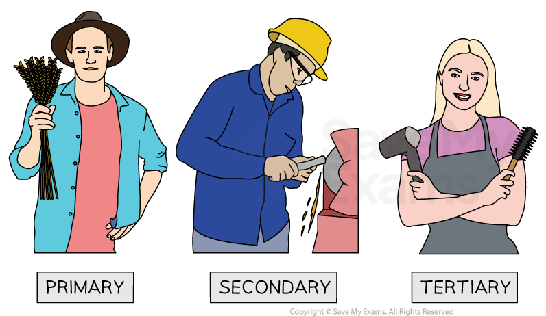
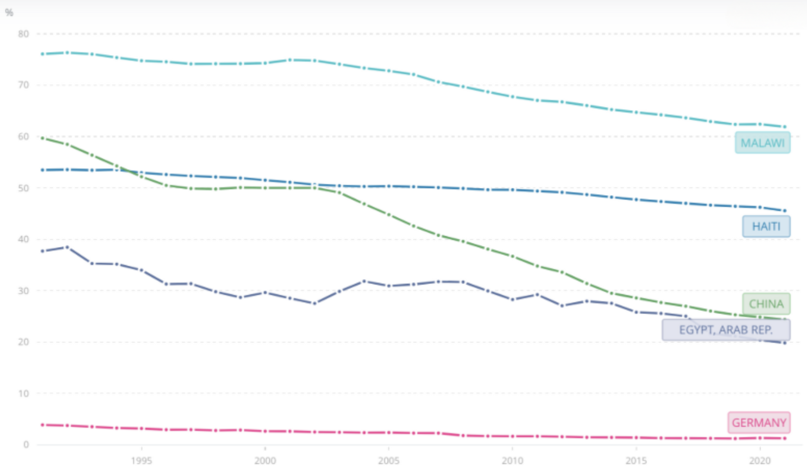
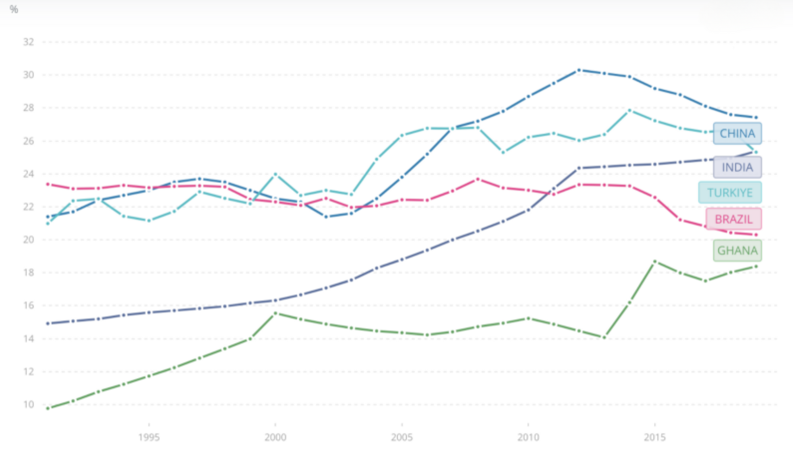
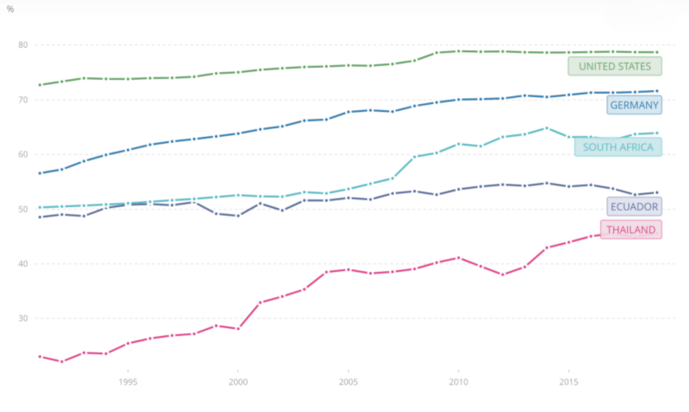

# Primary, Secondary & Tertiary Business Sectors

## The main sectors of industry

> **Spec point** — `spcpt_wqXnHh2B9k4ZQ5yx` · Primary, secondary and tertiary activities: 
• primary sector – extracting raw materials from the earth 
• secondary sector – converting raw materials into finished or semi-finished goods 
• tertiary sector – provision of a wide variety of services.

## The main sectors of industry

- Businesses can be classified according to the **industrial sector** in which they operate

  - This **aids comparisons** between firms in the same sector
  - However, it does not capture the full **complexity** of the business world
  
    - Some businesses** operate across more than one sector** of industry
    - E.g. Large oil companies such as **Shell **extract (primary), refine (secondary) and sell (tertiary) fuel through a large network of gas stations

#### The main sectors of industry

* Businesses operate in the primary, secondary or tertiary sector*

## The Primary Sector

> **Spec point** — `spcpt_vvfzdhMnB5Dqmn6G` · Primary, secondary and tertiary activities: 
• primary sector – extracting raw materials from the earth 
• secondary sector – converting raw materials into finished or semi-finished goods 
• tertiary sector – provision of a wide variety of services.

## The primary sector

- The **primary** sector is concerned with the **extraction** of raw materials from land, sea or air
- Examples include farming, mining, forestry and fishing
- **Less developed economies **are primarily focused on the **primary sector,** with most people employed in agriculture and the production of food

  - There has been a global trend away from employment in primary sector industries over the last two decades
  - Only in the least developed nations is the proportion of the workforce employed in the primary sector consistently high
  - This is partly as a result of** lower participation rates in education **and a **lack of infrastructure** to support manufacturing or service provision
- Some **developed economies,** such as Australia (viticulture or wine production) and Norway (forestry and oil extraction), continue to have significant primary sectors

#### Employment in primary industries in some countries since 1991

*Employment in primary sector industries in Malawi, Haiti, China, Egypt and Germany since 1991  (Source: WorldBank)*

- Malawi retains the highest proportion of employment in the primary sector
- China has seen a significant decrease in primary sector activity since 1991
- Germany has a small primary sector with an economy focused on manufacturing and services well before 1991

## The secondary sector

> **Spec point** — `spcpt_YnsKRd6K7JKtchrG` · Primary, secondary and tertiary activities: 
• primary sector – extracting raw materials from the earth 
• secondary sector – converting raw materials into finished or semi-finished goods 
• tertiary sector – provision of a wide variety of services.

## The secondary sector

- The **secondary** sector is concerned with the **processing** of raw materials and components

  - Examples include oil refinement and the **manufacture** of goods such as vehicles
- In **emerging economies,** improved technology enables less labour to be needed in the primary sector and more workers to be employed in the secondary sector

  - The proportion of workers employed in manufacturing has risen over the last few decades
  - Many businesses have relocated production facilities to take advantage of the **lower average wage rates** in these economies

#### Employment in secondary industries in some countries since 1991

*Employment in secondary sector industries in China, India, Turkey, Brazil and Ghana since 1991  (Source: WorldBank)*

- China has the highest proportion of employment in the secondary sector, though it is declining
- Ghana and India have seen significant increases in secondary sector activity since 1991
- Brazil and Turkey's secondary sectors have remained relatively stable over the period 1991 to 2019

## The tertiary sector

> **Spec point** — `spcpt_S8MzwBbF44dZvVGm` · Primary, secondary and tertiary activities: 
• primary sector – extracting raw materials from the earth 
• secondary sector – converting raw materials into finished or semi-finished goods 
• tertiary sector – provision of a wide variety of services.

## The tertiary sector

- The **tertiary** sector is concerned with the provision of a wide range **services** for consumers and other businesses such as leisure, banking or ***hospitality***

  - It includes a sub-sector called the **quaternary** sector, which is concerned with the provision of **knowledge-focused services** related to IT technology, ***consultancy*** or research
- **Emerging economies **have experienced growth in the tertiary and quaternary sectors in recent years, with many businesses now focused on the provision of consumer services
- The **most developed economies **have a very high proportion of the workforce employed in the provision of services, increasing focus on the quaternary sector

  - Developed economies use their wealth to fund advanced **education** and **higher-level skills training,** which further supports the growth of these industries

#### Employment in tertiary industries in some countries since 1991

*Employment in tertiary sector industries in the USA, Germany, South Africa, Ecuador and Thailand since 1991  (Source: WorldBank)*

- Highly-developed economies such as the US and Germany have the highest proportion of their workforces employed in the service industry
- Thailand's service sector employs twice as many employees in 2019 as it did in 1991
- Around half of Ecuador's workforce is now employed in service delivery

> **Exam Hint**
> This is a common topic covered in multiple choice questions. Make sure that you are aware of examples of primary, secondary and tertiary sector industries.
