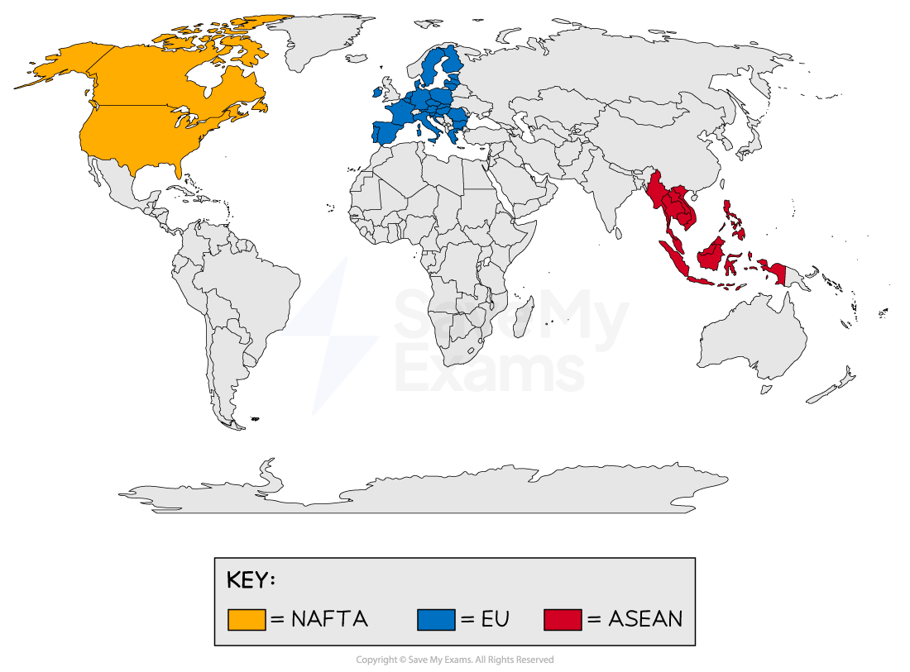
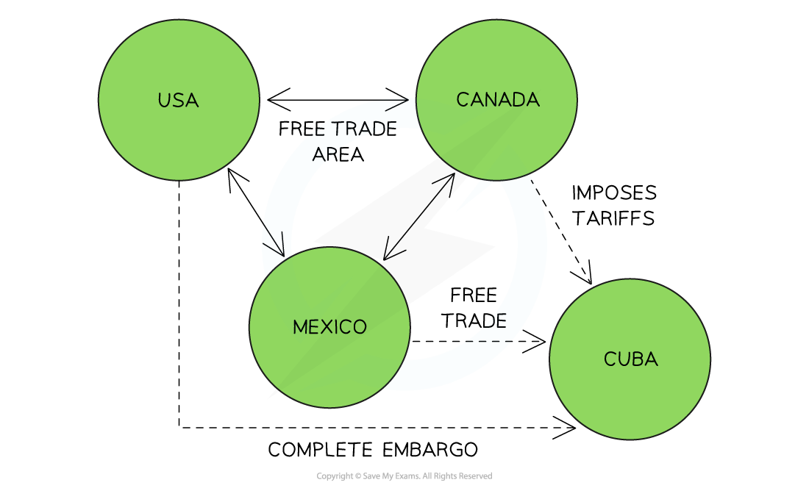

# Legal Factors & Location

## The impact of law on business location

> **Spec point** — `spcpt_XH73bhCSHykfkhvf` · legal controls and trade blocs.

## The impact of law on business location

- **Law**s are **rules** created by the government of a country with the aim of **regulating the actions of its citizens and businesses**

  - **Regulation** is the process of enforcing the laws that have been created and ensuring that businesses abide by them

- Governments and local authorities can **incentivise** businesses to locate in particular areas

  - In areas of** high unemployment **or** industrial decline** ***grants*** or reduced tax rates** **may be offered to businesses that create jobs or improve communities
- In some cases, businesses are **deterred** from locating in particular areas

  - E.g. In areas of outstanding natural beauty, strict ***bylaws*** or city ordinances may regulate the type of business activity that is permitted
  - E.g. A country with strict environmental laws might not be an attractive location for a manufacturing company that produces a lot of waste
- The **presence or absence of laws** can affect a business's choice of location in two ways

### 1. Less economically developed countries

- Less economically developed countries often have fewer laws and** less enforcement of their existing laws, **which is likely to be attractive to some businesses

  - Businesses enjoy **lower costs** as they have to meet fewer legal requirements, such as safe handling of waste material
  - Labour can be paid very low rates as no minimum wages exists
  - Employees and customers have less opportunity to pursue **legal action**

### 2. More economically developed countries

- Developed economies with **extensive laws** can be attractive to businesses who desire to locate in region with

  - **Good infrastructure**
  - **Highly-skilled workers**
  - **High standards of living**

#### Laws and their impact on location

| **Type of law** | **Areas of impact** | **Examples** |
|---|---|---|
| **Employment law** | - Pay & conditions - Equal treatment regardless of characteristics such as gender, race and disability - Employment contracts - ***Trade union*** rights | - In **Norway** employees have a legal right to generous ***overtime*** pay and benefit from generous periods of parental leave |
| **Environmental law** | - Emissions - Storage and disposal of waste - Storing and handling hazardous substances - Packaging - Water usage | - Since 2019, **German** businesses have been required to accept the return of all unwanted product packaging from customers |
| **Consumer law** | - Descriptions of products - Right to refund or replacement - Product safety - Advertising & ***sales promotion*** - Selling ***credit*** products | - To tackle rising levels of obesity in **Brazil,** the government introduced a law banning the advertisement and sales promotion of ultra-processed food products |

## The influence of trade blocs on business location

> **Spec point** — `spcpt_GFFXs3R3t5XZDszh` · legal controls and trade blocs.

## The influence of trade blocs on business location

- A **trading bloc** is a group of countries that come together and **agree to reduce or eliminate any barriers to trade** that exist between them

  - There are different levels of ***economic integration*** ranging from relatively low integration in a **bilateral agreement** to high integration in a **monetary union, **e.g. the Eurozone
  - Globally, there were more than 420 regional trade agreements in effect in 2022
  - Each subsequent type of trading bloc has **increased levels** of economic integration

- Examples of trade blocs include the **EU** (European Union), **USMCA** (United States, Mexico, Canada) and **ASEAN** (Association of Southeast Asian Nations)

#### Major trade blocs in 2023

*Major trade blocs include the EU, ASEAN and USMCA (previously NAFTA)*

- A **free trade area** is a bloc in which countries agree to **abolish trade restrictions** **between themselves** but maintain their **own restrictions** with other countries

#### How a free trade area trading bloc works

*Mexico, Canada and the USA have a free trade agreement but can deal individually with Cuba as they see fit*

- Mexico, Canada and the USA have** reduced or eliminated many trade restrictions** between themselves

  - The USA **refuses to trade** with Cuba and has placed a complete ban on all exports/imports to Cuba
  - Canada trades with Cuba but imposes **tariffs on all imports**
  - Mexico **trades freely** with Cuba

- Businesses may look to** locate their operations in a trade bloc** country in order to avoid paying ***tariffs*** or other restrictions such as ***quotas***

> **Exam Hint**
> Trade blocs and other trading arrangements are often in the news. Using contemporary examples in your longer answers can improve their quality and support your analysis by giving it more depth.
