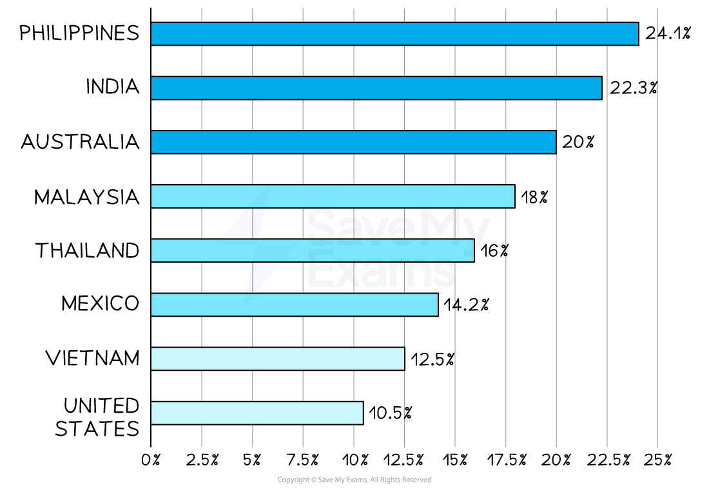

# The Impact of the Internet on Location Decisions

## E-commerce and location decisions

> **Spec point** — `spcpt_cQnqJbVHB9QMf7GV` · the impact of the internet on location decisions - e-commerce and/or fixed premises

## E-commerce and location decisions

- **E-commerce** involves the buying and selling of goods and services **online**

  - Some businesses sell goods online as well as operate physical stores
  - Small businesses have the ability to reach international customers by selling products online
  - E-commerce has **grown significantly** in recent decades

#### E-commerce sales growth in some countries in 2023

*E-commerce sales grew significantly in 2023, requiring many businesses to reconsider their location needs  (Source: Statista)*

### Factors for e-commerce businesses to consider

#### Lower business costs

- Business **costs are likely to be reduced** as smaller premises in lower-profile areas are usually cheaper to rent or buy

  - High-profile premises are less important than for physical stores as they** do not rely on foot traffic**

#### Cost and availability of labour

- Businesses with remote workers may only require a small hub, with workers requiring online access
- Experienced ***call centre*** and sales staff may be needed

#### Proximity to transport infrastructure

- Products ordered online need to be delivered efficiently to customers

  - Location close to highways, rail networks or ***logistics*** partners is a key consideration

#### Reliable IT infrastructure and power

- Remote workers need to have access to good communications infrastructure, such as high-speed **broadband,** in their homes
- Businesses in areas prone to **power outages** may struggle to maintain their online services
- Many governments are prioritising the improvement of communication systems

  - E.g. Sweden’s national broadband plan aims for all households and businesses to have access to high-speed broadband by 2025

> **Exam Hint**
> You could be asked to outline a benefit of e-commerce to a particular business. Outline questions require you to use the business context in your answer. A useful structure is to state **A** benefit, **B**usiness Reason, **C**onsequence, or A → B → C.
