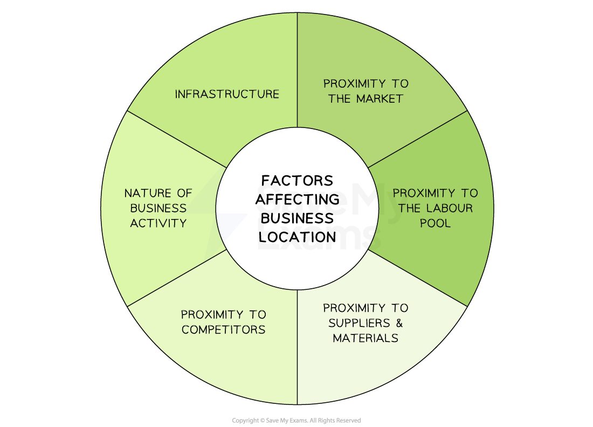

# The Importance of Business Location

## Factors affecting the choice of business location

> **Spec point** — `spcpt_8h5v5zFHzzSyjq2t` · Proximity to market, labour, materials & competitors nature of the business activity

## Factors affecting the choice of business location

- Business location is **where a business establishes and runs** its operations

  - Some businesses operate from a **single location** where it combines production, administration, sales and ***logistics***
  - Others distribute operations across **multiple locations **to take advantage of factors such as wage costs, skill availability and levels of  ***taxation***
  - **Remote** businesses may not operate from any single location
  
    - They use online technologies to link dispersed staff and resources

#### Factors affecting the choice of business location

*Businesses consider factors such as proximity to the market, labour, suppliers and competitors when choosing a suitable location*

- In many cases, businesses remain in the location in which they were **initially set up**

  - Business owners want to **remain loyal** to the communities in which their business were able to grow
  - Moving the business could involve **significant upheaval** and affect business ***continuity***
  - **Incentives** may be available to remain operating in a particular location, e.g. ***subsidies***, ***grants*** or tax benefits

#### Factors influencing the choice of business location

| **Factor** | **Explanation** | **Examples** |
|---|---|---|
| **Proximity to the market** | - Distance between the business location and the ***target market*** - Locating near the market reduces transportation costs and increases accessibility to potential customers | - A luxury car dealership may locate its showroom in a wealthy city suburb |
| **Proximity to labour** | - Availability of qualified and skilled workers in the area - Locating where there is a high concentration of skilled labour gives access to the necessary workforce to run business operations efficiently | - A high-tech manufacturer may locate in a region where similar firms already operate to access workers with relevant skills |
| **Proximity to materials** | - Availability of raw materials and supplies needed for the business - Locating close to key resources helps minimise transportation costs | - A brewery may be located close to a reliable water source to ensure a continuous, high-quality supply of a key ingredient |
| **Proximity to competition** | - **Take advantage of a shared customer base** or ***differentiate*** the business by offering unique products or services | - A designer clothing retailer may be located in the fashion district of a major city |
| **Nature of business activity** | - Businesses have varying space, ***infrastructure*** and accessibility needs - Businesses that sell products to other businesses (B2B) are less likely to need prominent locations, e.g. in shopping malls, than businesses that sell to consumers (B2C) | - A factory may require a large space for equipment and a loading dock for shipping and receiving goods |
| **Infrastructure** | - Location close to major **road or rail networks** allows businesses to receive supplies and distribute products - Good transport links are attractive to potential employees | - A law firm may require** **central** **office locations with good access to public transport |

> **Exam Hint**
> You may be asked to analyse factors that determine the choice of location for a given business. You should consider those factors listed above and you must ensure that you relate your answer to the business in the question. This is the skill of application and it is required in all longer responses.
