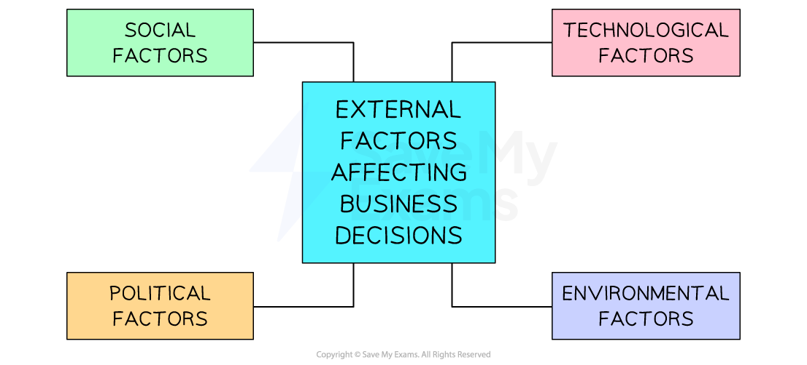

# External Factors that Impact Business Decisions

## The main external factors

> **Spec point** — `spcpt_b5QSq2cvpPjx5gYV` · The external factors affecting business decisions: 
• social 
• technological 
• environmental 
• political.

## The main external factors

- Business decisions are affected by a range of** external factors**

  - These external factors are outside of the control of the business, e.g the UK vote to leave the European Union trading bloc
- The response of the business is within their control

  - Businesses may **adapt** the products they sell or **reorganise the workplace** to ensure they meet the challenges and opportunities presented

#### External factors that can affect business

*Business decisions can be affected by political, environmental, social, or technological factors (PEST)*

## Political factors that impact business

> **Spec point** — `spcpt_PDhpvbGrWYfgjTsD` · The external factors affecting business decisions: 
• social 
• technological 
• environmental 
• political.

## Political factors that impact business

- Political pressure come from **local and national governments **and from ***pressure groups***

  - Environmental groups such as **Greenpeace** have publicised environmental damage caused by businesses, affecting their reputation
- **Government** decisions influence business activity in a variety of ways

#### Political factors that influence business

| **Political factor** | **Explanation** |
|---|---|
| **Government stability** **and trading relationships** | - In stable regions, businesses can plan their activities and invest in the knowledge that political factors are unlikely to have an unexpected impact - If governments make ***trade agreements*** with other countries or join ***trade blocs*** businesses may benefit from easier trade of goods and services |
| **Tax regulations** | - Tax **rates can be raised or lowered** according to government priorities    - E.g. Carbon taxes encourage manufacturing and energy businesses to reduce emissions - **Tax** ***loopholes*** **can be closed** to increase tax revenues and improve fairness in the tax system    - E.g. From 2024, the UK government will require online marketplaces such as Ebay to report sellers' revenues so that individuals earning more than a modest amount can be taxed on earnings |
| **Trade restrictions** | - Governments **restrict the sale of some products** to buyers in other countries    - E.g. Arms manufacturers are usually prohibited from selling weapons to unstable foreign regimes - Protectionist measures such as the application of ***tariffs*** and ***quotas*** can be applied to imported goods    - E.g. The US government applies tariffs to most Chinese manufactured goods |
| **Investment in public services** | - Governments set budgets for key public services, including education, healthcare, transport and national security    - E.g. The **Portuguese** government prioritises **spending on infrastructure **and [popover id="N28FxuQymRXBFVE8" label="**R&D**"]** **to grow its economy        - **Spending on public services** has risen while **labour costs** have fallen     - **Exports** have risen and increased **foreign direct investment** is taking place in the growing economy |

## Environmental factors that impact business

> **Spec point** — `spcpt_HcPpqttPZ3H5Tdnq` · The external factors affecting business decisions: 
• social 
• technological 
• environmental 
• political.

## Environmental factors that impact business

- Both changing consumer **attitudes towards environmental protection** and** government policy **impact business operations in several ways

### Changing infrastructure

- Many governments are taking steps to make **public transport **more environmentally friendly, reduce** vehicle usage** and encourage the use of **electric vehicles**

  - Businesses may need to upgrade to electric vehicle fleets, increasing costs in the short term
  - Improved public transport may increase the accessibility of businesses for workers and customers

### Waste disposal

- Strict regulations dictate the way businesses dispose of manufacturing waste to avoid **pollution**

  - Higher charges for disposal, as well as limits on the volume of permitted waste, increase business costs
  - Some businesses may identify ways to increase the amount of waste they recycle or reuse

### Energy sources

- Some governments have prioritised the switch from fossil fuels to **green energy** production, such as solar and wind power

  - In the long term, this should mean that businesses are likely to enjoy lower and more consistent energy costs

### Changes in climate and weather patterns

- ***Global warming*** is set to cause permanent changes to the world's climate

  - Businesses in high-risk areas face more frequent **disruption** due to floods or intense heat conditions
  - Insurance premiums may rise, increasing business costs
  - Some businesses may **relocate** to less exposed regions or take advantage of changed climates in previously unsuitable areas

- Business impact on the environment can be **controlled by governments,** which can **legislate** or** take enforcement action** against those that break environmental laws

#### Government control and the environment

| **Legislation** | **Fines** | **Limits** |
|---|---|---|
| - **Change laws** to make environmentally-damaging practices **illegal**    - E.g.** **Ban **hazardous materials** in manufacturing processes | - Impose** financial** **penalties** on businesses that break environmental regulations and **order** them to **clean up** environmental damage | - **Curb **business activities that cause environmental damage    - E.g. **Pollution permits** allow businesses to pollute up to a certain limit |

> **Exam Hint**
> In your exam, you may be asked to analyse the reasons why a business may want to be more environmentally friendly. You must ensure that you apply your answer to the business in question and develop at least two reasons.

## Social factors that impact business

> **Spec point** — `spcpt_dk6Btp7wbGPRRZwy` · The external factors affecting business decisions: 
• social 
• technological 
• environmental 
• political.

## Social factors that impact business

- **Social factors** include **personal attitudes, values, culture and demographic change **that** **affect business
- As societies change, businesses need to carry out **ongoing research** to ensure that they continue to meet ***stakeholder*** needs

#### Social factors affecting business

| **Social factor** | **Explanation** |
|---|---|
| **Education** | - Education can **change the level of skills** in an economy - A better educated workforce may mean that the economy can move from a primary dominant sector to a secondary sector    - Higher levels of education open up well-paid employment opportunities - Knowledgeable, skilled employees help develop ***innovative*** products    - E.g. **India**'s young and well-educated population is highly skilled in IT, leading to many multinationals locating support services in the country |
| **Migration** | - Some countries have seen significant movement of populations towards cities (**urbanisation**)    - This provides increased labour and creates new markets for businesses operating in cities - In some countries, the lack of availability of lower-skilled labour has caused significant problems    - E.g. **UK** food producers have struggled to recruit domestic seasonal workers to pick and process crops since 2016 |
| **Awareness of contemporary issues** | - Consumers are **better informed about global issues** than ever before    - E.g. **Indonesia, Vietnam **and the **Philippines** have customers that are more eco-friendly than the global average - Businesses need to meet these consumer needs by providing goods and services that allow them to **shop locally, **be** environmentally friendly **and **be** **ethical** |
| **Demographic structure** | - **Ageing populations** as a result of reduced ***mortality*** and low birth rates create new markets for businesses    - E.g. Businesses such as **Arts Abroad** offer focused trips targeted at single, mature travellers - Individuals live healthy lives for longer due to **improved healthcare** and remain in **work for longer**    - Businesses may benefit from the **loyalty** of older workers but may need to offer more **flexible contracts** |
| **Social mobility** | - Groups such as women and those with disabilities increasingly work, increasing labour supply for businesses    - E.g. Insurance company **Allianz** operates a positive disability discrimination policy, offers a range of flexible working options and runs an internal network for employees with disabilities - Businesses may need to consider **access arrangements** and **vary working contracts** to attract these workers |

## Technological factors that impact business

> **Spec point** — `spcpt_hcJFTyJCc9WsNB3x` · The external factors affecting business decisions: 
• social 
• technological 
• environmental 
• political.

## Technological factors that impact business

- Advances in **technology** can have a significant positive impact on business operations
- IT technology can improve **communication** and support **administrative functions**

#### Ways IT can be used to improve business functions

| **Databases** | **Email** **and messaging apps** | ***Bespoke*** **finance programs** | **Online technologies** |
|---|---|---|---|
| - These allow efficient and convenient storage and interrogation of data | - This technology speeds up communication processes | - These are used to process transactions quickly and accurately | - These allow for** e-commerce** activity, online marketing and the rapid sharing of data |

- The use of **robots** and automation in manufacturing and agriculture has** increased productivity, reduced costs** and improved worker safety

  - Some industries now employ very few workers in production roles, reducing wage costs
  - In other industries, these technologies have helped to **solve the problem of worker shortages**
- **Electronic banking** has reduced the need for cash- handling, which improves security and reduces costs

  - Businesses hold less physical money on their premises, reducing the need for expensive security arrangements
  - In-person banking takes time and may be less accurate than digital banking
- Keeping up with new technology can increase businesses' ***capital expenditure costs*** and may require ***external finance***
