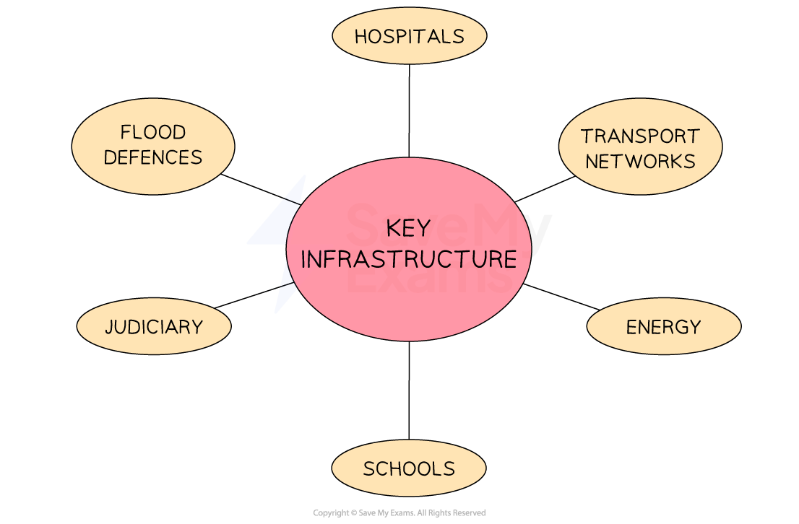

# Government Impacts on Business

## The provision of infrastructure

> **Spec point** — `spcpt_VRhBMc5VdjWxrg3S` · How governments can affect business activity: 
• infrastructure provision 
• legislation 
• trade policy - membership of trading blocs, tariffs.

## The provision of infrastructure

- A key role of government is to ensure that important infrastructure is **constructed, maintained and upgraded** when required

#### Infrastructure funded by government

*Government funding ensures that key infrastructure, including transport networks, health and education facilities and energy grids, operate effectively*

- Businesses **benefit from the provision of key infrastructure** in a number of ways

### Government contracts

- Some businesses are **paid to carry out construction and maintenance of infrastructure** on the government's behalf

  - In the UK, companies such as **Mitie** maintain public sector buildings, including hospitals and schools

### Higher consumer spending

- Government spending generates income in an economy.

  - Increased incomes from **employment** can **increase consumer spending,** which leads to more demand for goods and services

### Greater efficiency and productivity

- Improved networks can improve business performance

  - Better transport networks can improve ***logistics***
  - Reliable energy networks and disaster protection, such as flood defenses, allow for business ***continuity***
  - Faster communications networks can make online operations more efficient
  - Effective education and health systems improve the skills and wellbeing of workers, making them more productive

## Legislation

> **Spec point** — `spcpt_HTxMvgHq6rgk96dz` · How governments can affect business activity: 
• infrastructure provision 
• legislation 
• trade policy - membership of trading blocs, tariffs.

## Legislation

- **Legislation** refers to the **laws **and** regulations** created by governments

  - Businesses must operate within these so as to avoid fines or legal action
- A strong legal framework in the country in which a business is located provides **stability** for businesses to plan and invest

#### Key areas of legislation affecting business

| **Area of law** | **Explanation** | **Examples** |
|---|---|---|
| **Consumer protection** | - **Unfair selling practices** are not allowed, such as    - **False claims** about product capabilities   - Selling goods that are **unfit for purpose** or **dangerous**   - Selling **short measures** of goods | - Businesses must follow **India's** **Consumer Protection Act, **which** **defines eight fundamental rights for consumers, including the right to **safety**, the right to **be informed** and the right to **seek** ***redress*** |
| **Equal opportunities** | - Prevent workers from being **treated less favourably** as a result of protected characteristics, including    - Gender and sexual orientation   - Race   - Disability   - Age | - The **Egyptian** **Labour Code** prohibits **wage discrimination** on the basis of religion, gender, race, language, disability, social class, or political affiliation and guarantees **equal pay for equal work.** |
| **Health and safety** | - Protect the public, including workers, from **harm** as a result of business negligence, such as    - Injury and stress caused by **poor working conditions**   - Failure to provide **protective equipment** | - **Vietnam**'s first law covering workplace health and safety was introduced in 2015 - Employers must **reduce hazards** and risks, improve **working conditions**, take care of employee’s health and prevent workplace **accidents and diseases** |
| **Competition policy** | - **Uncompetitive practices** such as    - Removing or reducing ***trade barriers*** to **encourage market competition**   - Preventing ***mergers*** or ***takeovers*** that could **reduce choice** for consumers | - **Norway**'s Competition Act bans **unlawful cooperation** between firms, abuse by a business of a **dominant market position** and controls **mergers and takeovers** |
| **Environmental protection** | - Reduce **negative environmental impacts** of business activity, including    - Air pollution   - Water pollution   - Waste reduction   - Use of harmful chemicals | - Since 1998, **Brazil**'s Environmental Crimes Act set out the definition of **environmental crime** and has played a key role in **reducing deforestation** in the Amazon |

## Trade policy

> **Spec point** — `spcpt_4BRCwgXrtF9WqvJB` · How governments can affect business activity: 
• infrastructure provision 
• legislation 
• trade policy - membership of trading blocs, tariffs.

## Trade policy

- **Government trade policy** determines their approach to** **the **import and export of products** across borders

  - **Importing** involves bringing goods or services into a country from overseas
  - **Exporting** is where a business sells its products abroad
- Governments can use *trade barriers *to restrict the level of trade between countries for several reasons

  1. **Protect new industries **from overseas competition
  
    - E.g. The UK government heavily subsidises the solar panel industry
  2. Achieve a healthy **balance of payments**
  
    - Trade barriers applied by the US on products from China since 2017 have focused on reducing the country's trade deficit
  3. **Protect jobs** in industries that are major employers
  
    - E.g. The UK government provided subsidies of more than \$500 million to Tata Steel, a major employer in South Wales
  4. **Retaliation **for trade barriers applied by other countries
  
    - China has applied retaliatory tariffs of up to 25% on US-produced goods such as soybeans
  5. **Prevent dumping **of cheap goods from overseas
  
    - In 2017, India applied tariffs on imports of Bangladeshi jute that was priced to undercut domestic producers
  6. **Pressure **a foreign power to change policies
  
    - Many western governments have applied sanctions on Russia since 2022 in response to its foreign policy

### Tariffs

- A **tariff** is a tax placed on imported goods from other countries

  - E.g. Tennis rackets imported into the UK from China have a tariff of 4.7%
- A tariff **increases the price** of imported goods which helps to **shift demand** for that product/service from foreign businesses to **domestic businesses**

*When the USA places a tariff on imported cheese from Britain, the price of British cheese in the USA rises*

- American customers are more likely now to** purchase American cheese** as the tariff has made British cheese** equally expensive**

#### Evaluation of tariffs

- The **benefits of tariffs** include

  - Protection for ***infant industries*** so they can eventually become more competitive globally
  - An increase in **government tax revenue**
  - Reduced ***dumping*** by foreign businesses as they cannot sell below the  market price
- The **disadvantages of tariffs **include

  - **Increased cost** of imported raw materials, which may affect businesses who use these goods for production, leading to higher prices for consumers
  - **Less competition** for domestic firms who may become more inefficient and produce poor quality products for their customers
  - **Reduced consumer choice **as imports are now more expensive and some customers will be unable to afford them

### Trade blocs

- **A trade bloc is a group of countries that agree to reduce or remove trade barriers between themselves, while maintaining individual or common trade policies towards non-members**

  - The extent of integration depends on the type of trade bloc (e.g. free trade area, customs union, or common market).
- Membership of a **trade bloc,** such as the EU or ASEAN, usually includes** barrier-free trade** between member countries

  - Most EU countries share a **common currency**, the Euro
  - ASEAN members are cooperating to ***harmonise***** laws and regulations **relating to product safety, **labelling **and** ingredients**
  
    - This enables products manufactured in any of the countries within the trade bloc to be** suitable for sale **in all of the other countries
- Governments can cooperate with other countries outside of trade blocs to ease business transactions

  - A **free trade agreement** allows goods and services to be sold across borders as easily as domestic firms trade with each other
  
    - E.g. **Norway's** free trade agreement with the **EU** allows its goods to be exported with ease to its member countries

> **Exam Hint**
> You could be asked to calculate the impact of a tariff on the selling price of product. This will usually involve working out a percentage. Don't forget to add this percentage to the original product price.
