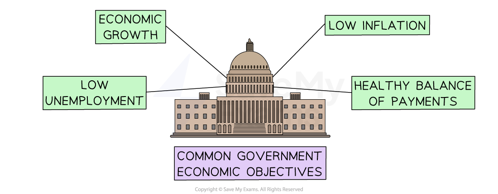

# Government Objectives

## Government Economic Objectives

> **Spec point** — `spcpt_rjKKNqNBvGPn8WCn`

## Government economic objectives

- Most **governments pursue similar objectives** for their national economies

  - They use a mix of government spending and taxation in order to achieve these objectives

- The government has many policy options available that can be used to meet the targets of their macroeconomic objectives

  - Any policy action taken is likely to have a direct impact on business

#### Government economic objectives

*Governments typically look to achieve economic growth, low inflation, low unemployment and a positive balance of payments*

### Positive economic growth

- Positive economic growth is the increase in the amount of **goods and services produced per head of population** over a period of time
- The **standard of living** of the population is likely to increase with GDP growth

  - As output is rising, **more workers are needed,** and **high levels of employment** are achieved
  - Households can **afford to buy more goods and services** as most people become richer
  - Business owners expand their business as people have more money to spend on their products and revenue rises

### Low levels of inflation

- Inflation refers to a general **increase in prices** and **fall in the purchasing value of money **over time
- Both the UK and US governments set their ***Central Bank*** an inflation target of 2%
- Central Banks have a range of tools they can use to achieve this target, such as ***base rates*** and ***quantitative easing***

### Low levels of unemployment

- Unemployment refers to the **number of people without a job **who are actively seeking and available for work
- Low unemployment **increases national output**, **improves workers’ living standards** and **reduces government spending on *****welfare benefits***

### A healthy balance of payments

- The balance of payments is the relationship between **the value of *****imports*** **and *****exports*** over a period of time

  - **A balance of payments deficit **occurs when the money spent on imports is higher than the money received from exports
  - **A balance of payments surplus** occurs when the money received from exports is higher than the money spent on imports
- If a country has an ongoing deficit, it means there is possibly less support for domestic business (imports preferred)

  - The country's residents may need to borrow more money to fund these imports
- Maintaining a healthy balance of payments helps to avoid some of these issues

#### Examples of government actions aimed at meeting macroeconomic objectives

| **Example** | **Explanation** | **Impact on business** |
|---|---|---|
| **The government raises the *****interest rate***** in order to reduce the level of inflation** | - Higher interest rates mean that businesses and people will borrow less money as they will have to pay back more | - Demand for goods typically purchased using ***credit*** is likely to decline, causing revenue to fall |
| **The government places a tariff on imports in order to reduce foreign purchases** | - Tariffs increase the price of imported goods compared to those that are domestically-produced | - Increased demand for businesses that sell domestically-produced goods is increasing revenue - Higher costs for businesses that import goods from overseas, which they may choose to pass on to customers |
| **The government allows fewer low-skilled workers to enter the country and be available for employment** | - Low-skilled jobs are filled by the domestic workforce, reducing both the level of unemployment and government spending on welfare benefits | - Businesses may have to offer higher wages to compete with rivals and attract enough workers - Staff shortages may encourage some businesses to move towards ***capital-intensive*** production methods |

> **Exam Hint**
> In the exam you may be asked to explain how a change in government objectives might affect businesses. Remember, explain questions do not require a contextualised response.
