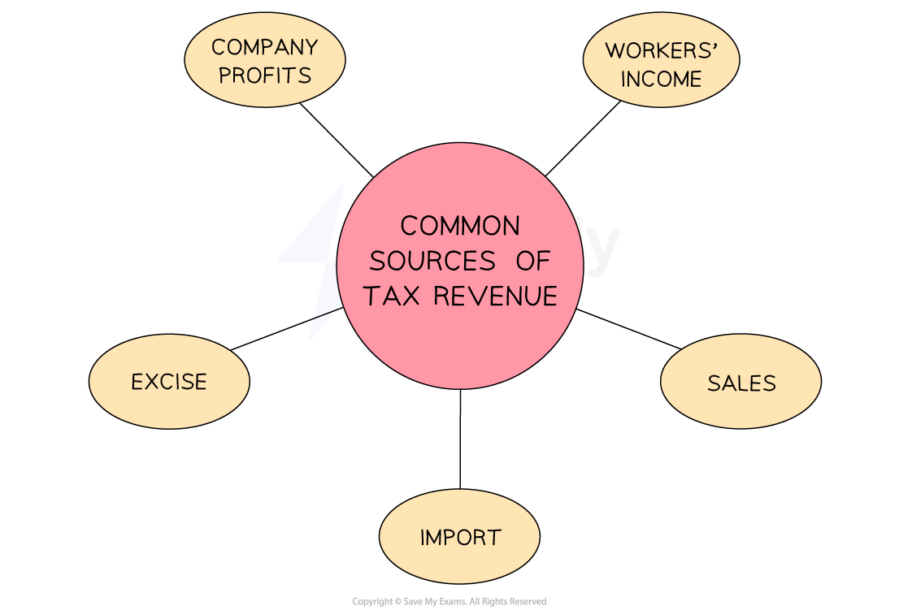
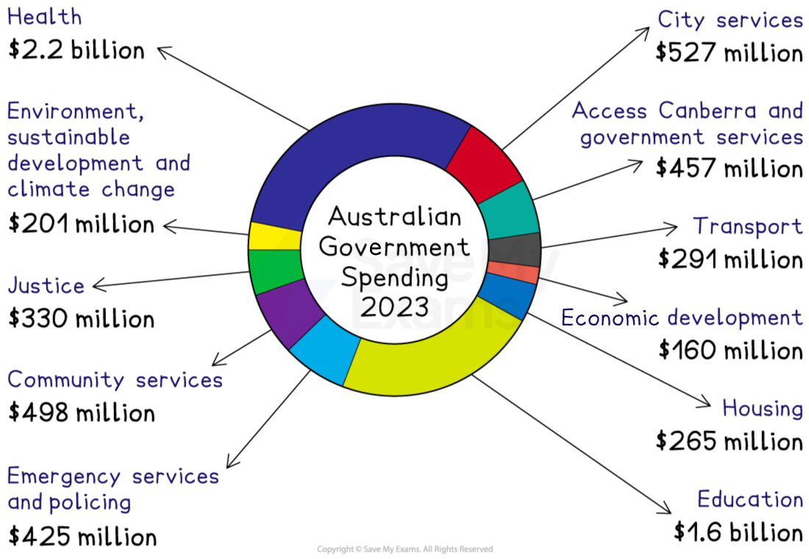

# Government Spending

## The impact of government spending and taxation on business

> **Spec point** — `spcpt_Cwc5Fwjzrsvw73Db` · Government spending: 
• to provide public service 
• taxation and constraints on public spending.

## The impact of government spending and taxation on business

- The government of each country sets the ***corporation*** and ***income*** tax rates every year

  - **If tax rates fall**, then customers will have more money available to spend on goods or services
  - **If tax rates rise**,  then customers will have less money available to spend on goods or services
  - **If tax rates fall**, then businesses will have more money available to invest, increase their product range, or hire new workers
  - **If tax rates rise**, then businesses will have less money available to invest, increase their product range, or hire new workers
- The government also **decides how much money will be spent in the economy** during the financial year

  - Many businesses benefit from **government supply contracts**
  
    - **Pharmaceutical manufacturers** sell drugs and medical equipment to **public hospitals and other health providers**
    - **Construction companies** are contracted to build **infrastructure** such as roads, schools and public buildings
    - Publicly-owned **plant and equipment,** such as trains and ambulances, are produced by manufacturers in the private sector
- If government spending falls, then businesses will have** less demand for their goods or services**, and their profit may fall
- If government spending rises, then businesses will have more demand for their goods or services, and their **profit may rise**

## Raising tax revenue

> **Spec point** — `spcpt_QB5KPCZj8v2NPVjH` · Government spending: 
• to provide public service 
• taxation and constraints on public spending.

## Raising tax revenue

- **Tax revenue** is raised to fund public spending
- Rates of taxation are **set by national or regional governments**
- These decisions are sometimes considered to be **politically-motivated**

  - E.g. The reduction of income tax prior to an election could persuade voters with more disposable income to back the existing government

#### Common sources of tax revenue

*Tax revenue can be raised from a range of sources, including company profits, workers' income, sales, imports and excise duties*

### Tax on company profits

- Sometimes known as **corporation tax**
- A proportion of profit is paid by ***private limited companies*** and ***public limited companies***
- The rate of corporation tax varies from country to country

### Income tax

- Paid by workers based on their earnings

  - Employers usually deduct this tax before distributing earnings to workers
  - In most countries, workers earn a minimal amount before income tax is deducted
  
    - E.g. The first \$12,000 of income may not be taxed at all, but any income beyond that has **progressively** higher levels of taxation attached

### Sales tax

- Applied to purchases of certain goods, e.g. VAT or GST

  - Higher rates are often applied to luxury goods and services
  - Different rates can be applied to encourage or discourage spending behaviour
  
    - E.g. The rate of GST in Singapore is 9%

### Import tax

- Applied to products purchased overseas

  - Free trade agreements often involve the removal of these taxes to minimise ***trade barriers***

### Excise tax

- Applied to some manufactured products such as alcohol, tobacco and fuel

  - In the UK, excise tax of approximately £0.53 is charged on each litre of unleaded petrol

#### Tax revenue statistics in 2023

| **UK** | **USA** | **Bermuda** |
|---|---|---|
| - Almost three-quarters of tax revenue was generated from **income tax **and** value-added **(sales)** tax ** | - A greater percentage of tax revenue was raised through **corporation tax** | - A significant proportion of tax revenue was generated from ***customs duties*** |

> **Exam Hint**
> In the exam you could be asked to analyse the ways the introduction of a new tax might affect a given business. Consider what type of tax it is - if it is levied on the business profits or employee wages it will increase costs. However, if it is levied on the selling price of goods it could reduce sales revenue as customers may reduce consumption due to rising prices.

## Government spending

> **Spec point** — `spcpt_MvmW2FHgC7hsRdBQ` · Government spending: 
• to provide public service 
• taxation and constraints on public spending.

## Government spending

- Governments spend the tax revenue they have collected to provide a range of **public services,** such as

  - **Education:** including schools, colleges and universities
  - **Healthcare:** including hospitals, public health programmes, doctors and dentists
  - **Emergency services:** including police, paramedics, the fire service and coastguard
  - **Judicial systems:** including courts and prisons
  - **Defence:** including the armed forces and border controls
- Tax revenue also funds **social security,** such as ***state pensions*** and  ***unemployment benefits***
- Some governments use tax revenue to provide ***grants*** that **encourage certain behaviours**

  - Homeowners may receive funding to improve insulation or install environmentally friendly heating systems

#### 2023 government spending in Australia

*In 2023, the Australian government's largest spending priorities were health and education  Source: Australian Treasury *

- The Australian government's spending on **health, housing and education** helps to ensure that its citizens are capable of being **productive contributors to the economy.** ***entrepreneurs*** or productive employees
- Spending on the **judiciary and emergency services** ensures the country's stability so that it remains **safe and secure** for businesses to operate effectively and **consumers have confidence** to spend money in the economy
- Spending on **transportation** allows for businesses to **move goods around**, into and out of the country

  - It also provides workers with flexibility to commute and access** jobs** across the country
